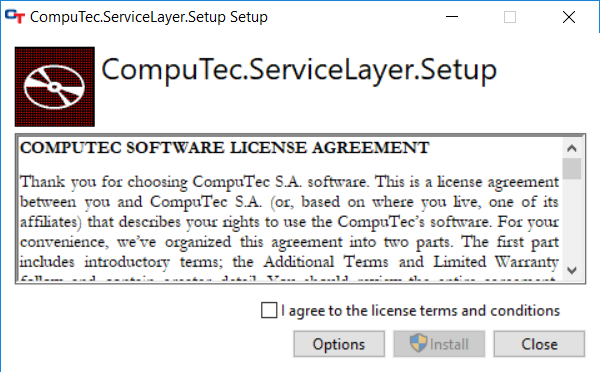
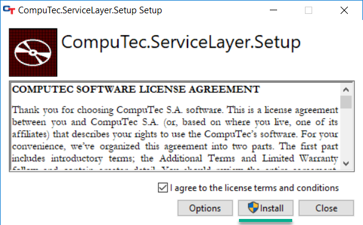
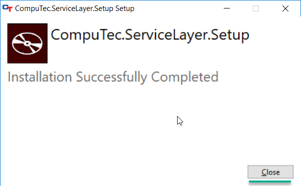
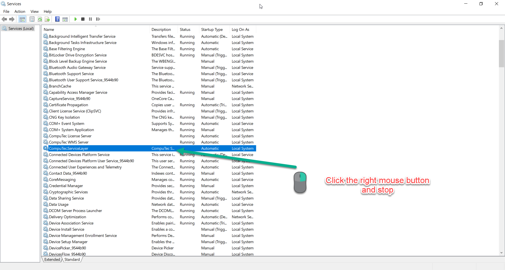
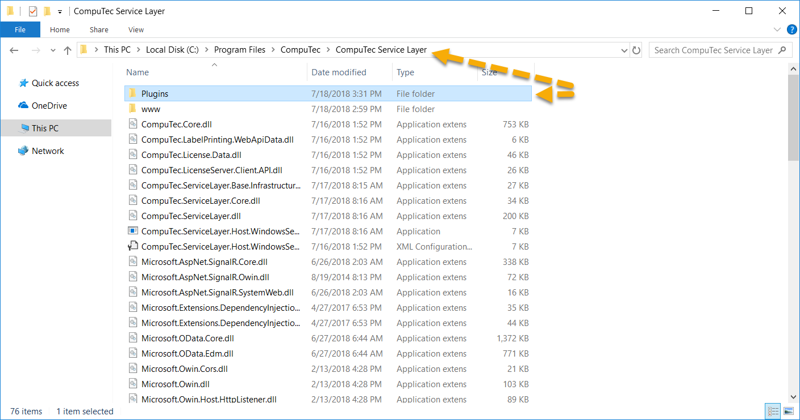

# Service Layer (CT AppEngine) installation

This document provides a step-by-step guide on how to install CompuTec Service Layer client.

---

## Prerequisites

  - configure your firewall to make the 8080 port available

  - Net Framework 4.7 is required.

## Installation

  - To install the Computec Service Layer client, download and run its installation file – you can find it here.

  - Check the checkbox after reading the message about installation preparation:

- Click the Install button to start the installation. A default installation path is "C:\Program Files\CompuTec\CompuTec Service Layer\".

- Click the Close button after reading the message to finish the installation:

- When the installation is complete, go to the system services and find CompuTec.ServiceLayer service. If it is enabled, then turn it off.

- Go to the CompuTec Service Layer installation folder and paste the Plugins directory that you can find here:

7. Turn CompuTec.ServiceLayer service on.

8. Service is ready to run. You can start by clicking the shortcut created in the Windows program list.
