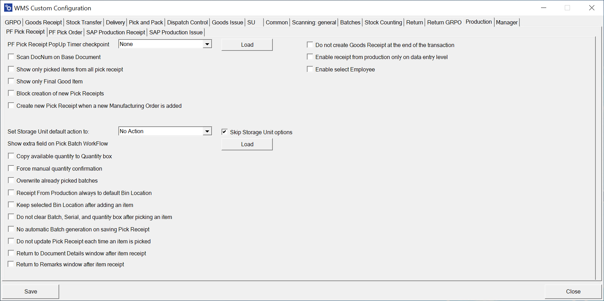
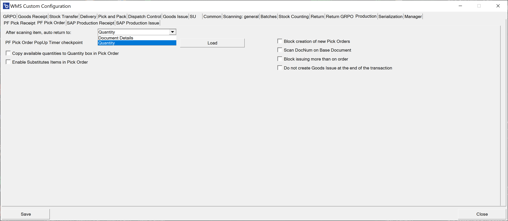

# Production

## PF Pick Receipt tab

**PF Pick Receipt PopUp Timer checkpoint** – None, Select the base document, Select Item on the list, Pick quantity to the first line, Save Document

**Scan DocNum on Base Document** – On selecting Pick Receipt or Manufacturing Order window, scanning will work by DocNum instead of DocEntry.

**Show only picked items from all pick receipts** – narrow the list of displayed Items to only those with a picked quantity greater than 0.

**Show only Final Good Item** – narrow the list of displayed items to only the Final Good Item.

**Block creation of new Pick Receipts** – enabling this option disables the following option: "Create new Pick Receipt when a new Manufacturing Order is added."

**Create a new Pick Receipt when a new Manufacturing Order is added** – creates a new Pick Receipt Instead of adding its content to the currently opened one.

**Set Storage Unit default action and Skip Storage Unit options** – after selecting a line, Storage Unit options are displayed, allowing a user to create storage units or continue packing the last created one. Selecting a default action, "New SU" or "New SU Each Pick," will automatically skip displaying Storage Unit options.

**Show extra field on Pick Batch Workflow** – displays an extra field on selecting batch if and only if the SQL query was provided after pressing the "Load" button:

**Copy available quantity to Quantity box** – copies remaining quantity to the quantity box.

**Force manual quantity confirmation** – blocks the "Fast scan" on the document. For each performed scan, the user has to manually confirm the quantity, i.e., press the save button before adding the item with a scan.

**Overwrite already picked batches** – when a Batch is already picked for a line, for example, in SAP B1, then picking the same batch in WMS will overwrite its quantity rather than adding to what was already picked.

**Receipt from production always to default Bin Location** – when receipting to a warehouse with bin locations, the default bin will be automatically chosen. Selecting other bin locations will be blocked.

**Keep selected Bin Location after adding an item** – after picking an Item, the Bin Location field will not be cleared (keeping the same Bin Location)

**Do not clear Batch, Serial, and quantity after picking an item** – changed from the old version where those fields were not cleared after picking.

**No automatic batch generation on saving Pick Receipt** – by default, when picking a batch item is not required to enter a batch number – it will be generated automatically. This option disables this feature.

**Do not update Pick Receipt each time an Item is picked** – by default, when an item is picked, the Pick Receipt document is updated, and information about it is displayed. Enabling this checkbox will disable this feature. To update the Pick Receipt, a user will have to save the transaction from the "Remarks" window, which will, by default, create a Goods Receipt document.

**Return to the Document Details window after item receipt.** When an item is picked/added, instead of staying on the "Quantity" window, the application will redirect back to the main document window.

## PF Pick Order tab

**After scanning item, auto return to** – choose to go either to the Document Details or stay on the Quantity form after scanning an Item barcode

**PF Pick Order PopUp Timer checkpoint** – None, Select the base document, Select Item on the list, Pick quantity to the first line, Save Document.

**Copy available quantities to the Quantity box in Pick Order** – copies remaining quantity to the quantity box.

**Enable Substitutes Items in Pick Order** – the option allows use in Pick Order. The option can be deactivated when not needed.

**Scan DocNum on Base Document** – on selecting Pick Order or Manufacturing Order window; scanning will work by DocNum instead of DocEntry.

**Do not create a Goods Issue at the end of the transaction** – when this option is checked, a Goods Issue document is not created at the end of the transaction. The user then can confirm and create it from ProcessForce → Pick Order level.

## The SAP Production Receipt tab

