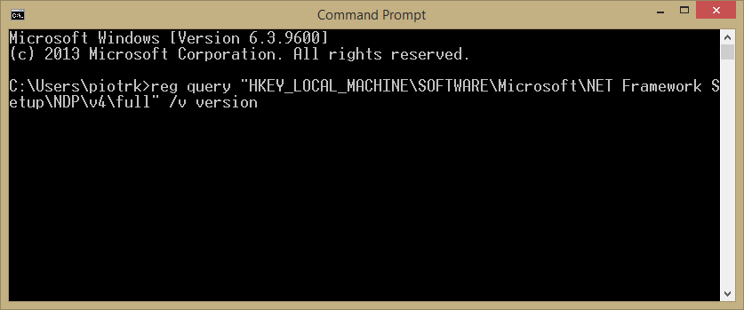
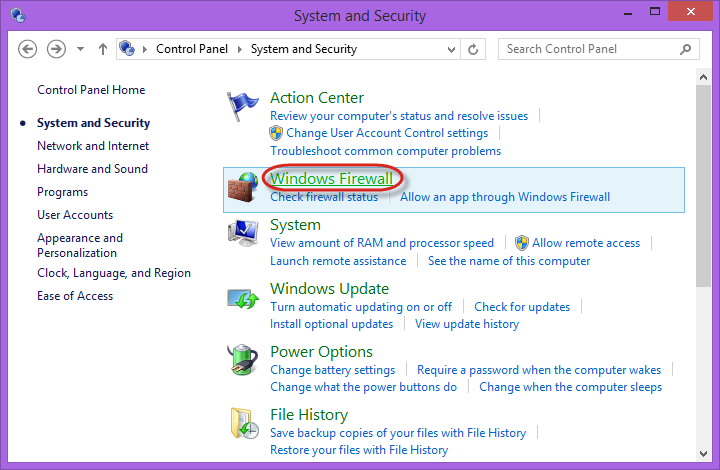
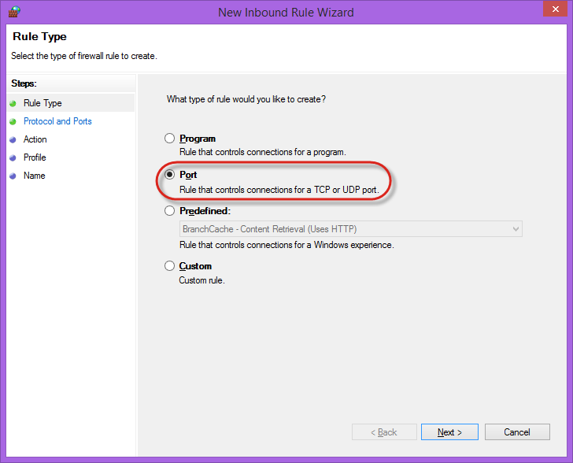
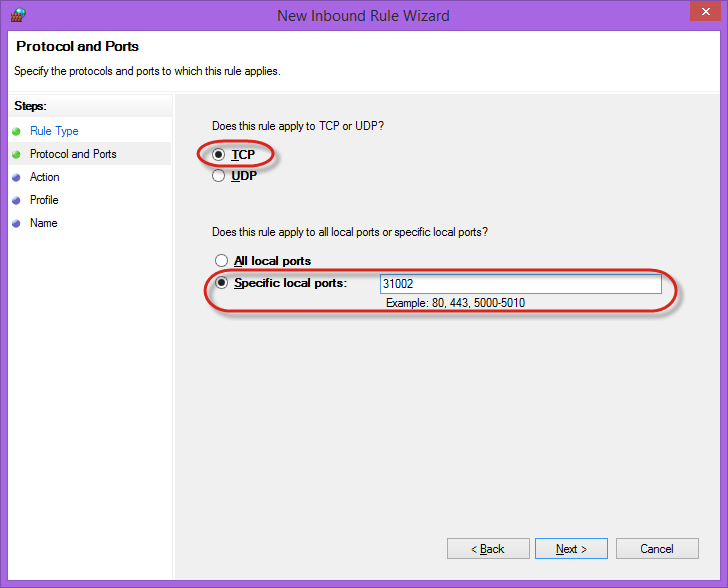
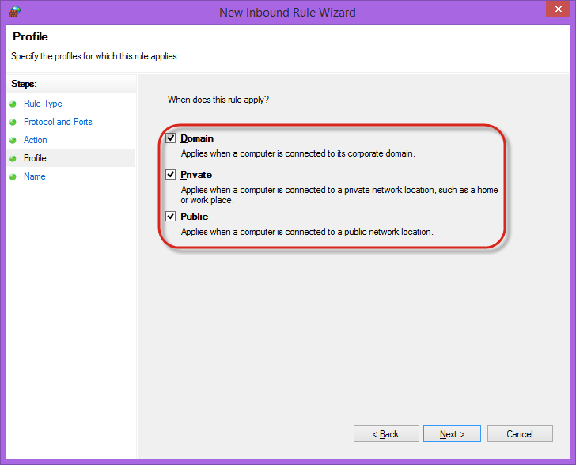
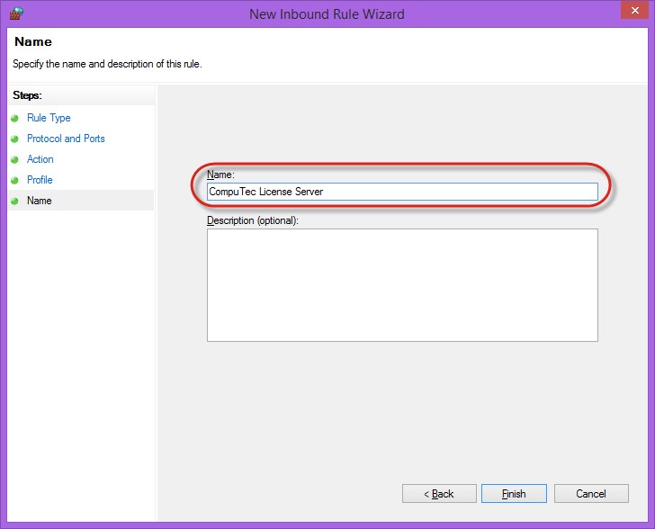
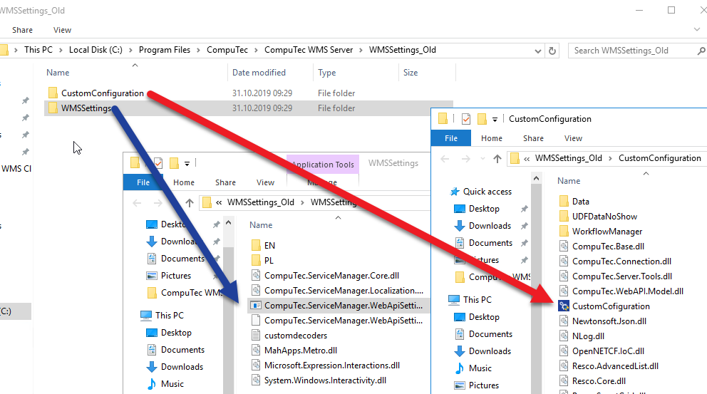
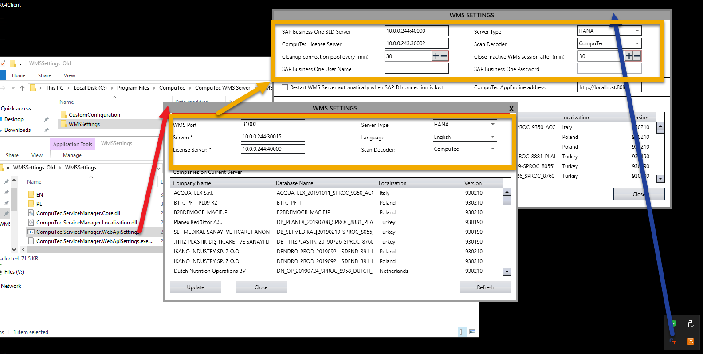
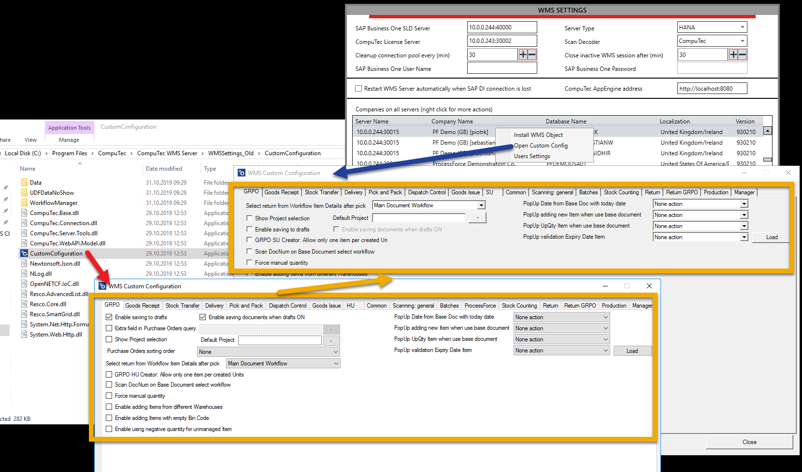

# Prerequisites

Here, you can find requirements that have to be fulfilled for CompuTec WMS to work correctly.

---

## .NET Framework

CompuTec WMS requires a .NET Framework to work correctly.

The minimum version of the .NET Framework supported by CompuTec WMS is 4.7.

### How to check the .NET Framework version

1. Type in the following command in Command Prompt from Windows applications:

   `reg query "HKEY_LOCAL_MACHINE\SOFTWARE\Microsoft\NET Framework Setup\NDP\v4\full" /v version`

    
    and click enter.

2. The result will show the .NET Framework version:

    

We recommend you install the latest version of .NET Framework – you can do it using the dedicated tool Windows Update or manually downloading the required files from the Microsoft site:

| Microsoft .NET Framework 4.7 (Web Installer)     | [Link](https://www.microsoft.com/en-us/download/details.aspx?id=55170) |
|------------------------------------------------------|---|
| Microsoft .NET Framework 4.7 (Offline Installer) | [Link](https://www.microsoft.com/en-us/download/details.aspx?id=55167)   |

## User Defined Objects

You can check how to install the CompuTec WMS objects to a database [here](ADD LINK).

### Custom Batch UDFs

To correctly handle custom Batch UDFs in CompuTec WMS with ProcessForce installed, it is required to add a specific UDF to the following tables:

- "OBTN" (SAP)

- "@CT_PF_OABT" (ProcessForce)

- "@CT_PF_PRE2" (for picked but not receipted Batches)

Click [here](ADD LINK) to find out more about working with UDFs in ProcessForce.

## SAP Business One DI API

CompuTec WMS Server requires SAP Business One DI API 32-bit or 64-bit (depends on CompuTec WMS version) application to work correctly.

## SAP Business One user

To operate CompuTec WMS with an SAP Business One user, it is required to log in to SAP Business One with the user and accept or decline the SAP Business One Improvement Programme message.

### ProcessForce License

When working on CompuTec WMS with ProcessForce, it is required for an SAP Business One user to have a corresponding ProcessForce license assigned (e.g., Limited Logistic both for SAP B1 and ProcessForce, or Indirect Access both for SAP B1 and ProcessForce).

## Unique Serial Numbers, SAP Business One General Settings

For the application to work correctly and to avoid serial numbers being duplicated, you must select Serial Number in Unique Serial Numbers by combo-box in SAP Business One General Settings, Inventory tab:

## The inbound rule in Windows Firewall

CompuTec WMS Server requires a new inbound rule in Windows Firewall set for a specific port to work correctly. To get more information, see below.

1. Open: Control Panel > System and Security > Windows Firewall:

    

2. Click the *Advanced settings*:

    

3. Select *Inbound Rules* and choose *New Rule...* in the *Actions* window - this runs *New Inbound Rule Wizard*:

    

4. Choose *Port* as the rule type:

    

5. Choose *TCP* protocol and specify *31002* local port:

    

6. Choose the *Allow the connection* action:

    

7. Choose all profiles:

    

8. Specify the rule name and click "Finish":

   

## Anti-malware software

In some cases, anti-malware software may block the installation of the application. In cases like this, make a related exception in the software.

## Data Restore

If CompuTec WMS is set to work on a database with ProcessForce installed and the database has been used before without ProcessForce, be sure to perform the Item Details restore procedure. Operating on Items without Item Details assigned to it, on databases with ProcessForce installed, may cause the creation of some documents impossible (with these Items on it). Click here to find out more.

## Supported database servers

The supported database servers are:

- Microsoft SQL Server 2012

- Microsoft SQL Server 2014

- Microsoft SQL Server 2016

- Microsoft SQL Server 2017

- SAP HANA

## CompuTec ProcessForce API

If ProcessForce is installed, CompuTec WMS requires CompuTec ProcessForce API 32-bit or 64-bit (depending on CompuTec WMS version) to work correctly. You can download it from here. ProcessForce API has to be in the exact version as ProcessForce installed on the database).

## Preparing environment: Installation order

:::danger

Please bear in mind that installing in order other than presented below may cause problems with operating CompuTec WMS.

:::

### Microsoft SQL

1. Microsoft ODBC Driver.

2. Microsoft SQL Native Client (version based on SQL version being used).

3. SAP DI API.

4. ProcessForce API.

5. WMS Server.

6. WMS Client.

### HANA

1. HANA ODBC Driver.

2. SAP DI API.

3. ProcessForce API.

4. WMS Server.

5. WMS Client

## Upgrade

It is required to uninstall the CompuTec WMS Server manually (in Programs and Features functionality in Windows) before installing the CompuTec WMS 2.0 version.

### 32-bit and 64-bit CompuTec WMS Server version

:::danger

Both server versions cannot work simultaneously in one environment.

:::

### Custom Config and CompuTec WMS Server Settings transfer

Upon upgrading to the 2.0 version from any lower one, transferring Custom Config and Server Settings manually is required. To do this, go to the old settings folder in the installation folder. By default, it is:

C:\Program Files\CompuTec\CompuTec WMS Server\WMSSettings_Old

Go to the respective sub-folders and run old Settings and Custom Config:

Move manually data from the old settings to the respective fields in the currently installed ones:

Note that there is a License Server field in the old settings, and on the new form, there is an SAP Business One SLD Server field (these values can be different in some cases).

Perform the same procedure for Custom Config options.

