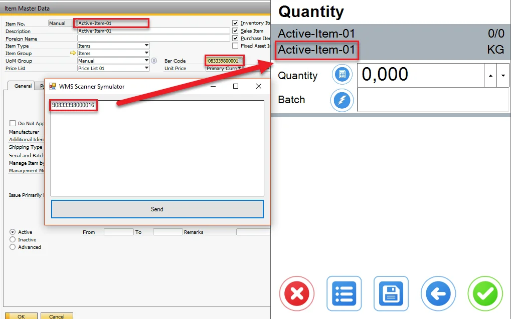
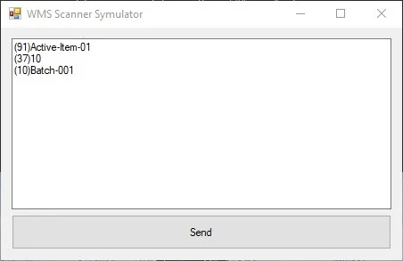

# WMS Scanning Simulator

Here, you can find information on WMS Scanning Simulator – a simple but valuable tool that can imitate CompuTec WMS behavior on scanning barcodes. It can be beneficial during the CompuTec WMS testing period.

---

## Download

<!-- [Download](./media/WMSScannerSymulator.zip) -->

Unzip the file and run it (it does not require installation).

## Usage

- The simulator can be run through a remote desktop, but only one user at a time can do this (unlike CompuTec WMS, which can be used by many users simultaneously).
- The simulator can operate on one of the barcode standards supported by CompuTec WMS: GS1, Odette. Click here to find out more.
- You can scan an Item by its name or barcode.

    
- You can scan a single code or use a multi-part barcode by putting each code in a separate line:

    

VIDEO
