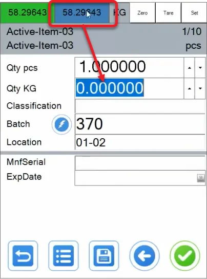

# Catch Weight

Catch Weight in CompuTec WMS refers to the ability to measure inventory using both inventory Unit of Measurement (IUoM) and document UoM (DUoM).

---

## Overview

The CompuTec WMS Catch Weight option addresses two main problems:

### The exact weighting of pieces with the DUoM set

Example: there is a Purchase order with UoM set to Boxes. A box is set to contain 10 kilograms of an Item:

In this example, there are 10 Boxes in the purchase document, which gives 100 kilograms of the Item. But in many cases, the company will get ten boxes with the quantity in each box varying, e.g., from 9.7 kilograms to 10.2. The total will not be 100, then.

What needs to be done is to set an actual total weight and an average quantity per Box.

### A label for each Box

A Batch is generated upon receiving the Boxes from the example and saving the document. Printing is triggered by the document being saved to the database. That gives all the labels at once.

The Labels should be printed (when integrated with CompuTec Labels) as you enter inventory onto the document (for each Box) to make it easier to track which label belongs to which piece of inventory.

## Requirements

:::warning

Please note that the Catch Weight functionality does not work with different UoM defined in SAP Business One.

:::

### Item Master Data

**Path**

SAP Business One → Inventory → Item Master Data

The option is activated per Item. Go to Item Master Data, find the required Item, and

- Set up Purchasing UoM name (Purchasing Data tab),

- Open User-Defined Fields (Ctrl+Shift+U) and set the Catch Weight Enabled field value to Yes.

The option can be used in the following transactions:

- Goods Receipt PO

- Goods Receipt PO from Purchase Order

- Goods Receipt PO from AP Invoice

- Stock Transfer

- Delivery

- Delivery based on Sales Order

- Return

- Return PO

- Pick and Pack

## Usage

When the Catch Weight option is enabled, on Quantity, there are two quantity fields: the top one for a DUoM quantity (a DUoM called pcs in our case) and the lower one for an IUoM (an IUoM called KG in our case).

By default, one is set in the pcs quantity field to select the quantity for KGs.

:::note

When recording a number of entries, in this case, it is suggested to check the Keep selected Bin Location after adding an Item in Custom Configuration.

:::

### Recording total Quantity for different DUoMs of different quantity

In the video below, you can see the CompuTec WMS with Catch Weight option on behavior when recording ten packages (pcs) with weights ranging from 9,21 to 11,45 (even though the DUoM is set to 10). The transaction used in this example is Goods Receipt PO from Purchase Order:

Note that the check button on the quantity form does not work with Catch Weight. After setting up the units, click back to Document Details, and choose a required item row, the right arrow, and the Save icon (as shown at the end of the video).

Saving the document from our example results in the following Goods Receipt PO:

As you can see, CompuTec WMS recorded the total quantity and set an average quantity per unit.

Note that the created packages are just for information purposes – they are not as fixed as Storage Units. In the Batch Number Transactions Report (opened from the context menu on Goods Receipt PO), you can see that one Batch with total quantity was recorded. To check the specific package records, go to CompuTec WMS → Whs. Info → Batch/Serial Info and choose the suitable Batch:

### Using weight scales

If CompuTec WMS has weight scales integrated, it is possible to set inventory quantity based on their measurements. To do this, click the IUoM field (Qty KG in our example) and the weight button (highlighted). The IUoM field will be filled with the weighted value:

The field can be automatically filled in with the actual scale weight measurement upon clicking the Save icon if the Weight Scale auto-complete quantity option is checked in Custom Configuration.

### Average quantity per DUoM

It is possible to set the number of units and total quantity. Saving documents like this will create units with an average quantity per unit.

This option can be used, e.g. when a user is sure about weight of each of the units but has a different weight per unit than the units set in SAP Business One (in our example, it is set that one pcs has 10 KG).

#### Indivisible rest

If the quantity cannot be divided evenly between DUoMs, the Catch Weight option will add indivisible rest to one of the units. E.g., if there are three boxes and 10 kilograms, the mechanism will create two boxes with 3,333333 kg and one with 3,333334 (when there are six decimal places set in the system):

### A label for each Box

If CompuTec WMS is integrated with CompuTec Labels, printing a label automatically upon saving each unit is possible. In our example, a user gets a label after saving each of the ten units (e.g., a box), not ten labels, upon saving the whole document.
