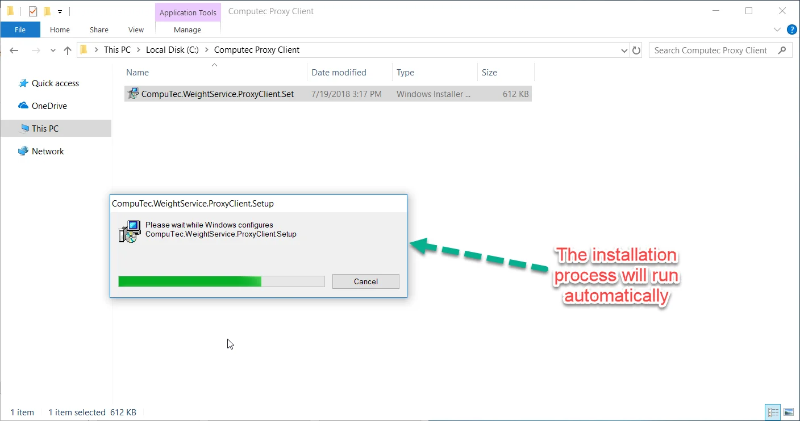
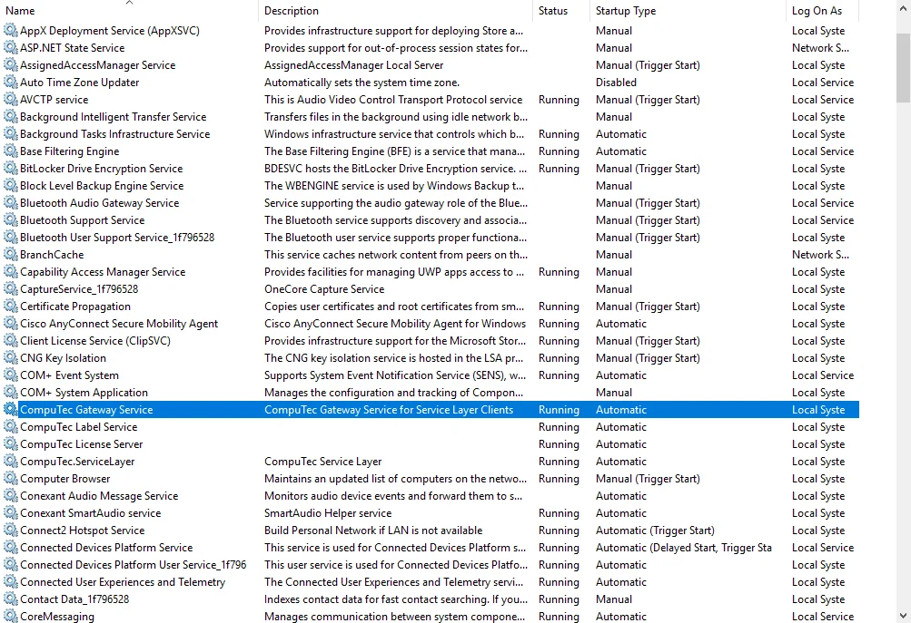

# CompuTec Gateway Service Installation

:::info
    This document provides a step-by-step guide on how to install CompuTec Gateway service.
:::

:::warning
    Important! For the program to work properly, configure your firewall to make the 8080 port available.
:::

1. To install CompuTec Gateway Service, download and run its installation file - you can find it here
2. Run the installation file CompuTec Gateway Service. When the installation is complete, the Gateway Service service will start automatically.

    
3. The CompuTec Gateway Service was successfully started and connected to Service Layer. Now you can go to the Weight Configuration Manager.

    
