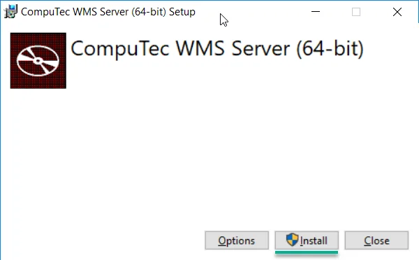
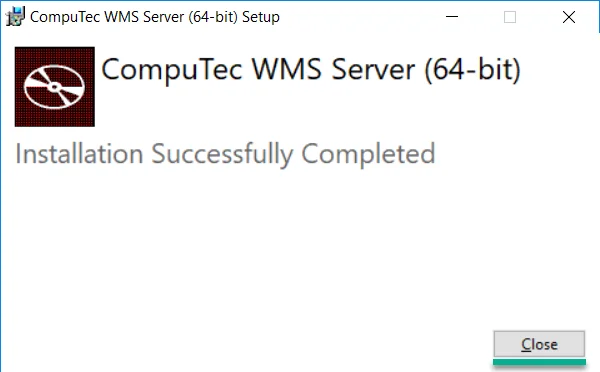
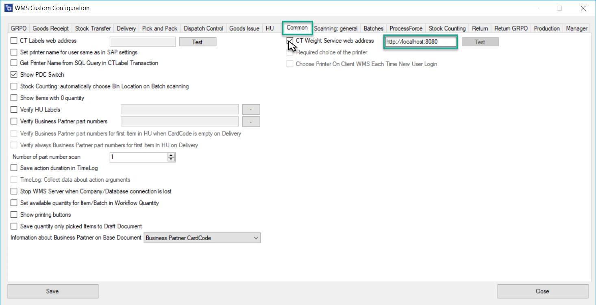
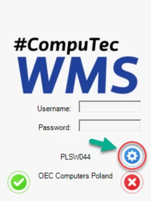

# Integration WMS with Weight Scale Service

:::info
    This document contains a step-by-step guide on installing the WMS server and Client with weight scale support.
:::

:::warning
    If you already have WMS installed, please uninstall it. WMS client and server with support weight must be installed from scratch.

    Net Framework 4.7 is required.
:::

1. To run the CompuTec WMS desktop version, you must install a server and a client unit.
2. To install the server, download and run its installation file. You can find it here: x86 or x64 version.
3. In the window that will appear, click the "Install" button:

    
4. A window with an installation progress will be displayed. Click the "Close" button after a communication about a successful setup:

    
5. Now, you must run the Custom Configuration tool. The application is installed automatically during CompuTec WMS Server installation.

    You can run the application by starting the CustomConfiguration.exe file. It is placed in an installation folder, which is by default in the following location:

    `Local Disk (C:)\Program Files (x86)\CompuTec\CompuTec WMS Server\CustomConfiguration\`

    (the application was installed in a 32-bit version)

    or

    `Local Disk (C:)\Program Files\CompuTec\CompuTec WMS Server\CustomConfiguration\`

    (the application was installed in a 64-bit version)
6. Click the Common tab and click the CT Weight Service web address checkbox to activate.
7. In the web address field type `http://localhost:8080` or `http://Your IP address:8080` and then click the Save button.

    
8. Uninstall the old WMS client and install a new one, then enable the WMS client and go to Settings. You can download it here.

    
9. Click the " Scale " checkbox, choose your scale, then click the save button.

    
10. Your WMS is ready to proceed with the weight scale.
