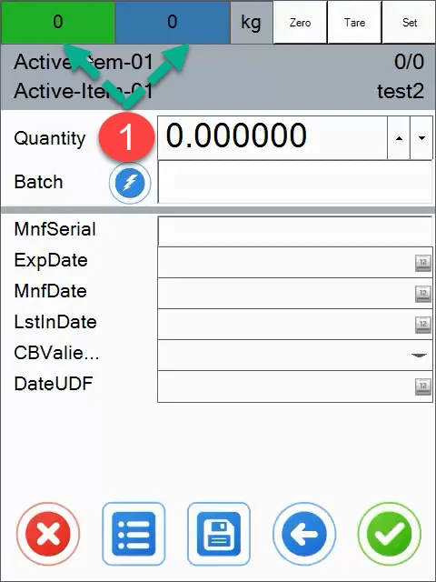
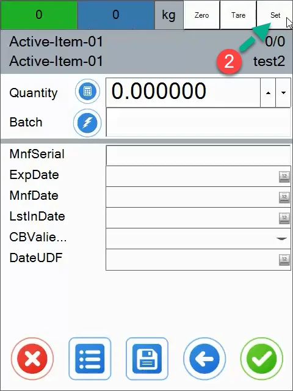
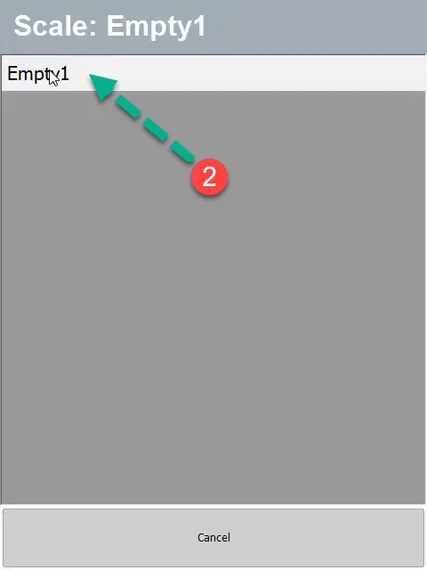
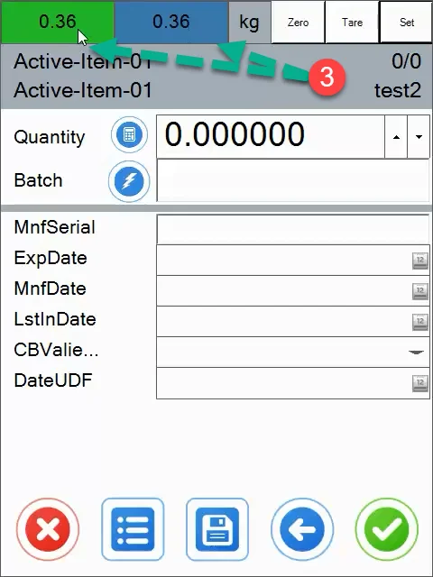
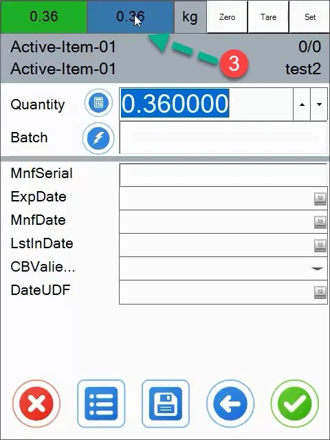
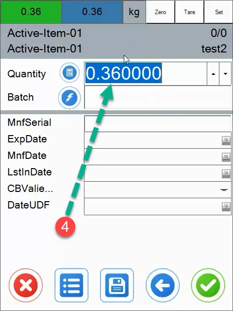
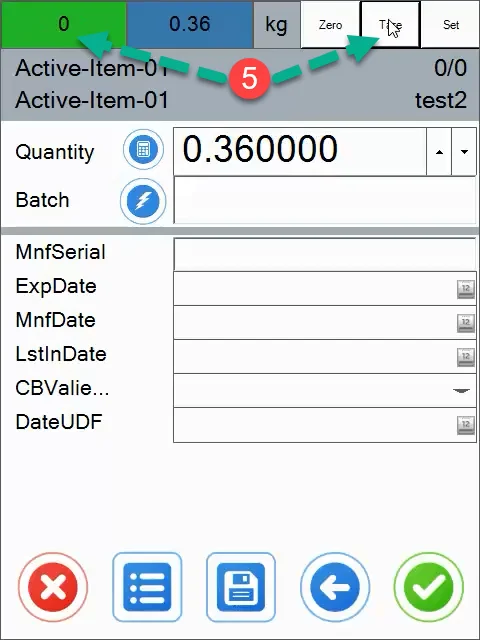
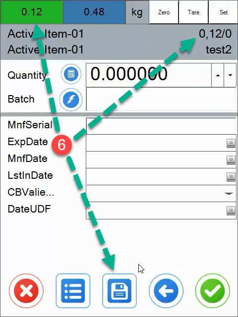
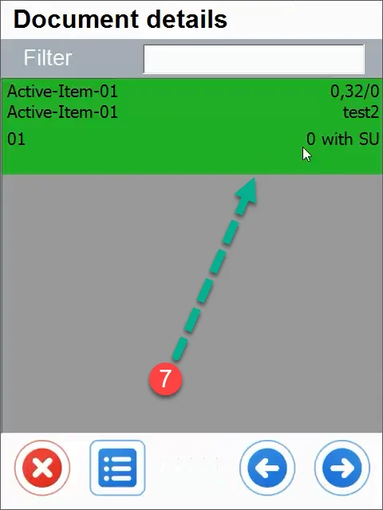

# Showing the operation in WMS

- We create goods receipt PO
- We choose a warehouse
- We choose a supplier
- We choose an index that we will weigh.

1. The green field displays the net weight and the blue field shows the gross weight.

    
2. By using the "Set" button we can select the device with which we want to connect to read the current weight.

    

    
3. As you can see, the scale works, check the quantity box and click on the weight box at the top (green, blue or gray).

    

    
4. The quantity field has been completed.

    
5. We can tare the given weight (e.g: if we weigh something in a box and without it).

    
6. After clicking the save button, the balance is added (we can zero the weight and add another weight). In the last step, we confirm all our operations.

    
7. The weight of the product has been saved and successfully supplied.

    
