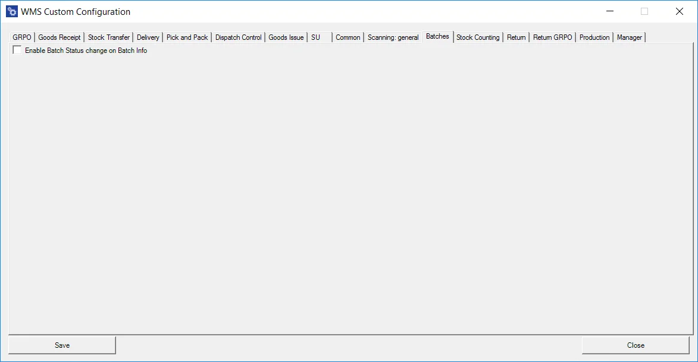

# Batches

**Enable Batch Status change on Batch Info** – checking this option adds the Status field (with a drop-down list) to the Batch Details / UDF form on the Batch/Serial Info workflow. Unchecking the option removes the field and prevents changing the Batch status from the application. **This option is available only for a database with ProcessForce installed**.
