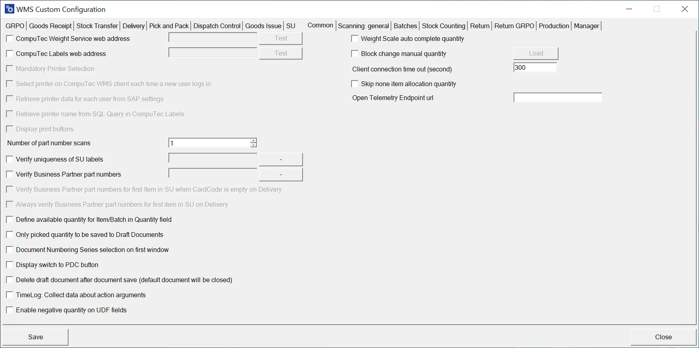

# Common

**CompuTec Weight Service web address** – checking the checkbox enables CompuTec Weight integration. After checking it, enter the CompuTec Weight Web address (available in General options in CompuTec Weight). You can test the connection to the address by using the Test button.

**CompuTec Labels web address** – enables CompuTec Labels integration. Click the Test button to check if the connection is available. Upon checking this checkbox, type in the CompuTec Labels web address (available in CompuTec WMS Client options).

**Mandatory printer selection** – checking this option prevents opening any CompuTec WMS transaction without previously choosing a printer in the client settings.

**Select printer on CompuTec WMS client each time a new user logs** in – self-explanatory

**Retrieve printer data for each user from SAP settings** – CompuTec Labels-related option (available only when the ‘CT Labels web address’ option is checked). By default, choosing from options available in the WMS CompuTec client is possible. When this checkbox is checked, information on printers is taken from SAP Business One setting

**Retrieve printer name from SQL Query in CompuTec Labels** – the name of a printer is taken from SQL query set up in CompuTec Labels settings instead of taking it from SAP Business One or CompuTec WMS

**Display printing buttons** – shows a button for label printing for specific functions

**Number of part number scan** – defines how many times a Business Partner part numbers have to be verified during the transaction

**Verify uniqueness SU Labels** – checks if a number of SU is already present in the system (because a number for an SU for a specific Delivery has to be unique)

**Verify Business Partner part numbers** – choosing which Business Partner Delivery documents are to be verified (by comparing a base document Business Partner with a Business Partner scanned/added during the Delivery transaction). Clicking a button next to the option leads to a list of BPs, from which it is possible to choose required partners

**Verify Business Partner part numbers for the first Item in SU when CardCode is empty on Delivery** – this option is related to the one above. It defines an additional Business Partner part number verification for the first position in an SU

**Always verify Business Partner part numbers for the first Item in SU on Delivery** – self-explanatory

**Define available quantity for Item/Batch in Quantity field** – if this checkbox is checked, the Quantity field is automatically filled with available quantity for a specific Item or Batch

**Only picked quantity to be saved to Draft Documents** – only picked quantity is saved in document draft

**Document Numbering Series selection on the first window** – enables to choose a document series on the first screen of a transaction

**Display switch to PDC button** – displays a button to switch to PDC

**Delete draft document after document save (default document will be closed)** – self-explanatory

**TimeLog: Collect data about action arguments** – saves the whole object sent to the server in TimeLog. It is an extension of the TimeLog option: log files are bigger with this option turned on, but it also allows to collect of more detailed information

**Enable negative quantity on UDF fields** – self-explanatory

**Weight Scale auto-complete quantity** – checking this checkbox automatically fills quantity fields with actual weight scale measurements upon clicking save.

**Block change manual quantity** – when checked, it is only possible to set the amount by scanning

**Client connection time out (second)** – time of inactivity after which a user is logged off

**Skip none item allocation quantity** – when the checkbox is checked, quantity of Items managed by neither Batch nor Serial Numbers is not detracted by the already allocated (e.g., on Pick Lists) quantity. To work correctly on, the option required related options to be checked for needed transactions (Delivery – skip SAP Allocation Quantity, Stock Transfer – skip SAP Allocation Quantity).

**Open Telemetry Endpoint URL** – an address to which diagnostic data is sent from the Android application.
