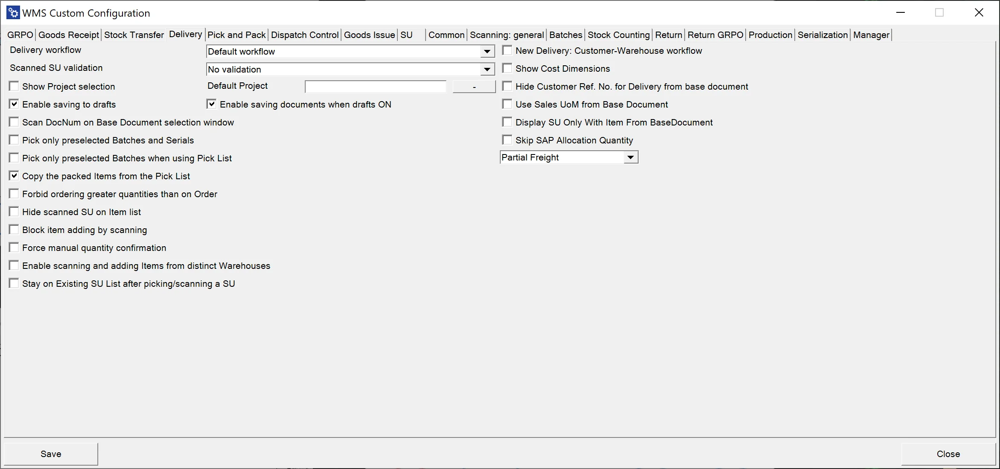

# Delivery

**Delivery Workflow** allows you to choose one of three workflows for Pick Lists: Default, Customer-Date, or Date-Customer.

**Scanned SU validation** – three options: 'Match selected Warehouse,' 'Match any base document, Line,' 'No validation.'

When "Match selected warehouse" is selected, it will block adding Storage Units with a different warehouse than set on the document - for example, when a new, empty Delivery document is created, and a warehouse needs to be chosen.

However, when a user creates a Delivery document from a base document, for example, Sales Order, there is no warehouse selection. Thus this option will not have any effect.

**Show Project selection** – Choosing this option causes displaying a window with Project selection before the Remarks window during the transaction.

**Default project** – choose a project that will be assigned to the document by default.

**Enable saving to drafts** – checking this option causes saving transactions as a draft document.

**Enable saving documents when drafts ON** – checking this option causes saving the transaction as a document or a document draft.

**Scan DocNum on Base Document select workflow** – if the option is checked, it is possible to scan DocNum on a Base Document selection form (instead of DocEntry)

**Pick only preselected Batches and Serials** – disables picking Batches and Serial Numbers Items not preselected on the Delivery transaction – preselection works only on Pick Lists. Thus a user can select those only when creating a Delivery document from a Pick List (also works from Delivery from Sales Order when Batches/Serial numbers are assigned to the Sales Order).

**Pick only preselected Batches when using Pick List** – when the option is checked, only Batches and Serial Numbers chosen for Pick List are displayed.

**Copy the packed Items from the Pick List** – self-explanatory.

**Forbid ordering greater quantities than on Order** – checking this checkbox blocks the possibility of issuing a higher quantity than on a base document.

**Hide scanned SU on Item list** – by default, scanning SU adds quantities of Item on it to a specific Item on the Item list and additionally SU as a line on the list. When the checkbox is checked, Item quantities are added to respective Item lines, but SU is not added as a separate line.

**Block item adding with scanning** – block the possibility of adding an Item by scanning a barcode (only picking it manually is available)

**Force manual quantity confirmation** – with this option checked, it is required to manually confirm the quantity previously set up (scanning a barcode does not confirm it automatically)

**Enable scanning and adding Items from distinct Warehouses** – defines whether Items for one Delivery document may or may not be picked from more than one Warehouse.

**Stay on Existing SU List after picking/scanning a SU** – when the checkbox is unchecked, scanning an SU barcode in the List of SUs screen leads to the Document Details screen (with the scanned SU highlighted). Scanning does not move from the List of SUs screen when the checkbox is checked.

**New Delivery: Customer-Warehouse workflow** – after checking this option on New Delivery, first you have to choose Customer, which leads to Warehouse form (instead of default Warehouse-Customer workflow). With this setting, scanning a Serial number or a Batch number on the Warehouse selection window will use the "Fast Scan," i.e., select warehouse, item, and serial/batch with the quantity provided in the scanned barcode and add it to the document.

**Show Cost Dimensions** – checking this checkbox adds a button (next to the Back button) on the Quantity form that leads to the Cost Dimensions form.

**Hide Customer Ref. No. for Delivery from the base document** – checking this option causes the customer Ref. No. field to be hidden in the Remarks form. (On Delivery transactions, when a user creates a document from a base document, a Customer Ref. No. on the document is filled in from the base documents. If more than one base document is used for a transaction, then the first non-empty Customer Ref. No. is used).

**Use Sales UoM from Base Document** – checking this option displays quantities in Unit of Measure from the Base Document (while still operating on the actual quantities). Saving as document drafts is not possible when this option is turned on. Click here to find out more.

**Display SU Only With Item From Base Document** – self-explanatory

**Skip SAP Allocation Quantity** – allows disabling SAP Business One Batch/Serial Numbers allocation (if needed for some custom changes). The Delivery works within a Warehouse with Bin locations for allocated Batches and Serial Numbers Items.

**Freight (Sales Order field) cost** options:

- **Partial** - default option for CompuTec WMS and SAP Business One (when created from a Pick List)

- **Full freight for first Delivery only** - total Freight cost added only to the first Delivery. The following Deliveries have no freight cost assigned (SAP Business One behavior with Delivery from Sales Order).

- Always charge full freight - total freight cost from the base document.
