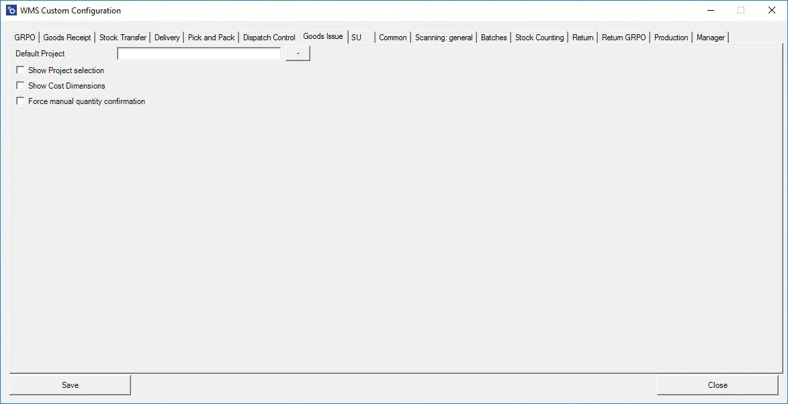

# Goods Issue

**Default Project** – if a default project is chosen, clicking the right arrow icon on the Project selection form is possible. A default project set up here will be selected automatically.

**Show Project selection** – choosing this option results in displaying the Project Selection form before the Remarks form when creating a document (to which it is required to add receiving Items). If a default project is set up in Custom Config, it is possible to skip project selection (by clicking the right arrow on the Project selection screenshot), and the default project will be chosen.

**Show Cost Dimensions** – checking this checkbox adds the Cost Dimension form to the transaction.

**Force manual quantity** – checking this checkbox force manual quantity confirmation – scanned quantity will be added to a quantity field. If the checkbox is not checked, the amount scanned is automatically approved. Still, it will have to be confirmed by pressing an on-screen button.
