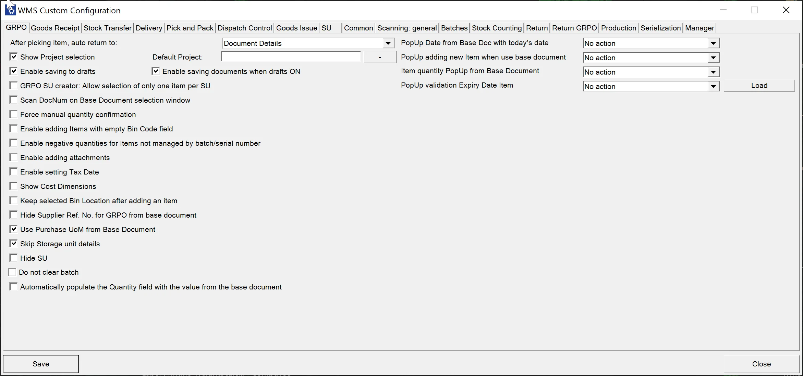

# GRPO

**After picking an item, auto return** – this option allows you to change the window to which the application will go after setting and confirming the quantity for an Item.

**Show Project selection** – choosing this option results in displaying the Project Selection form before the Remarks form when creating a document (to which it is required to add receiving Items).

**Default Project** – if a default project is chosen, clicking the right arrow icon on the Project selection form is possible. A default project set up here will be selected automatically.

**Enable saving to drafts** – allows saving documents as document drafts.

**Enable saving documents when drafts ON** – allows deciding on the Remarks form whether to save a transaction as a document or a document draft.

**GRPO SU creator: Allow selection of only one item per SU** – this option prevents the user from picking more than one Item from a base document for an SU when creating it by using SU Creator in Goods Receipt PO transaction. For example, this option can be used, e.g., when we want to create pallets with a single type of Item.

**Scan DocNum on the Base Document selection window** – checking this option allows you to scan a document by Docm, not by DocEntry.

**Force manual quantity confirmation** – with this option checked, it is required to manually confirm the quantity previously set up (scanning a barcode does not confirm it automatically).

**Enable adding Items from multiple Warehouses** – if the option is checked, adding Items from different Warehouses is possible, and the Warehouse window will be displayed during the transaction.

**Enable adding Items with Empty Bin Code field** – it allows to add Items without Bin Code to a Warehouse with Bin Locations. If enabled, an Item with an empty Bin Code will be assigned to the first available Bin.

**Enable negative quantities for Items not managed by batch/serial number** – allows using negative quantities for Items managed neither by Batches nor Serial Numbers.

**Enable adding attachments** – allows adding attachments to documents. If a scanner device is used, the option automatically turns on a camera to take a picture and add it as an attachment.

**Enable setting Tax Date** – allows selecting a Tax Date on the Remarks form.

**Show Cost Dimensions** – checking this checkbox adds a button (next to the Back button) on the Quantity form that leads to the Cost Dimensions form

**Keep selected Bin Location after adding an item** – after picking an Item, the Bin Location field will not be cleared (keeping the same Bin Location)

**Hide Supplier Ref. No. for GRPO from the base document** – checking this option causes the Supplier Ref. No. field to be hidden in the Remarks form (related to base documents: Purchase Order, A/P Reserve Invoice). (On GRPO transactions, when a user creates a document from a base document, a Supplier Ref. No. on the document is filled in from the base documents. If more than one base document is used for a transaction, then the first non-empty Supplier Ref. No. is used).

**Use Purchase UoM from Base Document** – checking this option displays quantities in Unit of Measure from the Base Document (while still operating on the actual quantities). Saving as document drafts is not possible when this option is turned on. Click here to find out more.

**Skip Storage Unit details**

**Hide SU**

**Do not clear batch** – when checked, the application stays in the Quantity screen after adding a Batch.

**Automatically populate the Quantity field with the value from the base document** – self-explanatory.

**PopUp Date from Base Doc with today's date** – an application message with a warning about the receive date of the document being older than today

**PopUp adding new Item when using base document** – an application message with a warning about adding an Item to a Base Document.

**Item Quantity PopUp from Base Document** – an application message with a warning about exceeding Up Quantity from the related Purchase Order. It is possible to either display a warning with a continue button or to block the action (please note that for A/P reserve Invoice, it is only possible to block the action)

**PopUp validation Expiry Date Item** – an application message with a warning about the Item expiration date. It is based on ProcessForce Item Details (Batches tab > Expiry Date) or MS SQL query (in case of using the MS SQL query: if the query is empty, validation is not displayed)
