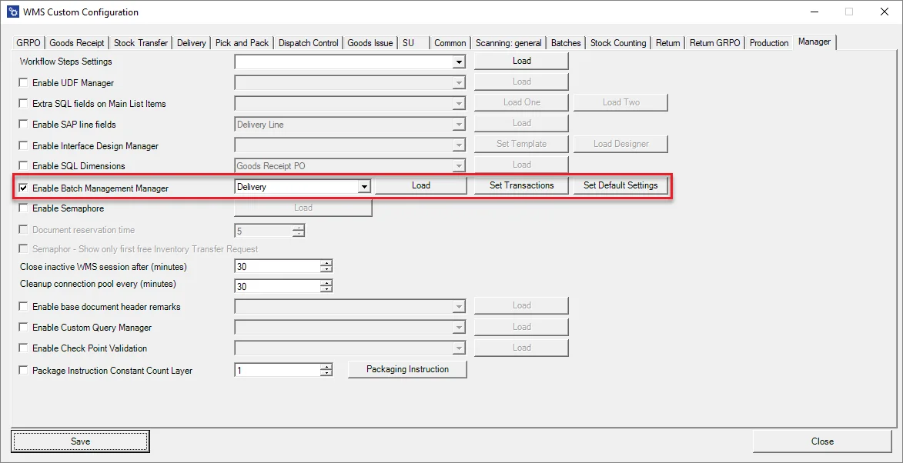
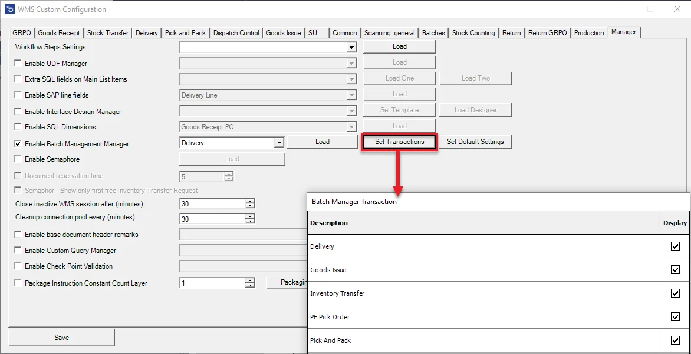
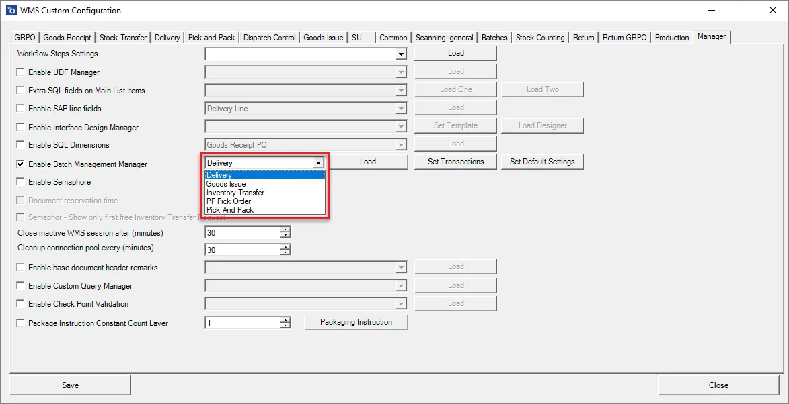
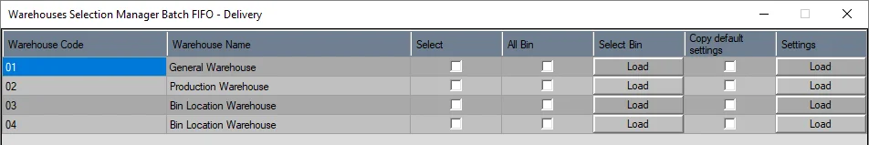
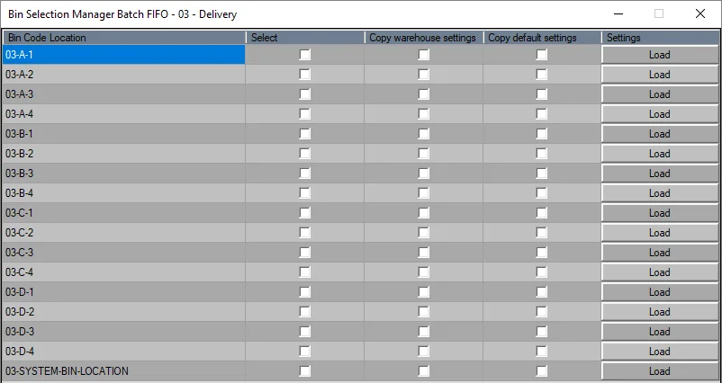
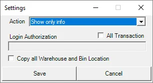
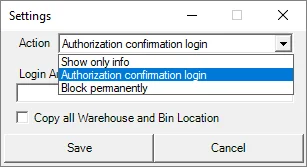
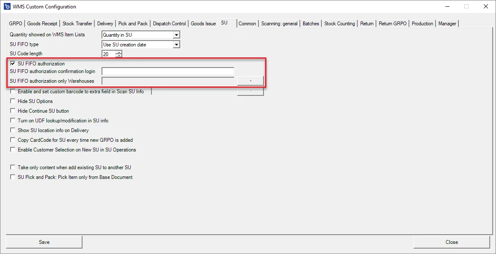

# Batch Management Manager

Batch Management Manager's purpose is to define FIFO behavior.

---

Check the Enable Batch Management Manager checkbox to use the option:

1. Set transaction(s) to be configured:

    
2. Choose a transaction to be configured and click Load:

    
3. A specific transaction configuration form (Delivery in this case) will be displayed with a list of Warehouses:

    

    Columns:

    1. Warehouse Code.
    2. Warehouse Name.
    3. Checking queue option checkbox.
    4. All Bins from a specified warehouse checkbox – used when all the Bin Locations have to have the same settings set up.
    5. Loading Bin choice form.
    6. Copy default settings.
    7. Assigning settings to a specific Warehouse.

    Bin localization configuration form:

    

    Columns description:

    1. Bin Code.
    2. Checking queue option checkbox.
    3. Copying settings from a Warehouse.
    4. Copying default settings
    5. Assigning settings to a specific Bin.
4. Set default Settings.

    

    

    Action:

    - Show only info – a default setting: showing information that a specified Batch is not the first in a queue; it can be skipped.
    - Authorization confirmation login – a specified user authorization is required to skip a Batch in a queue.
    - Block permanently – blocking or skipping a Batch is a queue.

    All Transaction checkbox – if the checkbox is checked, the Manager works on every available transaction (and the Set Transaction button is blocked). If the checkbox is unchecked, it is required to choose a specific transaction manually.

    Copy all Warehouse and Bin Locations – check this checkbox to assign default settings for every Warehouse and Location. In this case, setting up the configuration for a specific Warehouse/Location is impossible.

## Additional information

- It is not required to restart the WMS Server after changes were made in the Batch Management Manager
- Double click left mouse button on a column name to check all the checkboxes in the column
- Double-click the right mouse button on a column name to uncheck all the checkboxes in the column
- SU FIFO settings are now in the SU tab:

    
