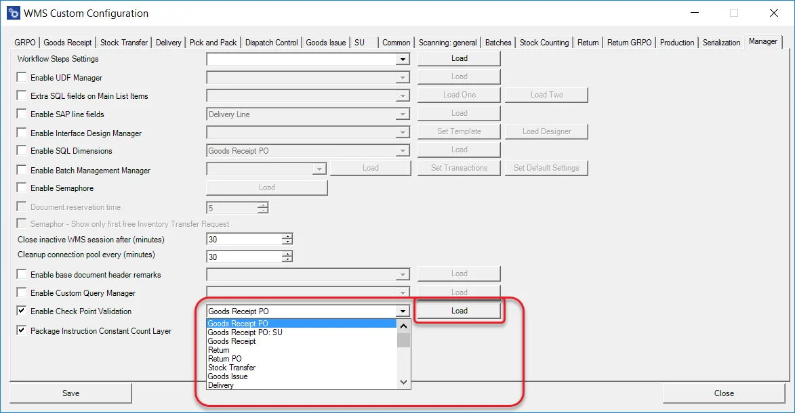
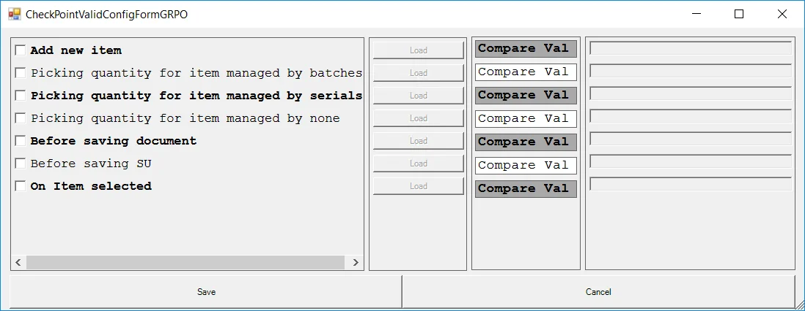
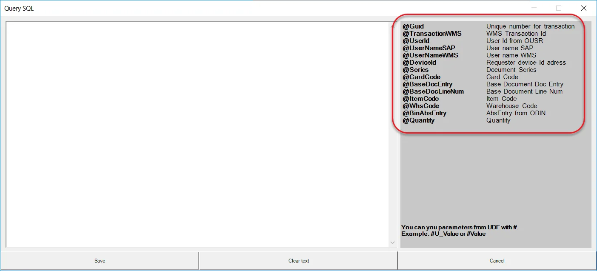
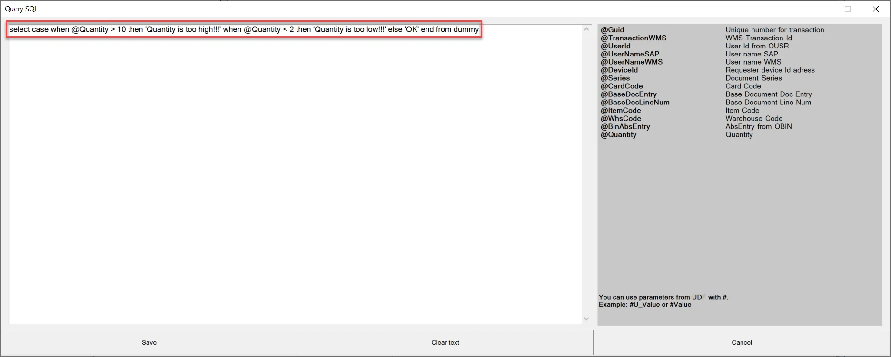
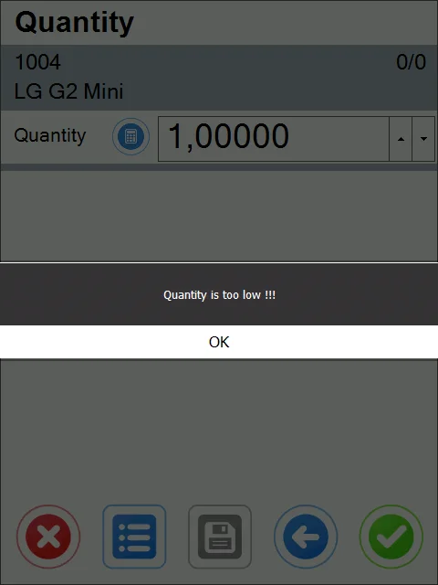
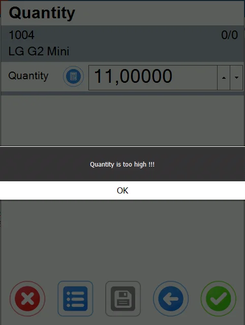

# Check Point Validation usage

Go to Custom Configuration, Manager tab. Check Enable Check Point Validation. Choose a required transaction from the drop-down list and click Load.



There are 6 points during transactions at which validation can take place:

- Adding New Items
- Picking quantity for an Item managed by Batches
- Picking quantity for an Item managed by Serial Numbers
- Picking quantity for an Item managed neither by Batch nor Serial Numbers
- Before saving a document
- Before saving an SU
- On Item selection.



- Check a checkbox of a required point and click Load. In the Compare Value field, put a value the system will compare with a query result. If the value is the same, it allows a user to pass to the next step. If not, the query result will be displayed to the user.
- In the right panel, there is a list of all parameters that can be used for the creation of a query/rule:

    
- In the following example, we have a simple rule for adding quantity for an Item managed neither by Batch nor Serial Numbers. If a user sets a quantity lower than two and higher than 10, a message will be displayed, and the amount will not be added.
  
    For HANA:

    ```sql
    Select case when @Quantity > 10 then 'Quantity is too high!' when @Quantity < 2 then 'Quantity is too low!' else 'OK' end from dummy
    ```

    For MS SQL:

    ```sql
    select case when @Quantity > 10 then 'Quantity is too high!' when @Quantity < 2 then 'Quantity is too low!' else 'OK' end
    ```

    
- In the screenshot below, you can check how the example works:

    

    
