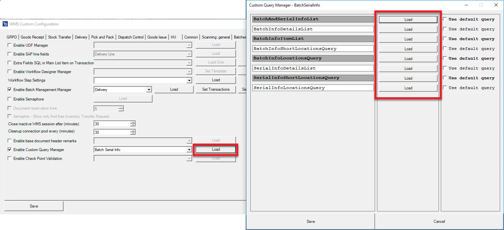
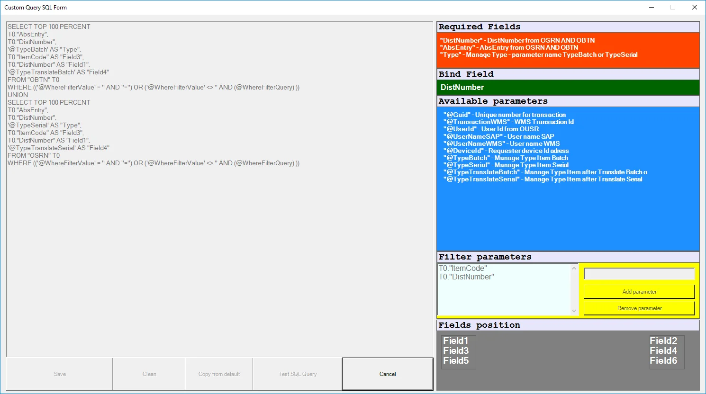

# Overview

## Introduction

Custom Query Manager allows to put additional information to specific screens in CompuTec WMS transactions by using customized queries. In this section, you will find information on how to use the option.

---

## Enabling the option

1. Go to Custom Configuration, Manager tab.
2. Check the Enable Custom Query Manager checkbox.
3. Choose a required transaction from a drop-down list and click Load.
4. Checking Use default query option blocks the creation/editing of a query and the default query is used:

    

    

5. Unchecking the option allows you to create your own query or edition of the default one:

    
