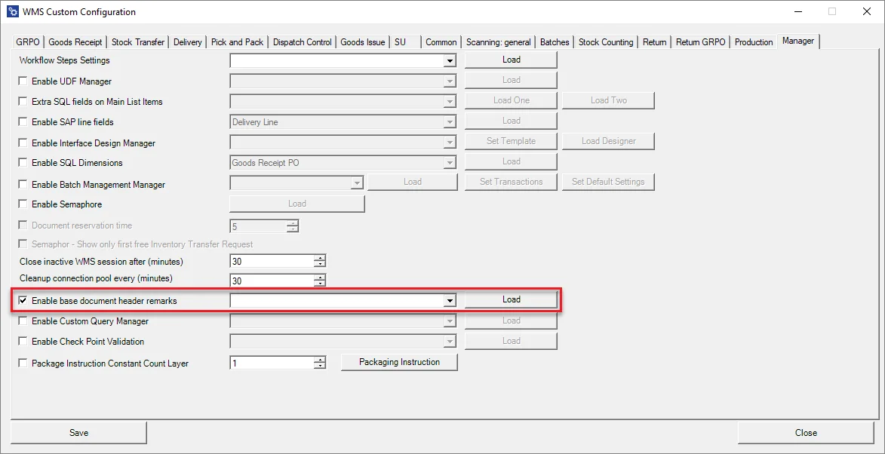
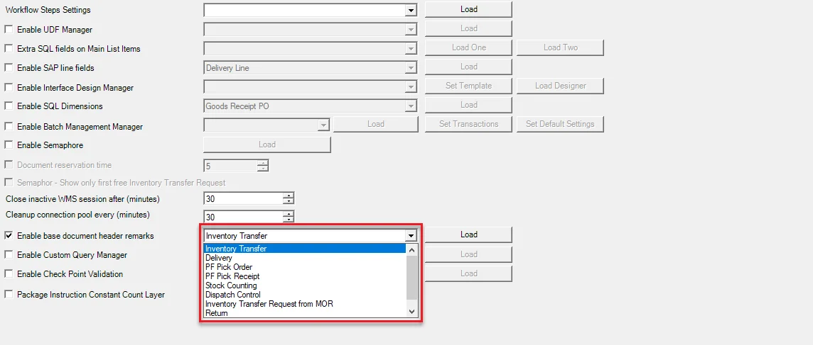
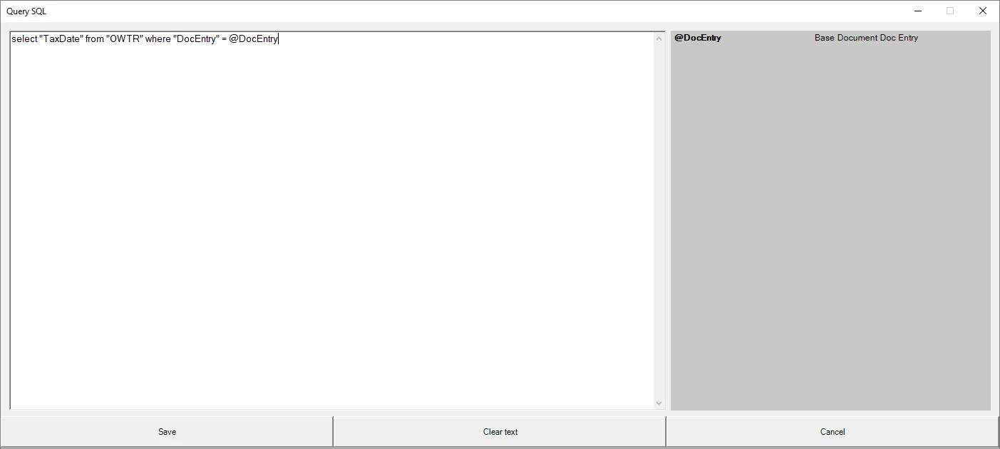
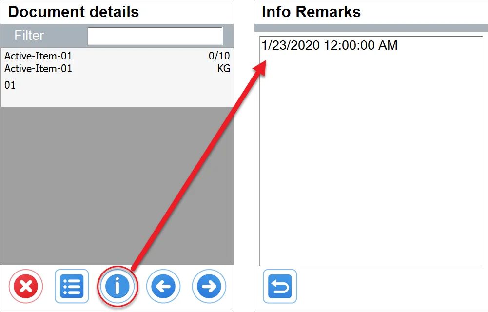

# Enable base document header remarks

This option allows to set additional fields for a header.

1. Check the checkbox, choose a transaction from the drop-down list and click Load:

    

    The option is available for the following transactions:

    - Goods Receipt PO
    - Inventory Transfer
    - Delivery
    - ProcessForce Pick Order
    - ProcessForce Pick Receipt
    - Goods Receipt
    - Stock Counting
    - Dispatch Control
    - Inventory Transfer Request from Manufacturing Order
    - Return
    - Return PO
2. Here you can put an SQL query, the result of which will be displayed in the header.

    
3. Upon opening the related document (Inventory Transfer from Transfer Request in this case), there is an additional button in the Document details window:

    
