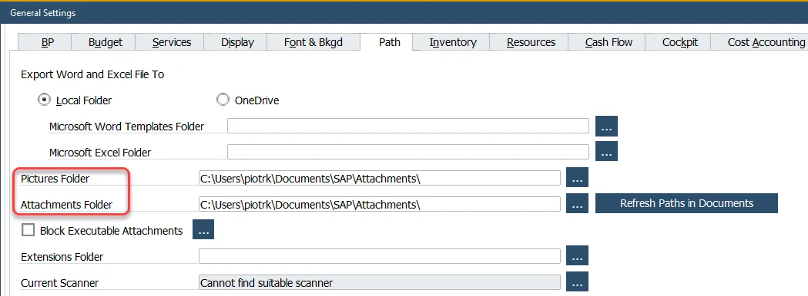
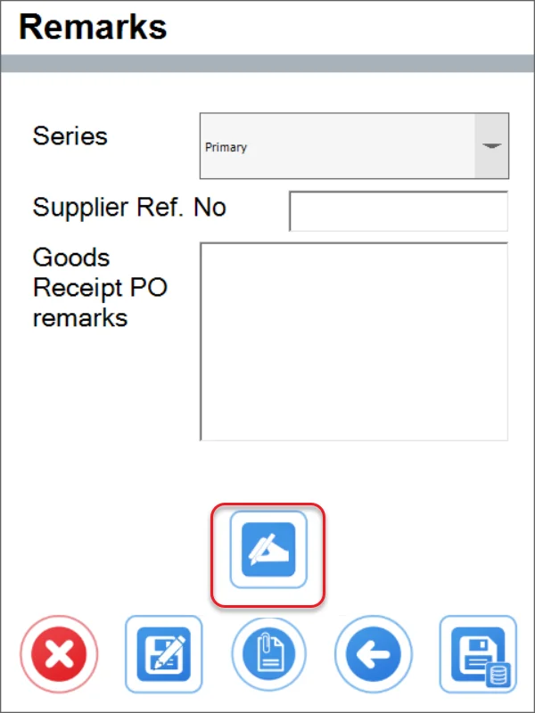
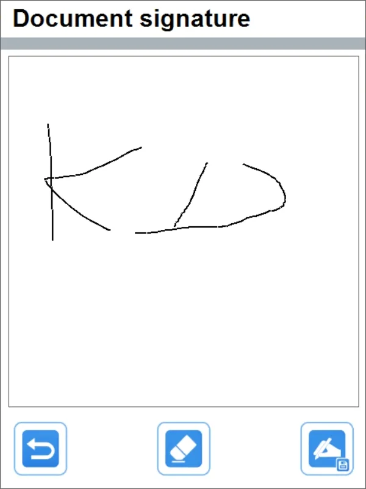

# Enable Signing Document

The option allows input and save a signature for a number of documents created in CompuTec WMS.

---

## Requirements

### Set up the picture and attachment paths

It is required to set the Pictures and Attachments path different than the default ones in SAP Business One (Both paths – Picture Folder and Attachments Folder – have to be the same to see the signature in the related UDF in the related documents in SAP Business One).

You can do it in SAP Business One Main Menu → Administration → System Initialization → General Settings → Path tab:

### Install the CompuTec WMS objects

You can check how to do it here.

### Interface Design Manager

If you are using a custom menu view in Interface Design Manager, please uncheck it checkbox and log in to all of the devices. After this, you can go to the Designer and reassign the custom view. Now you can check the Signing option.

## Usage

Open Custom Configuration, go to Manager tab and check the Enable Signing Document check box. Then click the Load button next to it to choose the required documents.

Checking the Display checkbox activates the option (it is then available in the Remarks form of the specific document):

Checking the Required checkbox blocks saving of a document without a signature.

Clicking the highlighted icon leads to the Document Signature form:

Use the three icons (from left) to:

- go back without saving
- erase already started signature
- save a signature.

A saved signature is then available in SAP Business One in the related document's UDFs: open a specific form (e.g. Goods Receipt PO), find the document, click Ctrl + Shitf + U. The saved signature is available in the Signature Document fields. Click it to get the full view.

### Document drafts

It is possible to save a signature for document drafts. Then, a document draft like this can be saved as a document. If the signature is not required then the signature saved in a draft is saved to SAP Business One. If the signature is required, it is required to input it again.
