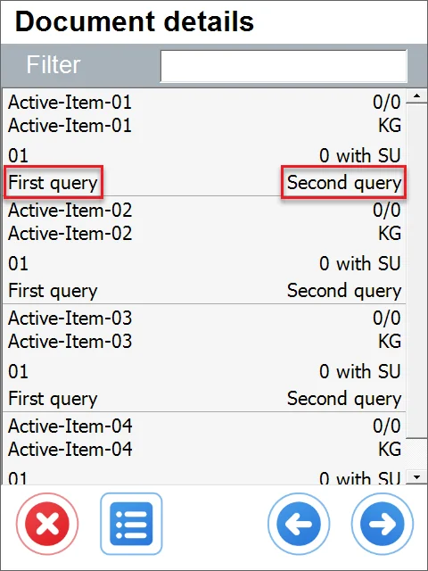
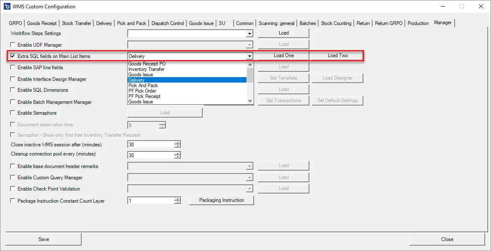
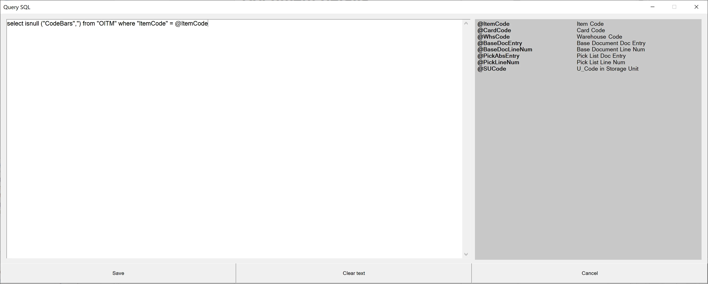
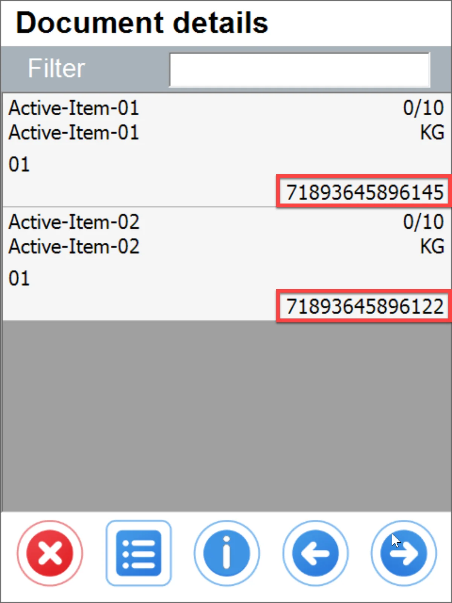
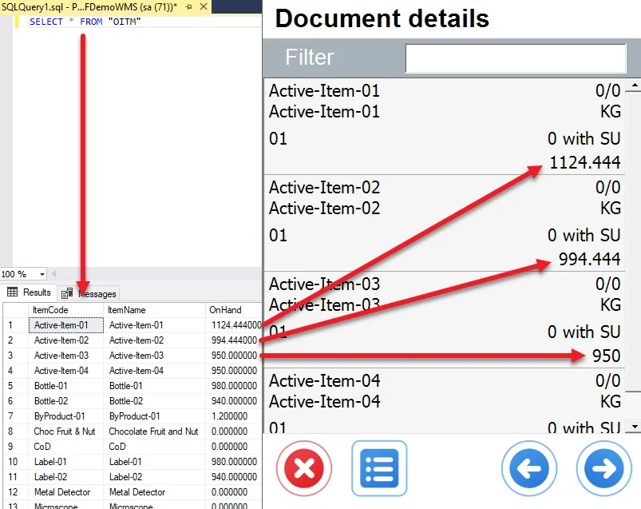

# Extra Fields SQL in Main List Item on Transaction

Adding up to two customized values on the Item row on CompuTec WMS transactions is possible. It is possible to choose different values for different transactions. The values are based on SQL queries. The option is available from Custom Configuration.

Using the Filter field, you can filter records on the lists in Main and Document details forms by values in these fields.



## Settings

- To activate the option, go to Custom Configuration > Manager tab > and check Extra Fields SQL in Main List Item on Transaction checkbox.

    
- Click the down arrow and a field next to the checkbox to open a drop-down list to choose a required transaction. It is necessary to log in to a database upon this action.
- Click Load One to set up the value for the first field (it will be displayed on the spot of Query result 1 from the example screenshot above), click Load Two to set up the value for the second field (it will be displayed on the spot of Query result 2 from the example screenshot above). This leads to the SQL Query form:

    

    The right panel holds CompuTec WMS constants for a specific document type (chosen from the list from the previous screenshot).
- Put a required SQL query in the left panel and click Save.

## Example SQL queries

### UDF

In this example, we want to add ItmsGrpCod (Item Group Code) where the value is 105 to the first extra field on the Item list on Delivery Transaction:

The SQL query:

```sql
select isnull ("CodeBars",'') from "OITM" where "ItemCode" = @ItemCode
```

The result:



## Quantity On Hand

In this example, we want to put a total amount (On Hand) to the second field on the Item list on the Delivery transaction:

The SQL query:

```sql
SELECT "OnHand" FROM "OITM" WHERE "ItemCode" = @ItemCode
```

The result:


