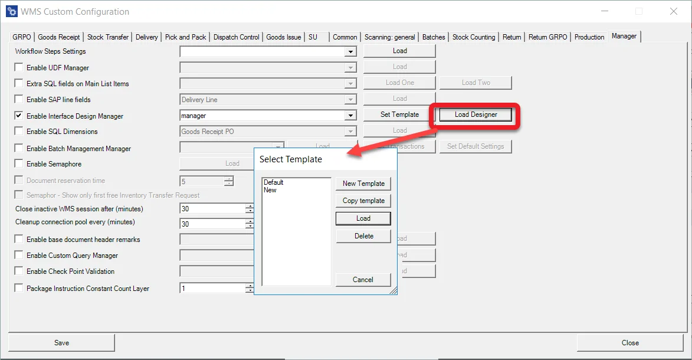
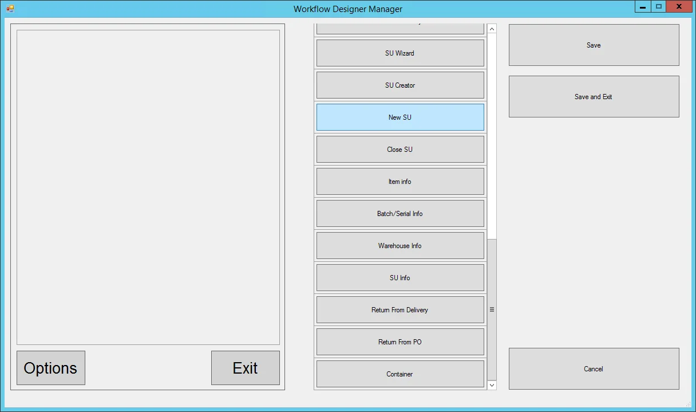
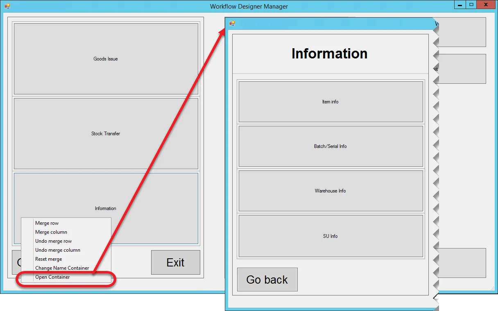
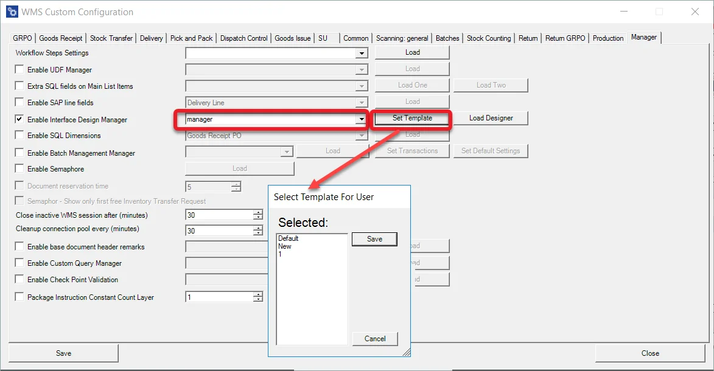

# Interface Design Manager

Workflow Designer Manager allows the creation of main menu layout templates and assigning them to a specific user. Thanks to it, it can be adjusted to individual needs, e.g., by putting main menu options into folders. Using Workflow Designer Manager to give a specific employee access only to particular options is also possible.

---

## Activating the option

To create and assign templates, go to Custom Configuration, Manager tab, and check the Enable Workflow Designer Manager checkbox.

## Creating a template

Clicking Load Designer leads to the Select Template form. Choose a template on the left side of the form and click Delete to delete it or Load to open it.

In the new window on the left, there are available Templates; on the right, actions we can take:

- New Template – create a new Template from scratch
- Copy template – highlight a Template and click Copy template to create a copy
- Load – highlight a Template and click Load to start editing it
- Delete – highlight a Template and click Delete to remove it from the list.

## Editing

Clicking Load leads to Workflow Designer Manager, where it is possible to create a main menu template:

The form is divided into three panels:

- The one on the left is a mock-up of the application's main menu. Use the right-click context menu to add rows and columns. Doing so creates grids.
- the center one lists all of the transactions available from the application's main menu. Drag and drop it to the mock-up to fill a specific grid. You can drag and drop it back to the center panel to use it in another place.
  
    This panel also contains a Container element: it allows storing many transactions in one folder. Clicking a container on a main menu leads to another form with the container's content. It is possible to use container elements multiple times. It is also possible to create a multilevel menu using it. You can change a container's name using a context menu option.
- the right one contains general options: saving or canceling changes and saving and quitting the manager.

After adding some transactions to grids, it is possible to merge rows or columns. You can reach the option from a right-click context menu.

### Example

In the following example, we created a main menu template for users using Goods Issue and Stock Transfer transactions. We also use a container to group some of the informational options.

#### Default template

Workflow Designer Manager comes with one predefined template. If Interface Design Manager is not used, this template will be used by default. You cannot load it for editing. It can be copied and then edit the copy.

### Assigning a template to a user

A template must be assigned to a specific SAP Business One user to work on.

Click the drop-down list next to Enable Interface Design Manager to choose a user to whom a template will be assigned. This action requires logging in to a database to download a list of users. After this, select a required user from a drop-down list.

Click Set Template, choose a template assigned to a user, and click Save.

:::warning
    Restarting the CompuTec WMS Server is required to apply the changes to a user.
:::
