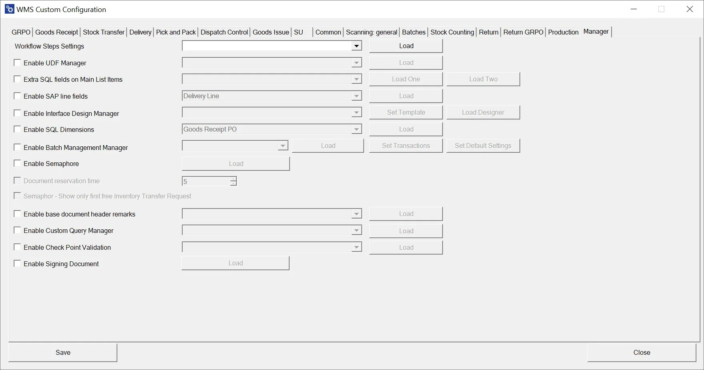

# Overview

**Workflow Step Settings** – allows choosing a workflow for a specific transaction. Click here to find out more.

**Enable UDF Manager** – UDF Manager allows to manage User Defined Fields during transactions.

**Extra SQL fields on Main List Items** – this option allows the display two additional values on the Item row on specific transactions. Click here to find out more.

**Enable SAP line fields** – this option allows the add document line fields to be displayed during transactions. Click here to find out more.

**Enable Interface Design Manager** – this option allows to customize main menu options. Click here to find out more.

**Enable SQL Dimensions** – allows for the automatic choice of dimensions in transactions based on an SQL query (instead of choosing it manually during a transaction). The option is available for Goods Receipt PO, Goods Receipt, Return, Return PO, Stock Transfer, Goods Issue, and Delivery.

**Enable Batch Management Manager** – this option allows to define of FIFO behavior. Click here to find out more.

**Enable Semaphore** – this option allows to activation of the Semaphore option in chosen transactions. Click here to find out more.

**Document reservation time** – period of a document being reserved for a specific user. Click here to find out more.

**Semaphore** – Show only the first free Inventory Transfer Request – if checked, only the first open document will be available on the list of documents in the Inventory Transfer Request transaction (instead of all of the documents)

**Enable base document header remarks** – click here to find out more.

**Enable Custom Query Manager** – find out more information on this here.

**Enable Check Point Validation** – find out more about it here.

**Package Instruction Constant Count Layer** –

**Enable Signing Documents** – find out more information on this here.
