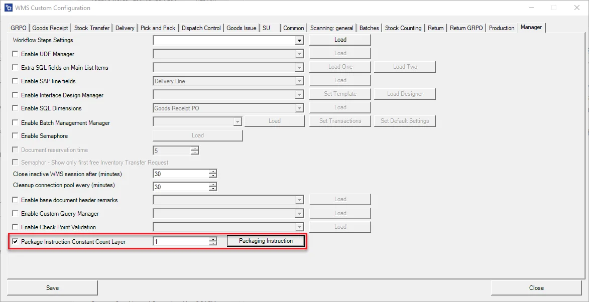
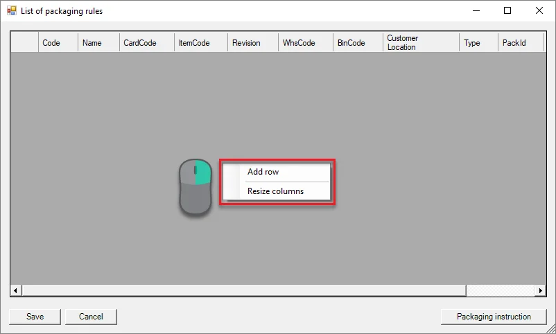
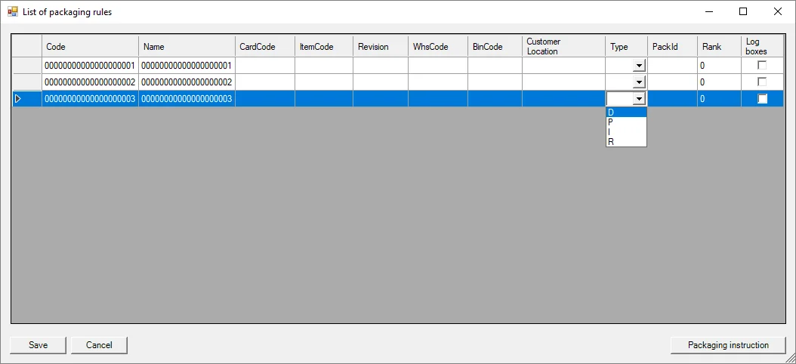

# Package Instruction Constant Count Layer

Here it is possible to packaging instructions.

1. To use the option, check the highlighted checkbox and click Packaging Instruction button.

    
2. List of packaging rules form is open. Right-click to add a row (or to resize columns).

    
3. Add the required number of rows. Each of these contains the following columns:

- Code – packaging code
- Name – packaging name
- CardCode – Business Partner Code
- ItemCode – Item Code
- Revision – Item's revision
- WhsCode – Warehouse code
- BinCode – Bin location code
- Customer Location – Customer localization
- Type:
  - D
  - P
  - I
  - R
- PackID – ID of this pack
- Rank – rank of this pack
- Log boxes – mark this checkbox if you want to

