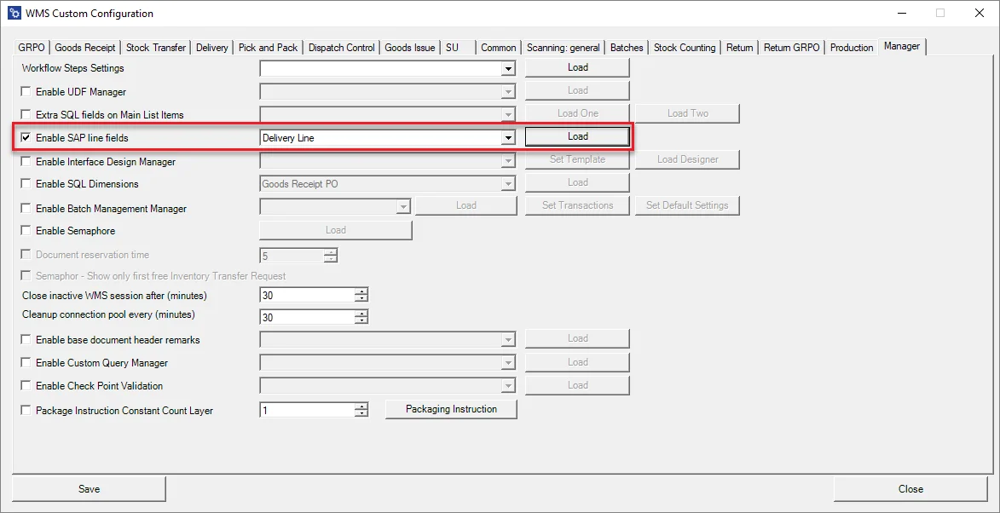
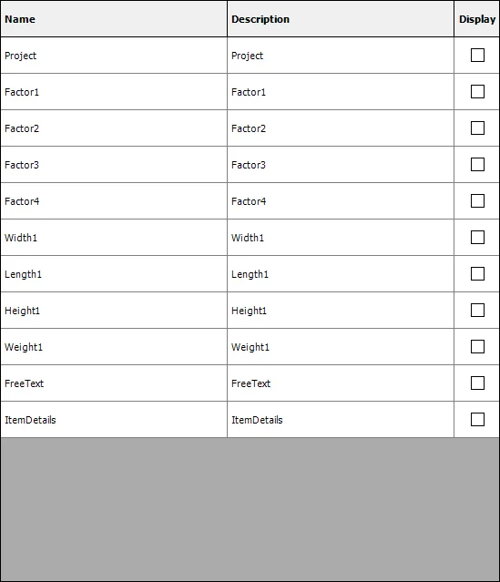
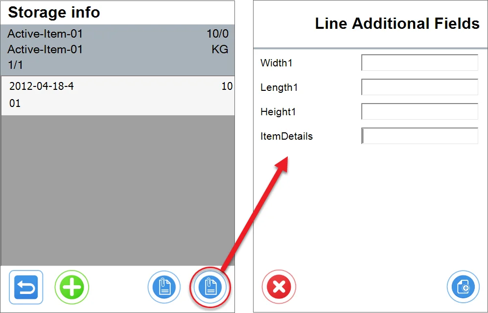

# SAP Line Fields

This option allows you to display additional document line fields during transactions. Let's check it based on the Delivery Transaction.

Check the Enable SAP line fields, choose a transaction, and click load.

A new window with available fields is displayed. Check the checkboxes of the fields that are required to be displayed:

Now, on each line on Delivery, there are additional fields available:

