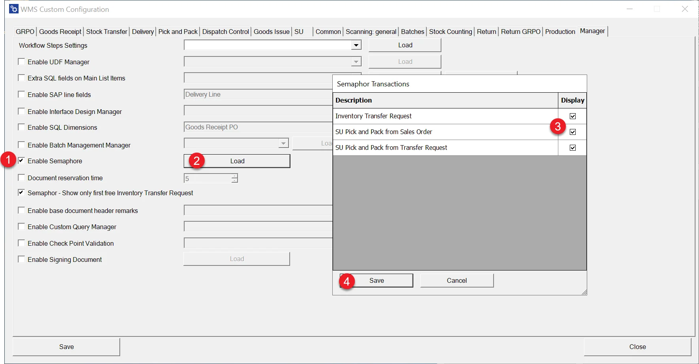
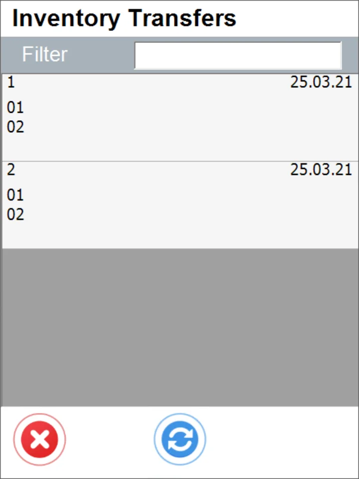

# Semaphore

When the option is activated, a document one user chooses is unavailable for another.

The option prevents the work of many people on one document and allows the control of a queue of documents. This option is available for Inventory Transfer Requests, SU puck and Pack from Sales Orders, and SU Pick and Pack from Transfer Requests.

---

## Settings

To activate the option, check the Enable Semaphore checkbox in Custom Configuration, click Load, choose the required document types, and click Save:

**Document reservation time** – time in minutes when a document chosen from a document list stays active after the last action (any clicking, like selecting an Item or choosing an arrow back). If the document is inactive for the set time, it is again available from a document list. If this option is disabled, the document is active without time constraints (it is never dismissed to a document list).

## Usage

When the option is activated, an active document (chosen from a document list and some actions are taken on it, e.g., selecting Items) is not available to choose from the document list by another user.

Example document list:

Main Menu → Stock Transfer → From Transfer Request:

The list does not change dynamically, which means that upon choosing a document, you can get a message about the document being reserved already. To avoid it, click the refresh button (lower-middle edge) before selecting a document.
