# UDF Manager

On this page, you can find information on UDF Manager, a tool that allows you to choose which User Defined Field (UDF) will be displayed on the document line in CompuTec WMS.

UDFs are custom fields that can be added to document types to add information to a document.

---

## General

### Prerequisites

It would be best to first define UDFs in a database to use during CompuTec WMS transactions. You can check how to add UDFs to document type and manage it here.

### Setting up

Go to Custom Configuration options > Manager tab, check the Enable UDF Manager check box, and choose a document type from the drop-down list for which UDFs will be added:

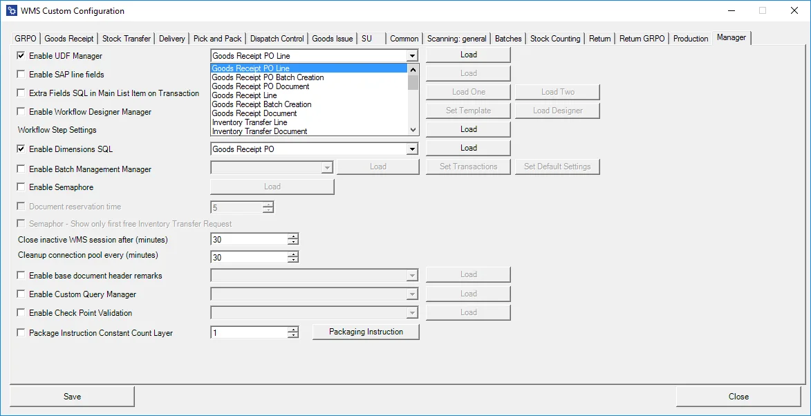

You can set up values for a header (e.g., Goods Receipt PO Document option) or a document line (e.g., Goods Receipt PO Line).

After choosing a required document type, click load (doing this requires putting in SAP Business One database credentials). Now, a list of UDFs defined for the chosen kind of document is displayed:

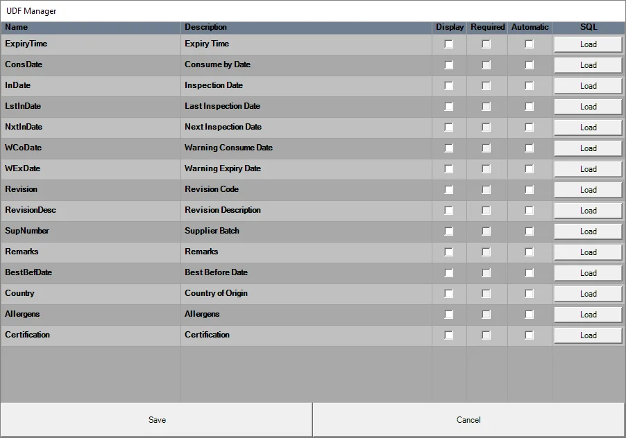

There are Name and Description fields along with three check boxes; when checked:

- Display: a UDF is displayed in the application
- Required: a UDF is required to be filled before moving through the workflow.
- Automatic: a UDF automatically fills the application with a query result. Click Load next to a specific line to go to the query form:

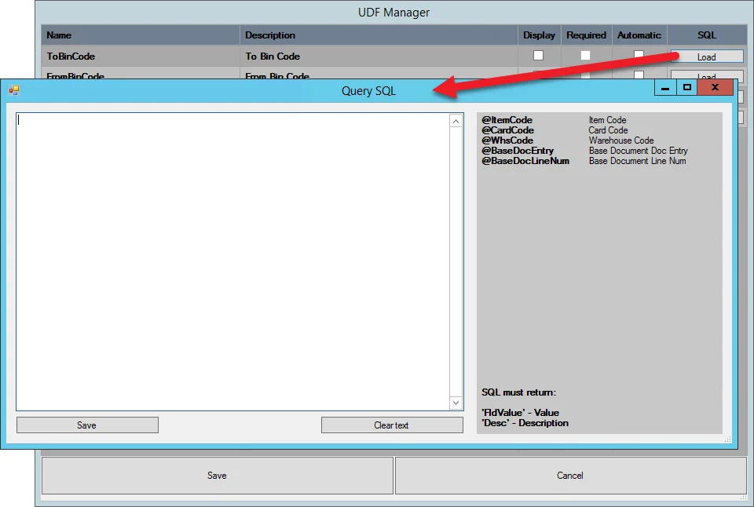

Now, the chosen UDFs will be displayed on lists during transactions.

You can change the order of the fields by dragging and dropping its line on the UDF Manager list (be sure to click and hold text from the Name or Description column).

Revision and Revision Description fields

For these UDFs, it is required to load an SQL query in Custom Configuration UDF Manager to get the UDFs displayed in CompuTec WMS:

#### Revision and Revision Description fields

For these UDFs, it is required to load an SQL query in Custom Configuration UDF Manager to get the UDFs displayed in CompuTec WMS:

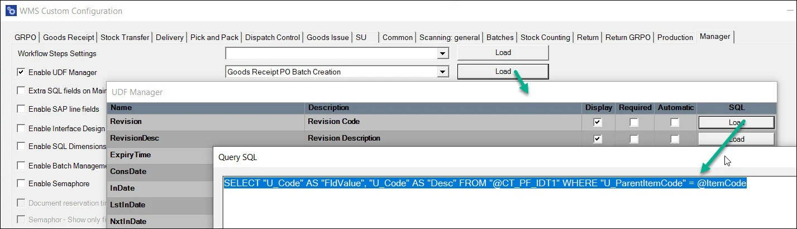

```sql
SELECT "U_Code" AS "FldValue", "U_Code" AS "Desc" FROM "@CT_PF_IDT1" WHERE "U_ParentItemCode" = @ItemCode
```

```sql
SELECT "U_Description" AS "FldValue", "U_Description" AS "Desc" FROM "@CT_PF_IDT1" WHERE "U_ParentItemCode" = @ItemCode
```

Then, in WMS, the user will be able to choose a revision and its description that matches the item

With this setup, the user can choose Revision and its description that matches the Item from CompuTec WMS level.

## Usage

### Document UDFs

Document UDFs are available on the Remarks screen:

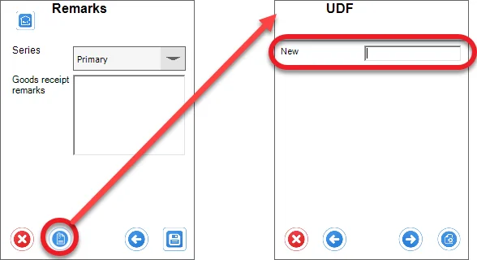

Set up the required value, click the Save icon to save it, and return to the Remarks screen.

Click an arrow icon to go back to the Remarks screen without saving.

### Line UDFs

Line UDFs are available from specific line screens in the transactions:

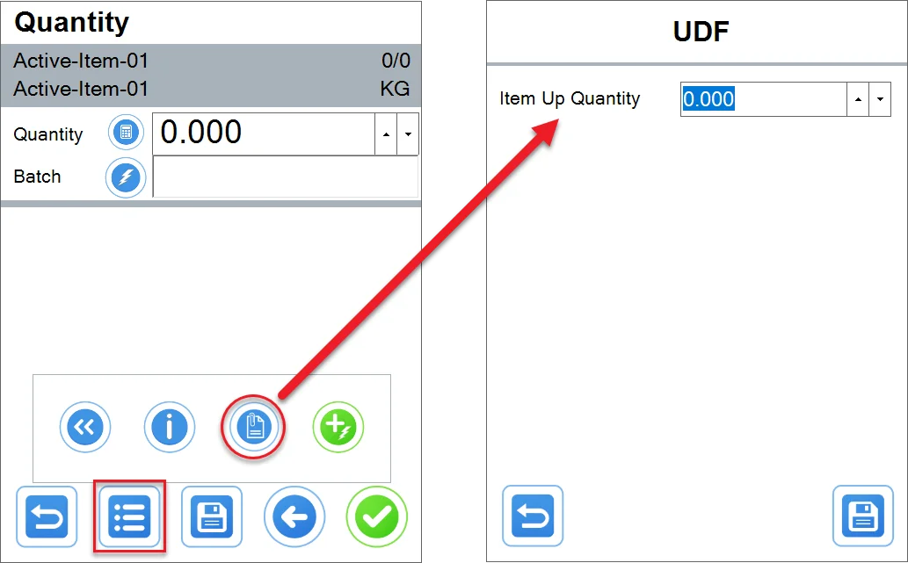

### Example

Example

In this example, we want to add a UDF with a Bin location, to which we want to move Items on creating Inventory Transfer. We do not want to add value, but choose one from a drop-down list.

- Check the UDF Manager checkbox, choose Inventory Transfer Line, and click Load.
- Check the Display option on the ToBinCode line and click Load.
- Put in the following query:

    ```sql
    select "BinCode" as "FldValue", "BinCode" as "Desc" from OBIN
    ```

#### Result

The field is available by clicking a UDF icon to set up the details of an item chosen to be transferred.

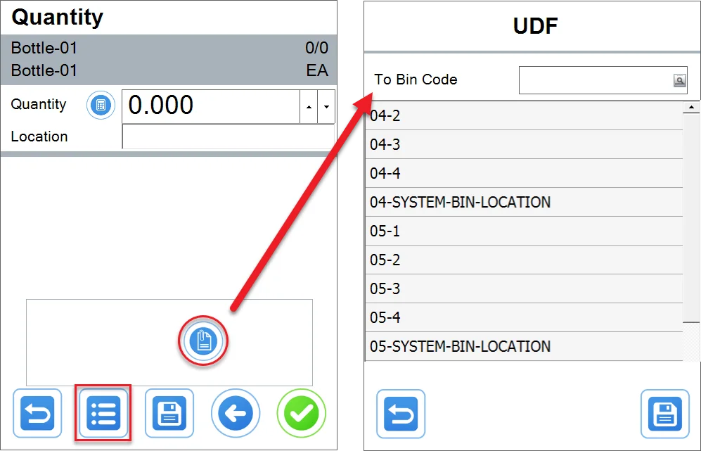

## Base document UDFs

UDFs from a base document are available on the following transactions:

- Goods Receipt PO From Purchase Order
- Goods Receipt PO From A/P Invoice
- Stock Transfer From Transfer Request
- Return From Delivery
- Return From Goods Receipt PO
- Delivery From Sales Order
- Delivery From Pick Lists (same as Sales Orders)
- Delivery From A/R Reserve Invoice
- ProcessForce Pick Order From Pick Order
- ProcessForce Pick Receipt From Pick Receipt/all Pick Receipts.

### Example usage

#### Prerequisites

Choose a base document (one of the bold ones above), for example, Sales Order.
Add a UDF to "Marketing Documents->Rows" in SAP B1 (click here to find out more about working with UDFs).

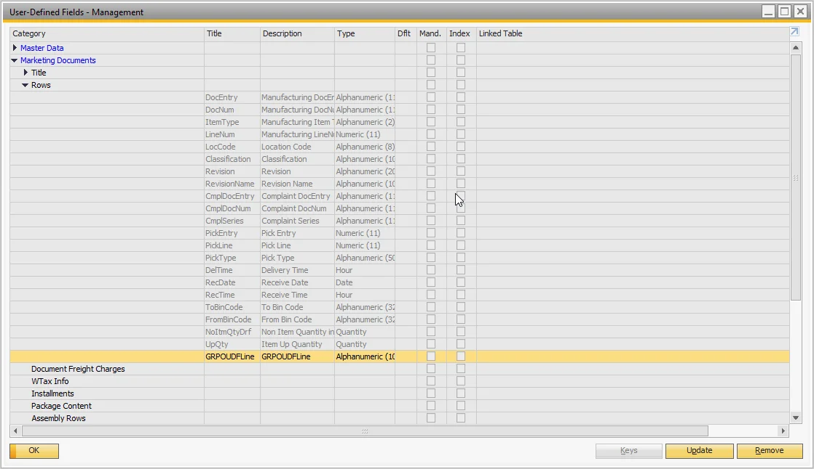

Create a base document with UDFs filled in:

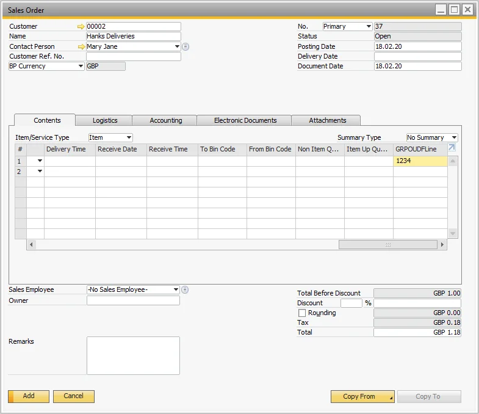

In Custom Configuration in the Manager tab, check "Enable UDF Manager," and then choose "Delivery Line" and press "Load". Check "Display" on the UDF that's been added:

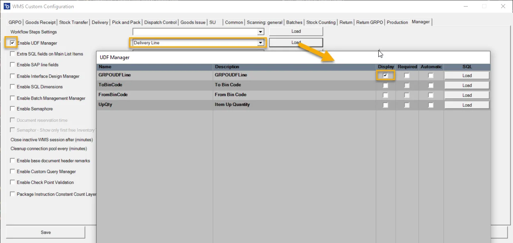

#### Usage in the application

- Open CompuTec WMS
- Choose Delivery
- Choose From the Sales Order
- Select a previously created Sales Order
- Select the first line
- Press the UDF button.

    
- UDF should be filled in:

    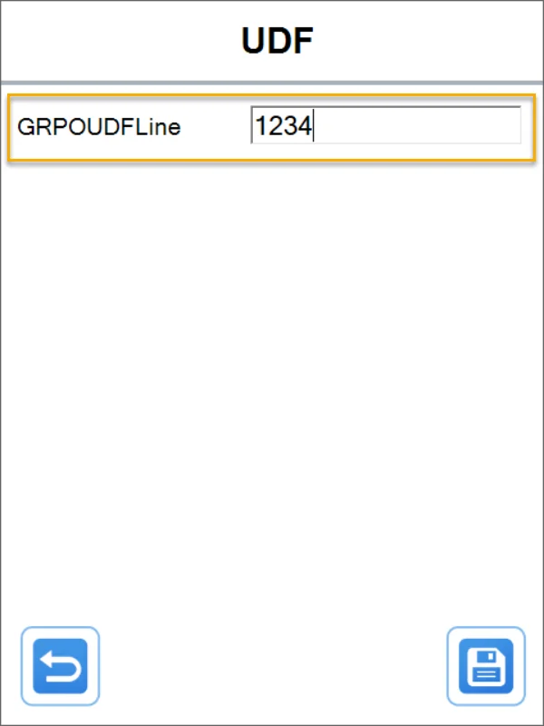
