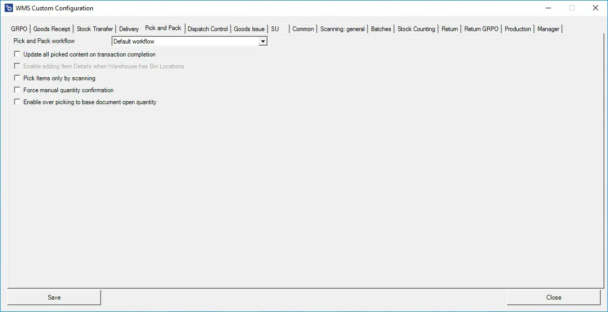

# Pick and Pack

**Pick and Pack Workflow** - you can choose the order of data entering. Available options: Default Workflow, Customer-Date Workflow, Date-Customer Workflow.

**Update all picked content on transaction completion** – all chosen during transaction information is saved on saving a transaction (the data selected from during the transaction is not held until clicking the save button at the end of the transaction).

**Enable adding Item Details when Warehouse has Bin Locations** – allows adding Item details when in a Warehouse receipt, Bin locations are defined.

**Pick Items only with scanning** – allows picking an Item only by scanning a barcode (cannot choose an Item manually)

**Force Manual quantity confirmation** – with this option checked, it is required to manually confirm previously set up quantity (scanning a barcode does not confirm it automatically)

**Enable over-picking to base open document quantity** – checking the option allows you to set quantity higher than on the related base document (leaving this checkbox unchecked blocks it).
