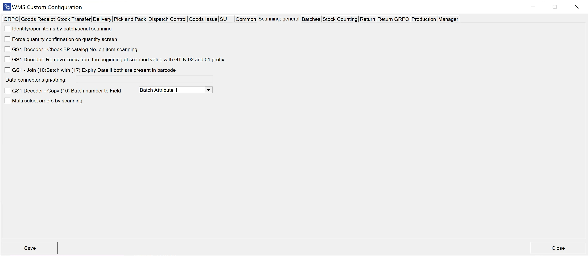
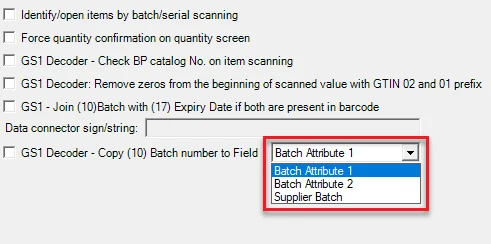

# Scanning: general

**Identify/open items with batch/serial scanning** – identifying an Item based on Batch / Serial Numbers. It allows one to find an Item based on Batch / Serial Numbers in all of the transactions (except receipt transactions) under the following conditions:

- the Batch number is unique

- the Batch is present just in one location

- for Delivery - "Enable scanning and adding Items from distinct warehouses" is checked

- for Stock Transfer, Goods Issue, and Delivery: it is possible to scan the Batch and quantity on the Warehouse selection window if 'Enable scanning and adding Items from distinct warehouses' is checked.

On Stock Transfer and Goods Issue, when on the Warehouse selection list, a user can (on top of the previously added feature for Batch Numbers scanning) scan Serial Number, and it will behave as a Fast Scan, i.e.:

- Warehouse will be chosen.

- Line with the item code of the scanned serial number will be added the serial number to it.

**Force quantity confirmation on quantity screen** – with this option checked, it is required to manually confirm previously set up quantity (scanning a barcode does not confirm it automatically)

**GS1 Decoder - Check BP catalog No. on item scanning** – self-explanatory

**GS1 Decoder: Remove zeros from the beginning of scanned values with GTIN 02 and 01 prefixes** – removes zeroes on scanning values with 01 and 02 prefixes

**GS1 - Join (10)Batch with (17)Expiry Date if both are present in the barcode** – links Batch Number to Expiry date if both of the values are present in a barcode

**Date connector sign/string** – defines which sign will act as a data connector, e.g., '-,' '/.'

**GS1 Decoder** - Copy (10) Batch number to Field – when checked, the Batch number is copied to the Supplier Batch, Batch Attribute 1, or Batch Attribute 2.

Multi-select orders by scanning – when the option is unchecked, scanning a Sales Order code in the order selection form chooses it and leads to the following form. When the option is checked, you can scan many codes. Going to the following form will occur only after clicking the right arrow.
