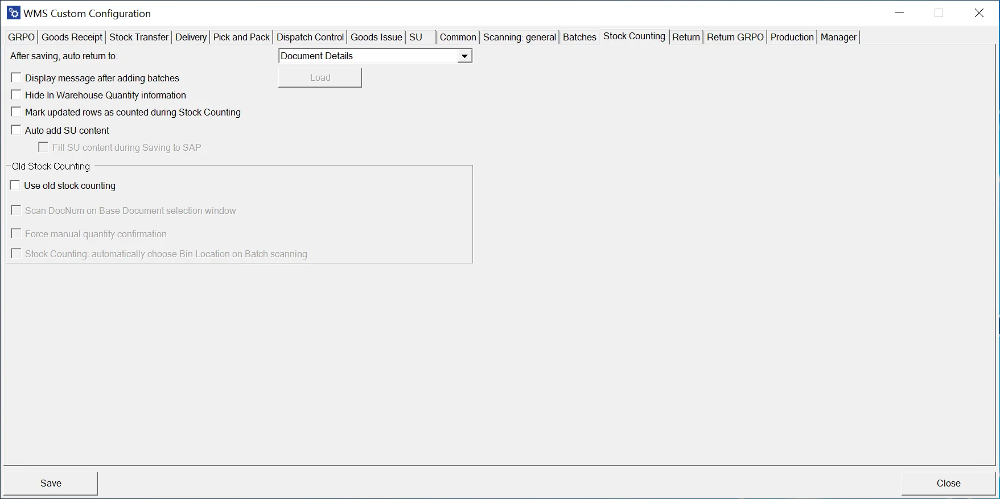

# Stock Counting

The new Stock Counting is created based on an empty document created in CompuTec WMS. Next, it is sent to SAP Business One. In the old Stock Counting, an SAP Business One user created a document based on which a list was displayed in CompuTec WMS. After enabling the old Stock Counting, you can use all of the checkboxes from this view (both for the old and new option versions).

---

**After saving, auto return to:** – choose where to return after saving Item Details on a document; you can select the main menu for this operation or the Item list

**Display message after adding batches** – configure a message displayed on adding a Batch. The message can be based on an SQL query.

**Hide In Warehouse Quantity Information** – hides quantities.

**Mark updated rows as counted during Stock Counting** – self-explanatory

**Auto add SU content** – checking this checkbox allows you to add a whole Storage Unit (with its content).

**Fill SU content during Saving to SAP** – checking this option, all the Items in the SU are saved only after clicking the Save to SAP button (not during specific lines).

## Old Stock Counting

**Scan DocNum on the Base Document selection window** – checking this option allows you to scan a document by Docnum, not by DocEntry, if a base document was chosen.

**Force manual quantity confirmation** – after scanning required prefixes (Warehouse, Vendor, Item, Quantity, Batch number), the application forces manual confirmation of quantity (instead of confirmation after scanning a barcode with quantity)

**Stock Counting: automatically choose Bin Location on Batch scanning** – automatically chooses Bin Location on Batch scanning.
