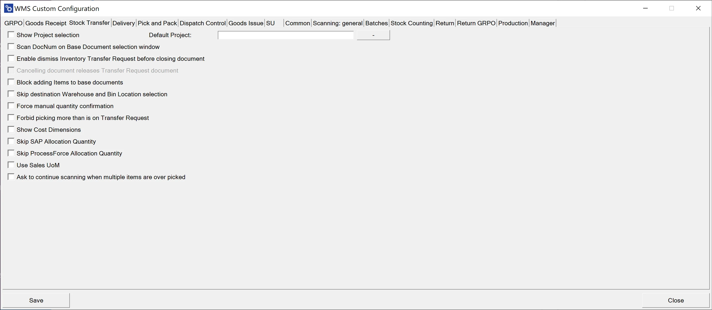

# Stock Transfer

**Show Project selection** – choosing this option results in displaying the Project Selection form before the Remarks form during the creation of a document (to which it is required to add receiving Items)

**Default Project** – if a default project is chosen, clicking the right arrow icon on the Project selection form is possible. A default project set up here will be chosen automatically.

**Scan DocNum on the Base Document selection window** – checking this option allows you to scan a document by Docnum, not by DocEntry.

**Enable dismiss Inventory Transfer Request before closing document** – this option allows to dismiss working on a document. The option is available on the Remarks window.

**Canceling document releases Transfer Request document** – this option is related to the previous one. Checking it results in closing the Inventory Transfer Request document on which Dismiss was set to 'Yes.' The document will not be available on Inventory Transfer Request in CompuTec WMS and will have a 'Closed' Status in SAP Business One.

**Block adding Items to base documents** – block adding Items when there is a base document (prevents from adding Items not included in the base document).

**Skip destination Warehouse and Bin Location selection** – skip Destination Warehouse/Bin Location selection step (a base document destination is chosen)

**Force manual quantity confirmation** – with this option checked, it is required to manually confirm previously set up quantity (scanning a barcode does not confirm it automatically)

**Forbid picking more than is on Transfer Request** – cannot assign greater quantities for an Item to a document than it is on the base document.

**Show Cost Dimensions** – checking this checkbox adds a button (next to the Back button) on the Quantity form that leads to the Cost Dimensions form.

**Skip SAP Allocation Quantity, Skip ProcessForce Allocation Quantity** – allows disabling SAP Business One Batch/Serial Numbers allocation (if needed for some custom changes). The Stock Transfer works within a Warehouse with Bin locations for allocated Batches and Serial Numbers Items.

**Use Sales UoM** – click here to find out more.

**Ask to continue scanning when multiple items are over-picked** – when checked: when two lines with the same Item are added to a document, exceeding the required quantity causes the system to display a message with a choice to which of the lines added exceeded the quantity.
