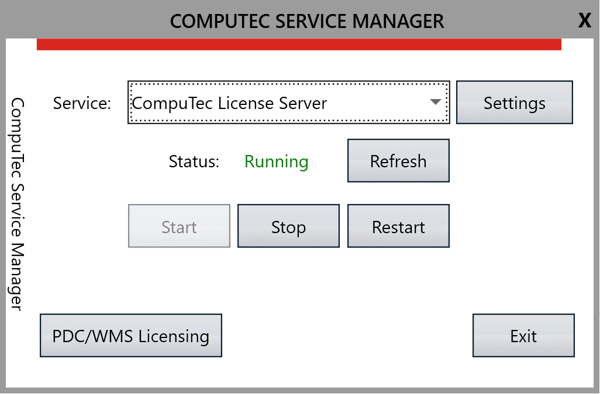
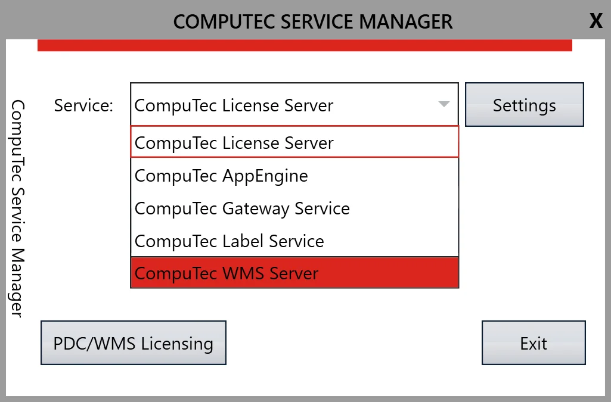
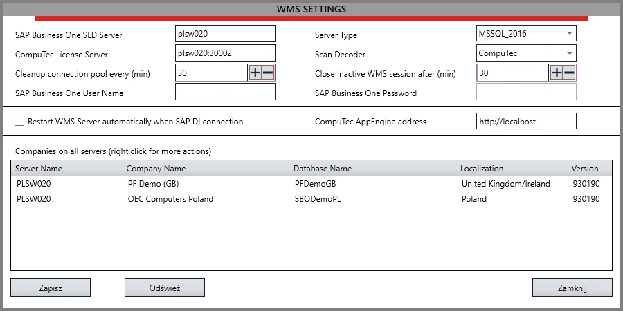
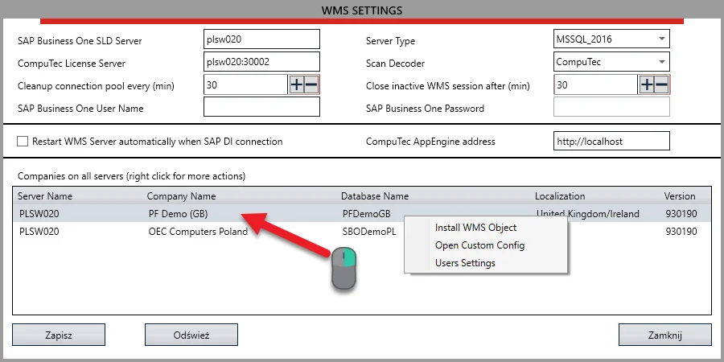
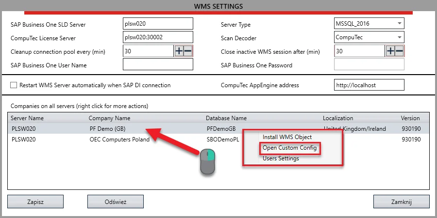
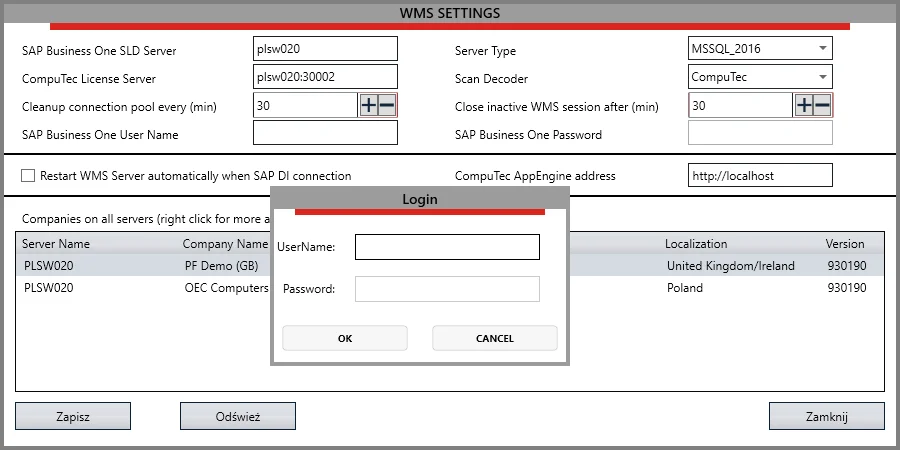
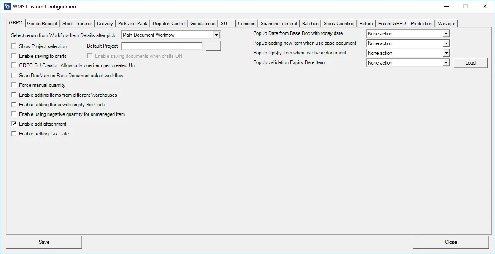

# Overview

Custom Configuration allows adjusting each transaction's workflow to specific needs. It is the primary customization tool of CompuTec WMS, covering a broad range of additional options.

---

## How to run Custom Config

- Run CompuTec Service Manager:

    
- Choose CompuTec WMS Server from the drop-down list:

    
- Click the Settings button to go to the configuration panel:

    
- Choose a database for which changes are going to be applied:

    
- Choose Open Custom Config from the context menu:

    
- Log in using SAP Business One database credentials (of SAP Business One users with superuser privileges).

    
- Logging in opens the Custom Configuration window:

    
