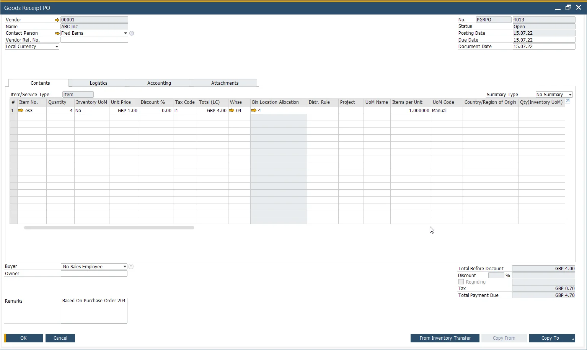
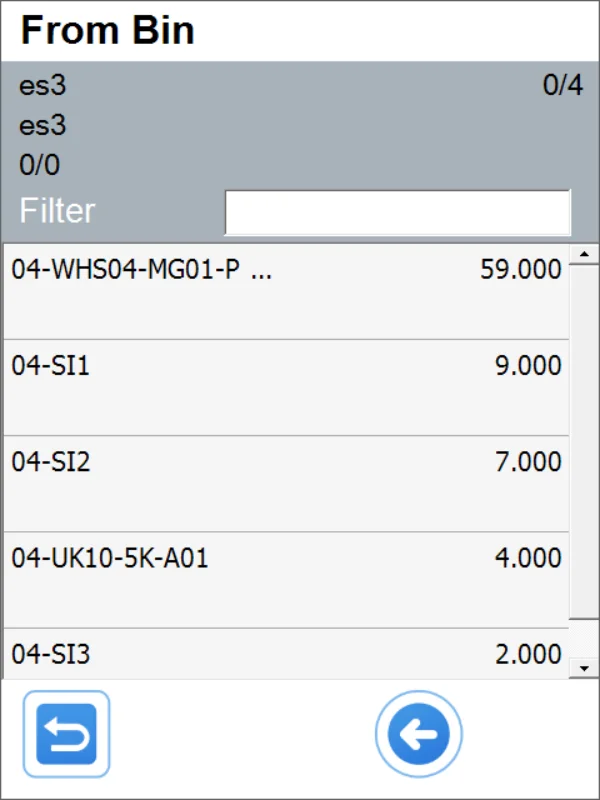
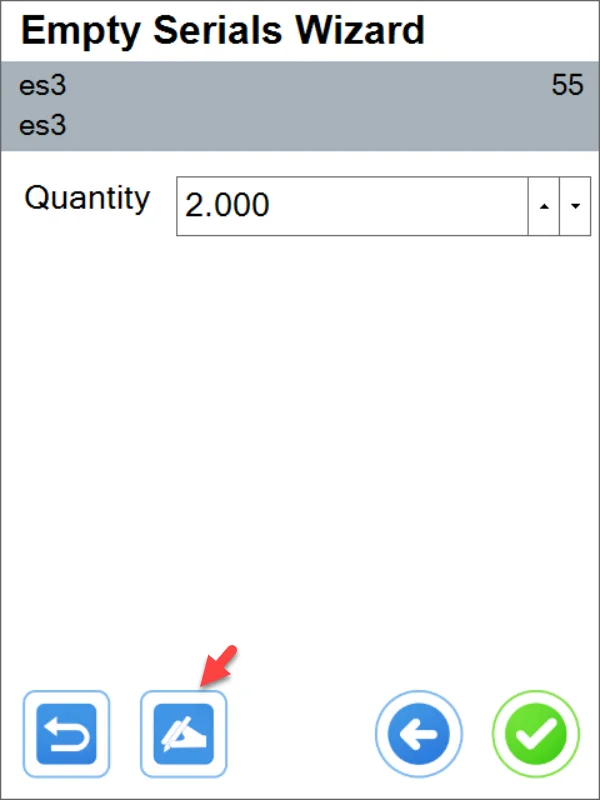

# Empty Serial Numbers

Here, you can find a description of managing Empty Serial Numbers Items through CompuTec WMS.

---

## Item Master Data Configuration

## Transactions supported in CompuTec WMS

- GRPO

- Delivery

- Pick and Pack

- Stock Transfer (Transfer Request)

- Stock Counting (planned to be supported).

### GRPO from Purchase Order

#### Result in SAP Business One

### Stock Transfer / From Transfer Request

#### All to one Bin Location

#### To different Bin Locations

### Delivery from Sales Order

#### Empty

#### Named

### In SAP Business One

### Pick and Pack

(In this transaction, it is not possible to choose Serial Numbers; it is only possible to choose it.)

Warehouses without Bin Locations are supported.

Preallocation when choosing the following option:

Or Bin Locations when this option is turned on:

- With preallocation:

  

  

  

- Without preallocation

  

  

Let's choose, e.g., one named (empty Serial Numbers and the one on the list must always be chosen separately, meaning you cannot pick one already called and one empty and proceed).

Let's choose the next three from the same location (different Bins):

In the next step, it is possible to go to Delivery from the Pick list and create a Delivery document:

The result Delivery in SAP Business One:

