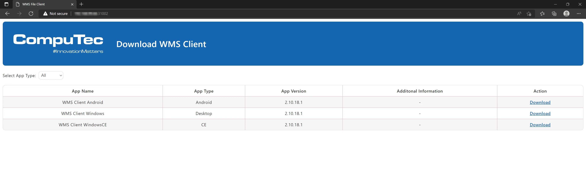

# CompuTec WMS Client download

Since the 2.10.8 R1 release, there has been an alternative, more accessible option for downloading CompuTec WMS Client files. First, install CompuTec WMS Server in this or a later version. Next, go to the end device (e.g., PC, handheld device, Android device), go to an internet browser, and put the following address in the address field: `http://[CompuTec WMS server address]:31002` (change the [CompuTec WMS Server address] for actual CompuTec WMS Server address for your case). This leads to the following page:

You can download a required Client file directly to the device from here.
