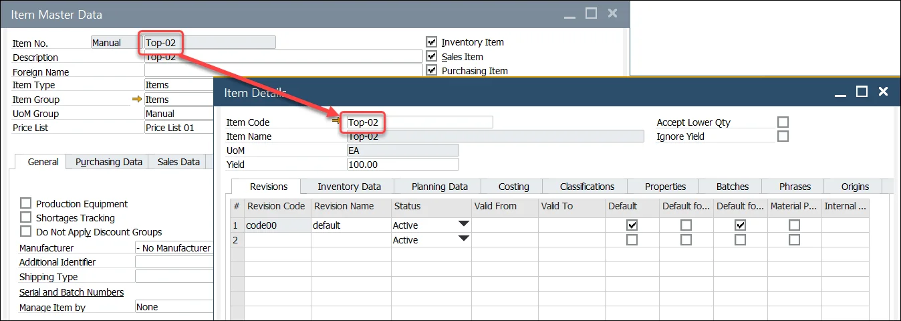

# Item Details Restore

For every Item Master Data created in ProcessForce, Item Details are recorded automatically:

If it is not created (e.g., when Item Master Data was created without ProcessForce), the Restore Item Details option creates it for a specific Item Master Data. An Item Details form for a particular Item Master Data is required for proper communication between CompuTec WMS and ProcessForce.

To perform the Item Details procedure, choose the following path in SAP Business One with ProcessForce:

:::info Path
    Help → Support Desk → Restore → Restore Item Details
:::
