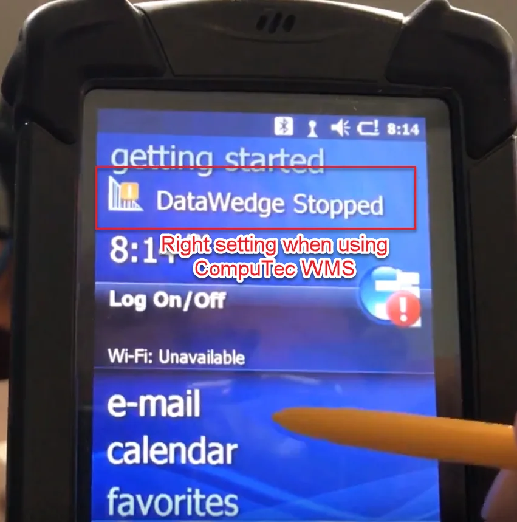
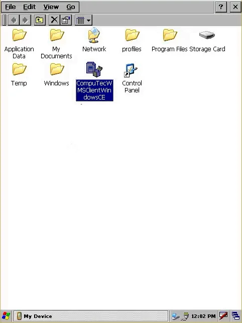
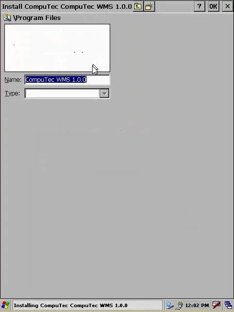
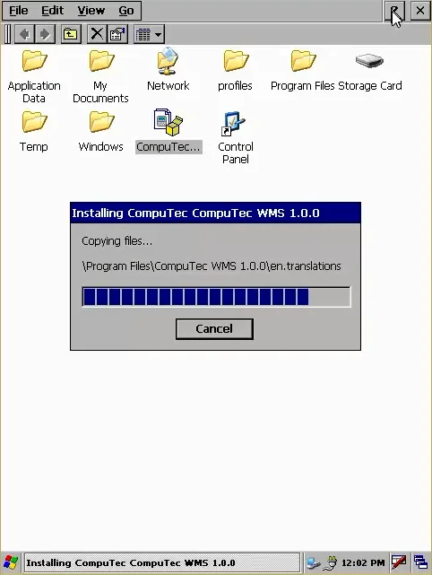
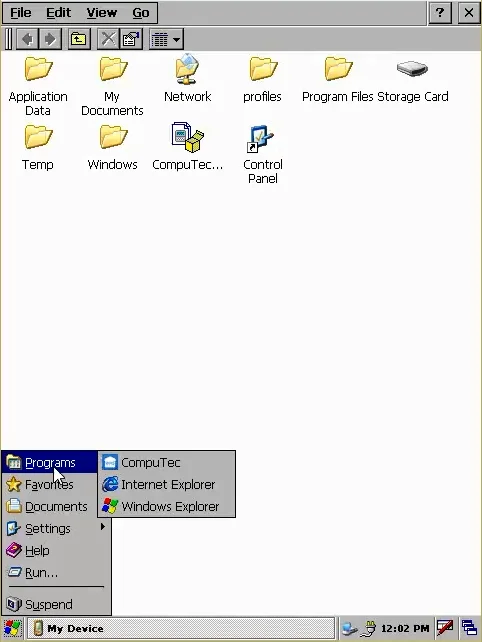

# Overview

This document provides a step-by-step guide on installing WMS Handheld Device Client and information on system environment requirements.

---

## Requirements

:::danger
    To run the CompuTec WMS handheld device client, you must first install the CompuTec WMS server. Click here for further information.
:::

### .NET Compact Framework

WMS requires a .NET Compact Framework version respective to an operating system installed on a device to work correctly:

<!-- | **For Windows CE**                         | [Download](./media/windows%20ce.zip)                              | -->
<!-- |--------------------------------------------|-------------------------------------------------------------------| -->
<!-- | **For: Windows Mobile, Handheld Compact**  | [Download](./media/windows%20mobile%20i%20handheld%20compact.zip) | -->

### Device Libraries

Libraries for a specific brand of a device:

<!-- | Intermec with Windows CE 5 and Windows Mobile 5 | [Download](./media/win%20ce%205%20i%20wm%205.zip) | -->
<!-- |:-----------------------------------------------:|---------------------| -->
<!-- | Intermec with Windows CE 6 and Windows Mobile 6 | [Download](./media/win%20ce%206%20i%20wm6.zip)            | -->
<!-- | Symbol                     | [Download](./media/symbol.zip)            | -->

### DataWedge

DataWedge service has to be turned off on Motorola and Symbol devices for the application to work correctly.

## Installation

1. Download the CompuTec WMS Client Windows CE file from here and transfer it to the mobile device or download it directly (click here to learn more). Open the destination folder on the device and run the file.

    
2. Choose a desired installation folder and click OK.

    
3. The "Installing CompuTec WMS" form with a progress bar will be displayed.

    
4. The installation is complete when the installation form is gone. Go to the Programs menu and choose the CompuTec WMS icon to start the application.

    
