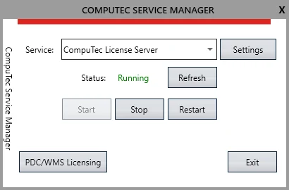

# WMS Licensing

WMS licensing is based on server and terminal licenses. Here, you can find a description of a licensing process required for the legal working of the WMS application.

---

## License loading and assigning

1. Start CompuTec Service Manager by clicking on its shortcut created in the Program list. The CT icon will appear in a tray. Click it to open an application.
2. CompuTec WMS Server service is running by default after installing the CompuTec WMS Server application; if not – choose it from a drop-down list and click the "Start" button:

    
3. Click 'PDC/WMS Licensing' in the licenses form where you can set details of server/terminal licenses:

    
4. Click on the 'Import' tab to set license details.
5. In the 'Browse' field, type in or browse the path to the license file. Create a license request ticket in the CompuTec Support portal to get a license file. Choose 'License request' from the "Component/s" dropdown list. The following information must be enclosed on the ticket:

    - Server Name
    - Terminal License Key – the number generated automatically (use the "Copy" button to copy the value to the clipboard)
    - The desired number of terminals
    - Purpose: customer's license, partner's license (for demo/test purposes).
6. Click the 'Import' button to load a license from the file.
7. One of the three communications will appear:

    - License appears to be valid – the license is loaded from an appropriate file,
    - License appears to be invalid – invalid license file loaded,
    - License not found – the wrong file is loaded for a license.
8. After receiving the 'License appears to be valid' communication, information about the number of days of license validity left is displayed.
9. To use WMS, users must be established. A specific terminal user has to be assigned to a particular SAP Business One user. You can do that in the 'WMS Users' tab:

    
10. To create a terminal user, click the Add button. A new row will be displayed.

    WMS Users tab columns:

    1. Barcode – a barcode for a specific user can be defined here. With a barcode determined, the user will just have to scan it to log in to WMS.
    2. Employee – a username assigned to a specific terminal user. This name is used to log in to WMS.
    3. Password – password assigned to a specific terminal user. It is used to log in to WMS.
    4. SAP User ID – the name of an SAP user to which a specific terminal user is assigned (many terminal users can be assigned to the same SAP User). Changes made and recorded during work with WMS are recorded in the SAP database through this user. A SAP user to which the terminal user is assigned must have at least an Indirect Access license user type.
    5. Password – corresponding SAP password.
    6. Is Active check box – The user can log in using data from this row if the check box is checked.

    Click the Update button to save typed-in data.

    You can remove a once-created user by clicking its row and clicking the Remove button.

    More than one terminal user can be assigned to one SAP account.
11. Try to log in to the WMS client using a terminal user. You will receive a communication: Terminal is not licensed. This step is required to connect the WMS Client and a license server.

    
12. Reload CompuTec Service Manager. After this, a terminal will be displayed in the Manage Licenses tab in Terminal Licensing.

    

    Assign available licenses for newly added terminal accounts automatically. If this option is checked, when a new, not yet registered Terminal is calling, it will be automatically assigned if there is a free (not assigned) license.
13. Two values are communicated on this tab:

    - Total Number of Licenses – number of licenses loaded from a file,
    - Available Licenses – number of licenses not assigned to any of terminals.
14. Choose a desired terminal from the list, check the checkbox to assign a license, and click the "Update" button. Note that the "Number of Available Licenses" decreases after that because of starting to use one of them.

    
15. Go to the Plugins tab and do the same for the newly appeared row there (which represents CompuTec WMS Server):

    
16. Restart CompuTec WMS and CompuTec License Server.
17. A license is now assigned to the server and terminal, which can work with it.

## License disconnection

License validity is checked every 10 minutes; therefore, in case of losing validity or disconnection deleting the license, the application will still work for up to 10 minutes.

If you lose a license (e.g., because of connection to CompuTec License Server interruption), go to the PDC/WMS Licensing form (see the screenshot above), check a checkbox in the Used column, and click Update. After logging back into the application, you can continue with the previously begun transaction.
