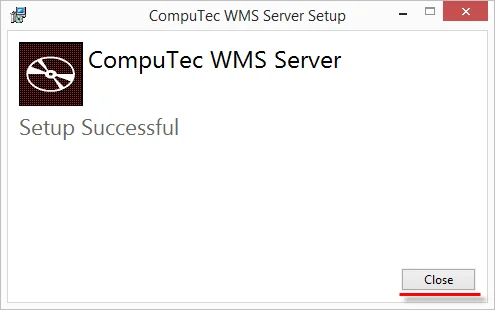

# Overview

This document provides a step-by-step guide on how to install WMS Server and information on system environment requirements.

:::danger
    Please be sure to fulfill [the prerequisites](../prerequisites.md) before starting the installation.
:::

---

1. To run the CompuTec WMS desktop version, you must install a server and client modules.
2. To install the server, download and run its installation file.

    :::caution
        If you have installed the CompuTec WMS Server already on this computer, you enter Setup by running the CompuTecWMSServer.msi file, in which you can change, repair, or remove it.
    :::
3. In the window that will appear, click the Install button:

    
4. A window with installation progress will be displayed. Click the Close button after a system message about a successful setup:

    
5. Choose CompuTec Service Manager from the Windows program list. As a result, you will have the CT icon in your system tray. Click it.
6. In the displayed window, choose the "CompuTec WMS Server" from a service drop-down list:

    
7. Click the Settings button to set the details of the CompuTec WMS Server. The WMS Settings screen will be displayed. You can also reach the WMS Settings screen through the Windows Start Menu:

    

    :::danger
        When reaching the WMS Settings screen through the start menu, start it with Administrator privileges. Otherwise, you will obtain an error upon attempts to save the changes.
    :::
8. Enter the required details:

    

    1. Type in the server name – it must be the same as a server name defined in the SAP Business One System Landscape Directory service! (The default server port number for SAP HANA is 40000).
    2. Type in the license server name/address. (The default license server port number for SAP HANA is 30002).
    3. Cleanup connection pool every (min) – a connection pool is a cache of connections to a database. It is created so that the connections can be reused during future requests to the database.
    4. SAP Business One User Name.
    5. Server Type: HANA or MSSQL 20XX.
    6. Here, you can choose the barcode decoding type:

        - CompuTec – CompuTec WMS adapted GS1 standard. Click here to find out more
        - Odette – Odette standard. Click here to find out more.
        - Custom – Barcode interpreter without prefixes and with custom ones.  Click here to find out more.
    7. Close inactive WMS session after (min) Time, after which a user is logged out from CompuTec WMS (in minutes).
    8. SAP Business One Password.
    9. WMS Server Port.
    10. Related to SSL connection. Click here to find out more.
    11. Checking this option restarts a good service on losing CompuTec WMS to SAP Business One or a database connection. The option requires further setting up to be available to use.

        Setting up an automatic CompuTec WMS Server restart in case of its crash:

        - Run Custom Configuration.
        - Go to the Common tab and check the Stop WMS Server when the ‘Company/database connection is lost’ checkbox and save changes.
        - Run Services (a Windows app).
        - Find CompuTEc WMS Server service, right-click, and choose Properties.
        - Go to the Recovery tab.
        - Set ‘Restart the Service’ for the ‘First failure,’ ‘Second failure,’ and ‘Third failure’ fields.
        - Set ‘0’ for the ‘Restart fail count after’ and ‘Restart service after’ fields.
        - Click ‘Apply.’
    12. CompuTec AppEngine address.
    13. Companies on all servers. **Right-click on a specific company row to get to its context menu**. The following options are available:

        1. **Install WMS Objects**. Click this option to install to the database CompuTec WMS objects (tables, fields) required for the application's good work. **This procedure is necessary to be performed before starting work with CompuTec WMS**. Click the option and put in database credentials to start the procedure. The object installation procedure is slightly different when using a new database in the HANA version. You can check it out [here](../../../).
        2. Open Custom Config. It leads to Custom Configuration options.
        3. **User Settings**. Here, you can enable a user for a specific database and set a language version per user. **Enabling a user here is required to work with CompuTec WMS by this user**.
        4. Copy CC Settings to. This allows copying the Custom Configuration option setup for one database to another in the same environment.
        5. Reset CC to default. Choosing this option erases all changes made to Custom Configuration for this database. The settings are reversed to the default state.
        6. Import CC Settings/Export CC Settings. Use the export option to export the CC Settings to a file. You can then use the import option to import it, e.g., on another server.
        7. Barcode Decoder - Export/Import Decoder Settings. You can export and import [Barcode Decoder settings](../../../user-guide/custom-decoder.md) the values set in Decoder Definition here.
    14. Check this option to operate with the SAP Multi-Tenant option. After checking the option, click Register Servers. In the new form, click the last (empty) row, enter the server's IP address in Multi-Tenant, check its checkbox, and click Save.
9. Click the Update button. Service will be up and running, ready to work with.

## CompuTec WMS Server automatic restart

Restarting the CompuTec Server WMS service at least once every 24 hours is required to make it work properly. This requirement is caused by extensive SAP Business One RAM usage (it is not a bug; it is just IT system specific).

You can set up the automatic restart in Windows Task Scheduler:

1. Set up the first task:

   1. Actions: Stop CompuTec WMS Server.
   2. Trigger set for a specific time every day.
2. Set up the second task:

   1. Actions: Start CompuTec WMS Server.
   2. Trigger set for a specific time every day (15 seconds after the stop).

This requirement is caused by extensive SAP Business One RAM usage.
