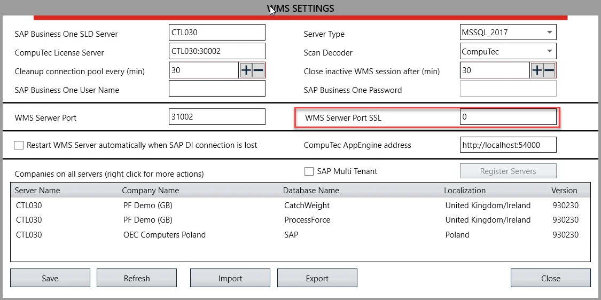
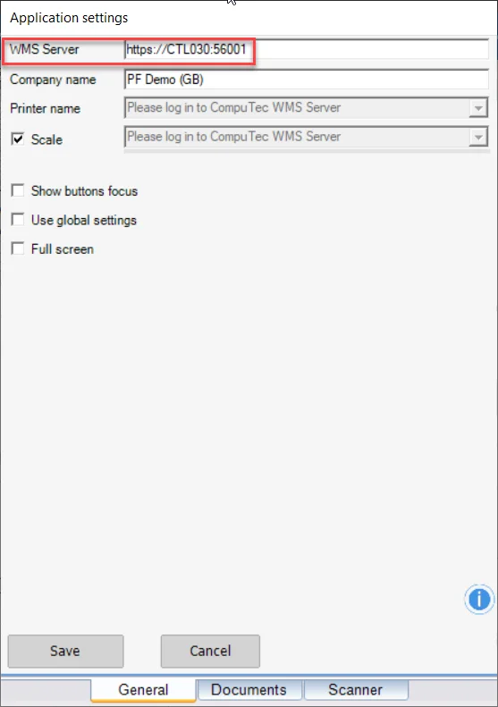
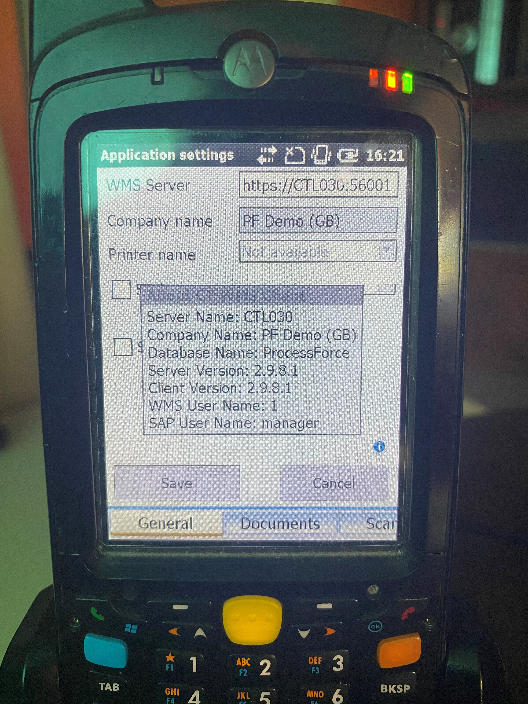

# SSL Connection

CompuTec WMS supports the SSL protocol.

SSL (Secure Socket Layer) - a protocol to securely transfer encrypted data. The protocol works in server-client architecture; its primary function is to verify a server to which a client tries to connect.

---

## Requirements

- CompuTec License Server, 5.10.2.9 version
- The feature works on SAP Business One 9.3 (MS SQL and HANA) and on SAP Business One 10 (MS SQL and HANA)
- The feature works on both Windows WMS Client and Windows CE Client
- Port addresses are defined for both SSL and non-SSL usage (a default port for non-SSL usage is 30002):

## Usage

In CompuTec WMS Client settings, choose the required port:

1. without SSL, HTTP (no changes):

    
2. With SSL (add HTTPS and change the port):

    
3. The corresponding settings (SSL or non-SSL) must be set. Do the same on the mobile device:

    
