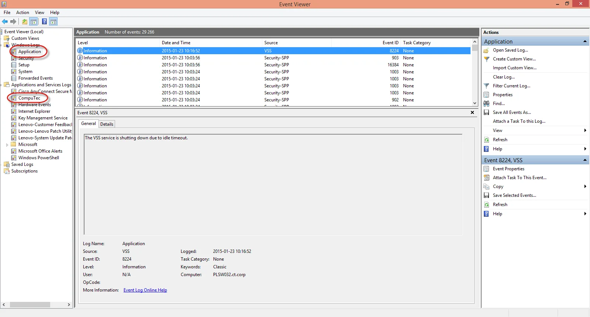
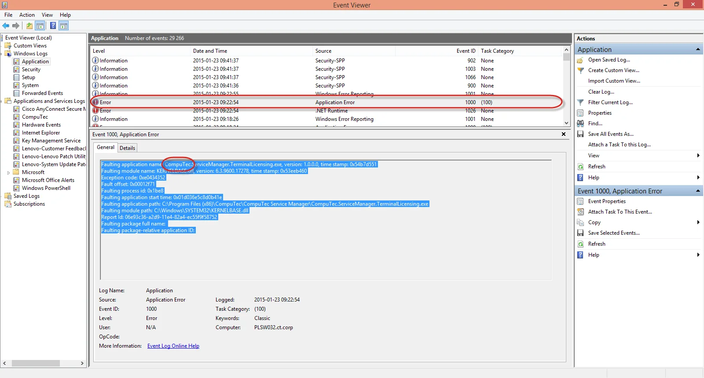

# Log file locations of CompuTec WMS components

|            Component             |                                                                  Default path                                                                  |
| :------------------------------: | :--------------------------------------------------------------------------------------------------------------------------------------------: |
|     CompuTec WMS Server logs     |                                                C:\ProgramData\CompuTec\CompuTec WMS\Server\Logs                                                |
| CompuTec WMS Windows Client logs | C:\Users\[username]\AppData\Local\CompuTec\CompuTec WMS\Client\Logs (where the [username] component has to be replaced with a proper username) |
|   CompuTec WMS CE Client logs    |                                              [Device_name]\Program Files\CompuTec WMS 1.0.0\Logs                                               |
|    CompuTec WMS Settings logs    |                                                  C:\ProgramData\CompuTec\ServiceManager\Logs                                                   |
|   CompuTec License Server logs   |                       C:\ProgramData\CompuTec\License Server\Logs C:\ProgramData\CompuTec\License Server\Logs\Terminals                        |

You can check Windows Event Viewer logs if you cannot find adequate files in the above locations.

If there is an error connecting to the CompuTec application, click its row, copy data from the main window and paste it into the support issue.

