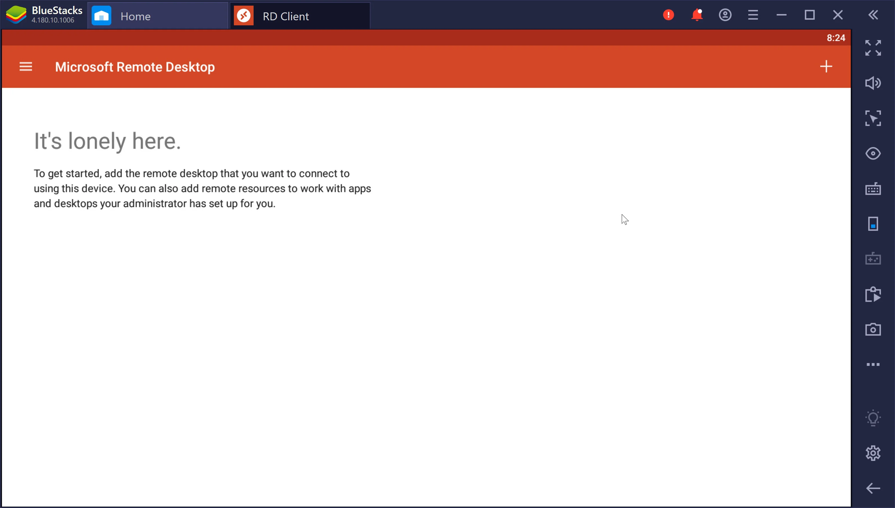
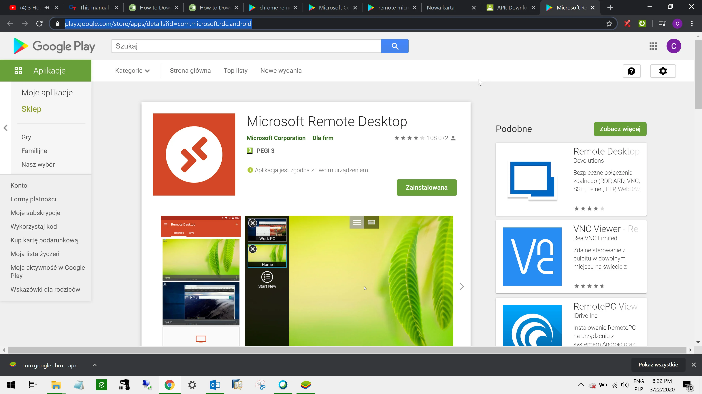
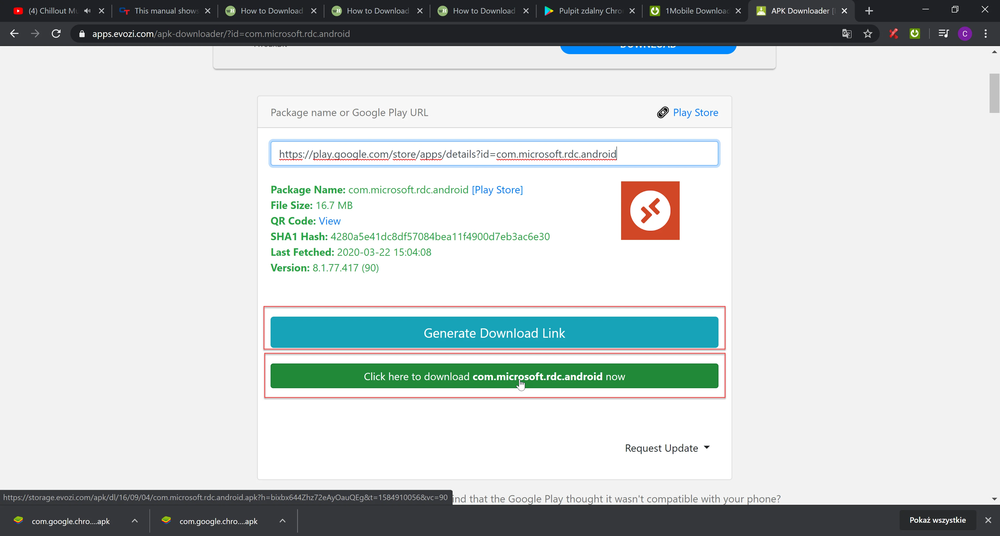
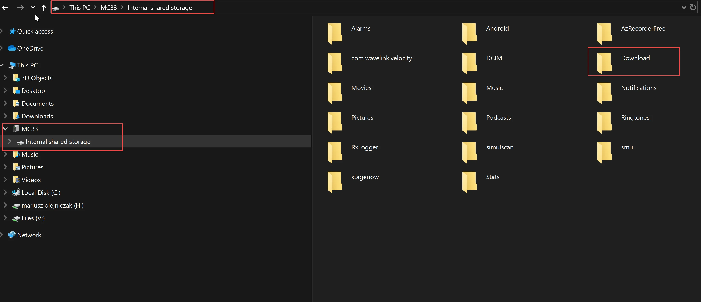

# RDP connection between Android System and WMS Client for ZEBRA MC330K

1. Download [the Bluestacks application](https://www.wikihow.com/Download-Application-from-Google-Play-to-PC)

    
2. Open [Google Play Store](https://play.google.com/store).
3. Find [Microsoft Remote Desktop](https://play.google.com/store/apps/details?id=com.microsoft.rdc.android).

    
4. Open the link to download the APK file(Android Instalator Package) [https://apps.evozi.com/apk-downloader/](https://apps.evozi.com/apk-downloader/).
5. Copy the link [https://play.google.com/store/apps/details?id=com.microsoft.rdc.android](https://play.google.com/store/apps/details?id=com.microsoft.rdc.android) and paste it to APK Downloader
6. Generate Download link and Download Microsoft Remote Desktop.

    
7. Copy downloaded APK File(Microsoft Remote Desktop) to your Device.
8. Go to Zebra Device/MENU/Settings/Connected Devices/USB/Select "Use USB to" Transfer Files.
9. Your device is available on your PC.

    
10. Copy the APK File to the folder Download.
11. Go to Device/MENU/Files/Download/Select APK File (Microsoft Remote Desktop)/Select Continue/Select Install/OK
12. Go to Device/Menu/RD Client/Select Button "+" to add New Connection/Select Desktop Connection/Add Manually.
13. Enter the Hostname or IP address of your PC with WMS Client
14. You can enter User and Password to log in every time with the same credentials.
15. Save.
16. Select Connection.
