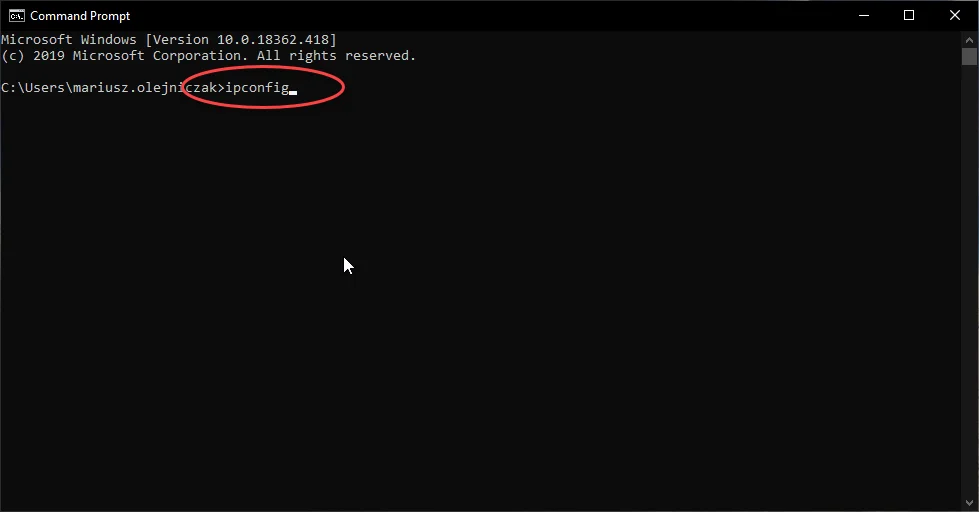

# RDP Scanner PC Configuration

This manual describes configuring the connection between the manual scanner and the PC. This configuration allows CompuTec WMS Client without installing it on a scanner.

---

:::note
    In this manual, the following environment is used:

    - System Windows CE 7.0
    - Scanner SYMBOL MC32N0
:::

## PC Setup

### Check your IP

Press Win + R, type cmd, and click Enter:

Type 'ipconfig' and click Enter:

Write down your IPv4 Address in the format presented on the screenshot, e.g., 192.168.0.143:

### Add WMS Client to Startup

Press button Win and:

- Type CompuTec WMS Client
- Right Mouse Button (RMB) on Icon and Open file location 1
- Do not close the window

Press Win+R

- Type shell::startup and Enter
- This is location 2
- Copy Computec WMS Client icon from location 1(client) and copy to location 2(startup)
- WMS Client will start automatically with Windows.

## DataWedge Setup on Scanner

You have to configure DateWedge to use WMS Client on PC with RDP.

Take your SYMBOL Scanner and click START → Settings → Control Panel → DataWedge

Click the Running Button on YES → STATUS: Ready.

Click Basic Configuration, then Basic Format:

Prefix to data → Set \u0002 → Save

Suffix to data → Set \u0003 → Save

Save and Close.

## RDP Setup on Scanner

### Configuration

Open RDP on Scanner, then go to Configuration, General tab, and type in your IPv4 Address on Logon settings.

Now go to the Display tab, Display Configuration → Set Small.

Save and Close.

Next, go to the Local Resources tab, Local Resources - Keyboard - Apply Windows key combination On this computer.

### RDP Connect

Set IPv4 Address (it should be filled in automatically).

Set the User and Password of the PC.

## DataWedge Scanning configuration(PickList Mode)

[Enable Picklist Mode](https://supportcommunity.zebra.com/s/article/Enable-Picklist-mode?language=en_US)

DataWedge for Windows:

    - Open the DataWedge setting.
    - Tap Basic configuration.
    - Scanner input.
    - Tap on the displayed internal scanner (for example, Long, range Imager, or Kepler Imager).
    - Reader Params.
    - More.
    - Picklist mode.
    - Select a Hardware or Software reticle to enable it.
    - Tap Back until you see the message 'saving changes, please wait...'.
    - Tap Home then Exit.
    - Hit OK to close DataWedge settings.

## Finish

Once the above configuration is complete, take your scanner and start RDP Connection to use CompuTec WMS Client.

---

If you have problems with connection to System Windows Mobile 6. x, please use the following instructions:

[https://www.zebra.com/us/en/support-downloads/knowledge-articles/evm/remote-desktop-connection-troubleshooting-and-terminal-services-server-common-issues-and-fixes.html](https://www.zebra.com/us/en/support-downloads/knowledge-articles/evm/remote-desktop-connection-troubleshooting-and-terminal-services-server-common-issues-and-fixes.html)

[https://social.technet.microsoft.com/Forums/windowsserver/en-US/e172f4c6-dbd1-4aa1-b6d7-ffff06b40a17/wyse-thin-client-not-connecting-to-windows-2008-r2-server?forum=winserverTS](https://social.technet.microsoft.com/Forums/windowsserver/en-US/e172f4c6-dbd1-4aa1-b6d7-ffff06b40a17/wyse-thin-client-not-connecting-to-windows-2008-r2-server?forum=winserverTS)

[https://www.zebra.com/us/en/support-downloads/software/operating-system/mc65-operating-system.html](https://www.zebra.com/us/en/support-downloads/software/operating-system/mc65-operating-system.html)

[https://www.zebra.com/us/en/support-downloads/mobile-computers/handheld/mc65.html#pageandfilelist_7308](https://www.zebra.com/us/en/support-downloads/mobile-computers/handheld/mc65.html#pageandfilelist_7308)
