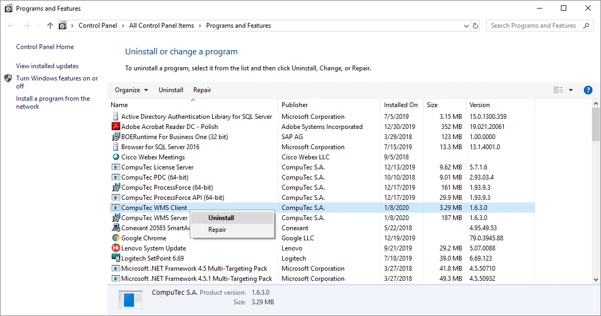

# Upgrade

This document provides information on upgrading the WMS application to a newer version.

:::danger
    It is required to uninstall the CompuTec WMS Server manually (in Programs and Features functionality in Windows) before installing the CompuTec WMS 2.0 version.
:::

---

To upgrade WMS to a newer version, perform the following steps:

1. Uninstall the WMS application currently installed in a system.

    You can do it in Windows by choosing the following path: Control Panel > All Control Panel Items > Programs and Features. Right-click CompuTec WMS Client and select Uninstall. Do the same with the CompuTec WMS Server.

    
2. Get the latest versions of WMS components installers (WMS Server and WMS Client).
3. Perform the installation procedure described here using new files.

    Please fulfill the requirements and install both WMS Server and WMS Client components.
