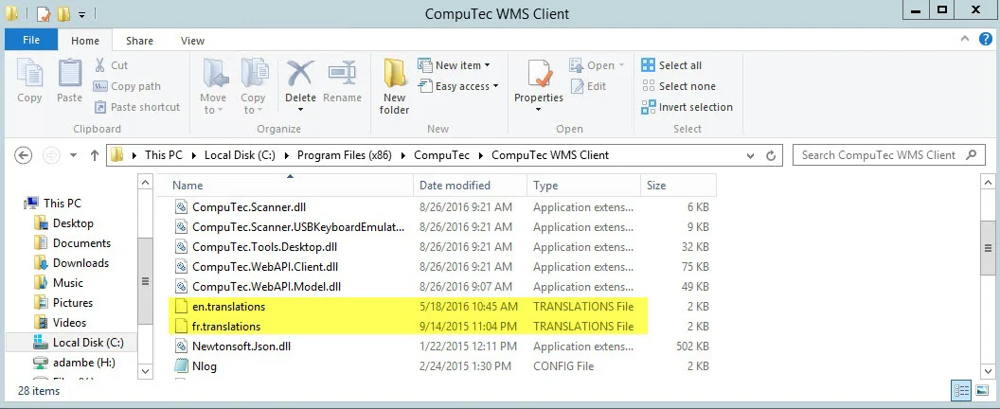

# WMS Translator

WMS Translator is an IT solution that allows you to translate CompuTec WMS easily from its default (American English) to any other language.

---

:::note
    If you have created a translation for a specific language, we suggest you send the files to us to incorporate in the next installer. Otherwise, the language will get back to default after an upgrade.
:::

## WMS Translator address

URL address: [https://translate.processforce.eu:4433](https://translate.processforce.eu:4433)

## Logging in

Log in using credentials provided by CompuTec.

## Home page

Use the switch at the top of the window to access WMS Client and Server translation.

Choose the language which you want to translate (Select language). After that, you can also browse the chosen language version by specific text. Click Load data to load the desired language.

When you implement changes, you can send them to the server (by clicking Save Changes). They will be stored there and added to the following official CompuTec WMS release.

The default language is a source. You cannot change it.

## Translation Download

You can download the translation for the selected language. You can update your CompuTec WMS installation with the downloaded translation files, e.g., to test it before an official release (please remember that the files will be updated with official versions upon upgrade to the official release).

To swap downloaded language files with the ones in your WMS Server and Client installation folders, you have to copy translation files to two folders:

- A file with a longer name:

    

    (Or the same path with the Program Files folder, instead of Program Files (x86), in case of using a 64-bit version of the application)
- A file with a shorter name:

    
