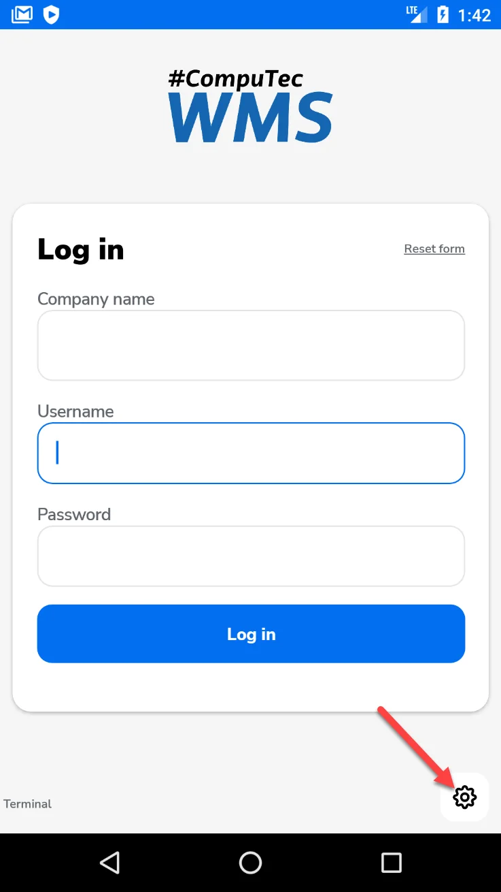
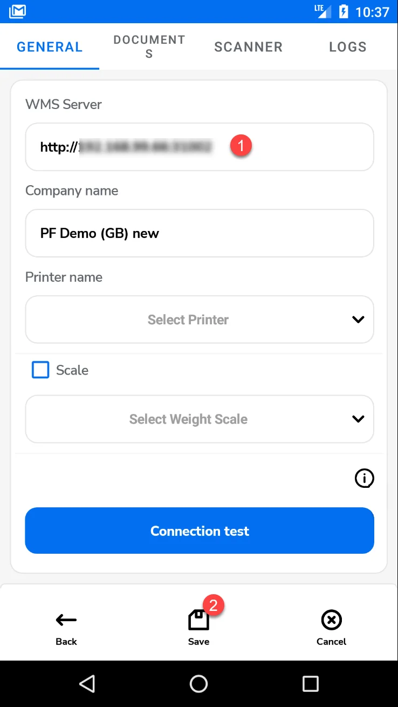
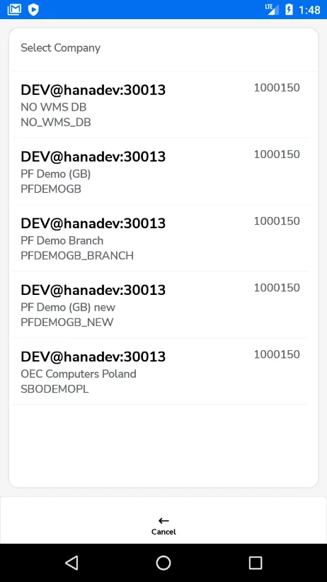
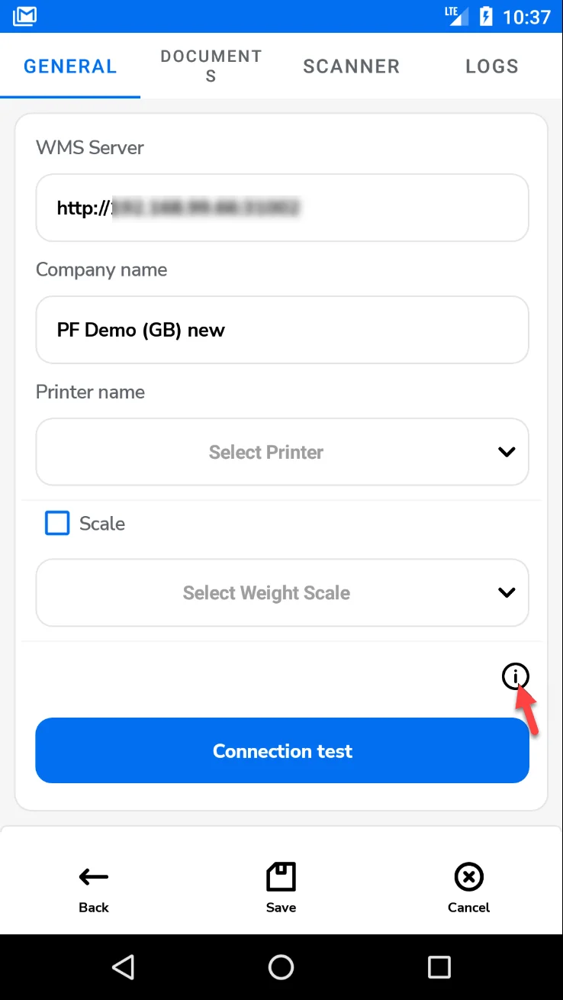
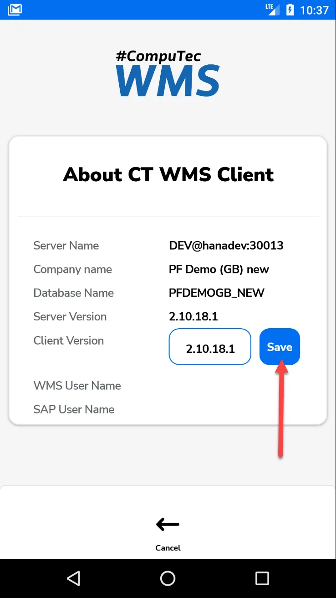
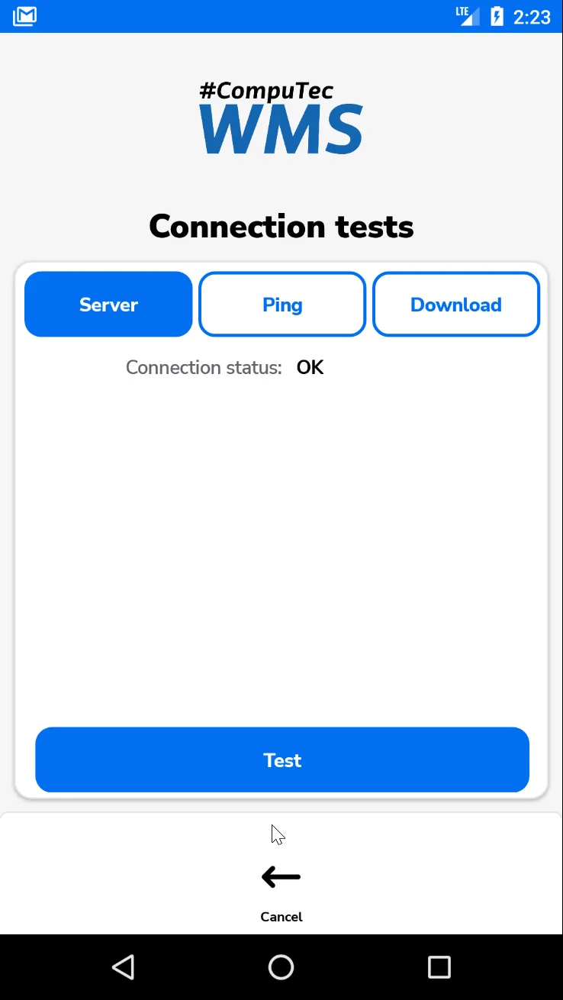
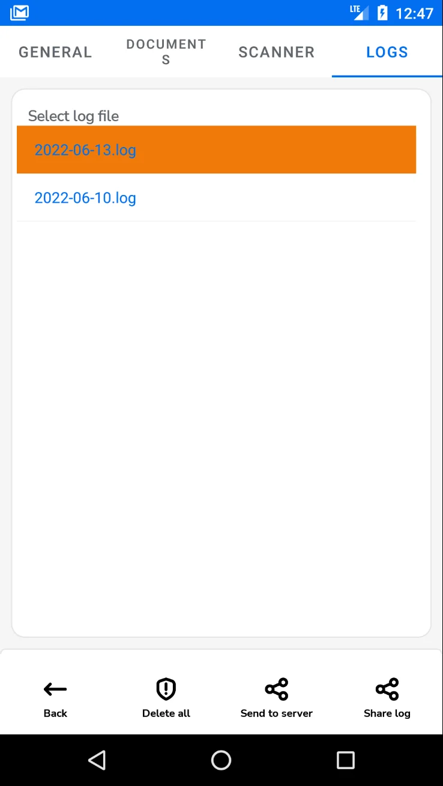
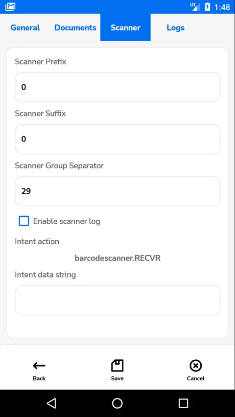

# CompuTec WMS Android version

Here, you can find a manual for installing and configuring the Android version of CompuTec WMS.

---

## Requirements

- A device with the Android system, minimally supported version: Android 6 (API 23).

- The device has access to the network, in which a CompuTec WMS Server is installed. To check the connection between the device and the server, open any browser on the device and enter the following address:

        http://[server address]:31002/api/Test/Get

  Instead of this element: [server address], put a proper CompuTec WMS Server address.

  

  In the picture above, you can see a proper response. If you get any other response, please get in touch with your network administrator to request a change of the server settings / the network settings/firewall settings to provide proper access.

- the devices must have enabled an option to install .APK files from external sources. This setting is usually available as a single setting in the security settings or as permission to install applications from external sources for a specific application, e.g., file managers or a browser.
  An example permission setting:

      

### Tested devices

:::note

This is not a complete list of supported devices. All devices that meet the requirements from the previous section should support CompuTec WMS in the Android version. However, the following devices have been tested, and the proper work of the CompuTec WMS Client has been confirmed on them.

:::

The Android version of CompuTec WMS has been tested on the following:

- Samsung A202F/DS (barcode scanning using the device's camera)

- Samsung SM-J415x, Samsung Note 20

- Zebra MC330K (MC330K-GE3HA3RW) with Android 8 (barcode scanning using the built-in barcode scanner)

- Zebra MC930B.

## Download and installation

Download the installation file from here. Unpack it and upload it to the device.

Go to the download folder using a file manager app and click it. The installation starts if all the related permissions are set up correctly.

:::note

Installing an application from the default download folder is impossible on some devices. In a case like this, please move the installation file to another folder on the device.

:::

## Running and configuration

After the first run of the installation, it is required to configure it. Start it by clicking the cog icon:

Type in a proper CompuTec WMS Server name and save the changes:

Next, enter the CompuTec WMS user credentials and click the Company Name field. Now, you can see the list of databases. Please choose one of them by clicking it. Now, you can log in:

## Overwriting a client version

There is an option for manual change for the client version to simplify the testing procedure. Thank this; you can avoid the problem with a mismatch of different CompuTec server and client versions, which might be problematic when testing the Android client along with different CompuTec server versions.

The version number field is available in the CompuTec WMS client information field. To reach it and change the number, you have to click the information icon in the General tab, double-click the client number, change the number, and click the Save button.

## Connection Testing

CompuTec WMS client in Android version contains tools for testing connection (and its quality) to a server. You can find the tools in the General tab, the Connection test button:

Here, you can use one of three tests:

- Server

  Choose this option and click Test to test the connection to the CompuTec WMS server. You would get a message if the attempt to connect was successful.

- Ping

  Choose this option and click Test to the latency of the connection. You will get a message with the value of the latency. Click Stop to finish the test.

- Download

  Choose this option and click Start to check the Download speed. You will get a message with an approximate download speed. The test stops after some time by itself. You can also click Stop to stop the test.

  

## Log files

There is no direct access to the CompuTec WMS log files directory on Android devices. You can access the log files through the Logs tab.

    

**Share log** – use this option to send a highlighted log file in a text message or save it as a file.

**Send to server** – this option sends a highlighted log file to a related server. The default location is c:\programdata\CompuTec\CompuTec WMS\Server\Logs\ClientLogs\XXXXXXXX-XXXX-XXXX-XXXX-XXXXXXXXXXXX.

This section: XXXXXXXX-XXXX-XXXX-XXXX-XXXXXXXXXXXX is a device identification number.

## Configure scanning on Android handheld decoders.

To properly handle scanning barcodes, you must enable Intent Output in your device's Scanner options. Then, you must set Intent Action and Intent Extra key Data (if available).

In Intent action set: barcodescanner.RECVR - this is an action under which CompuTec WMS receives data from the scanner.

Under Intent Extra key Data set: com.motorolasolutions.emdk.datawedge.data_string - this is the default key that CompuTec WMS uses to extract barcodes from Intent data.

To properly handle scanning barcodes, you must enable Intent Output in your device's Scanner options. Then, you must set Intent Action and Intent Extra key Data (if available).

In Intent action set: barcode scanner.RECVR - this is an action under which CompuTec WMS receives data from the scanner.

Under Intent Extra key Data set: com.motorolasolutions.emdk.datawedge.data_string - this is the default key that CompuTec WMS uses to extract barcodes from Intent data.

