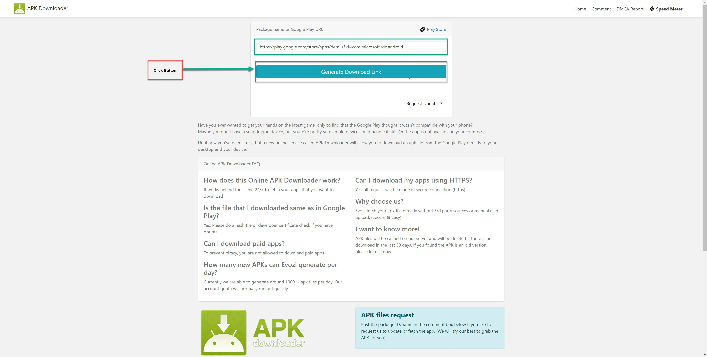
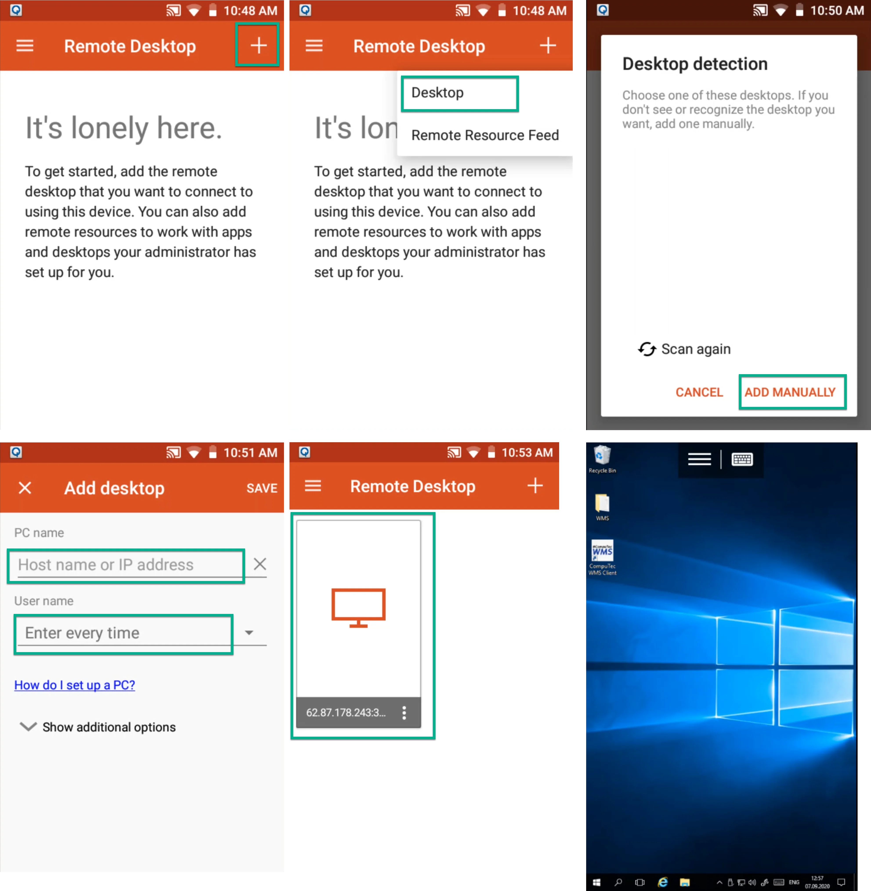
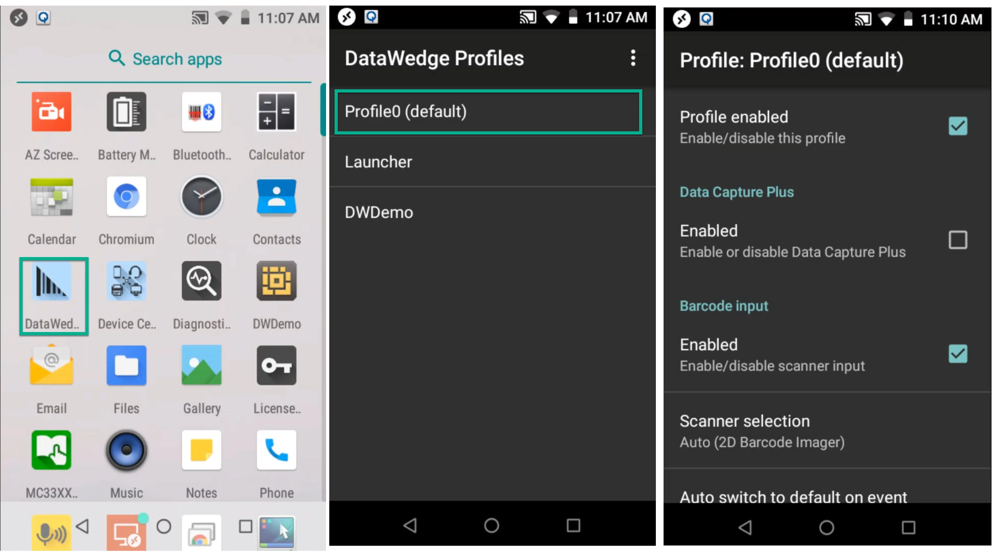
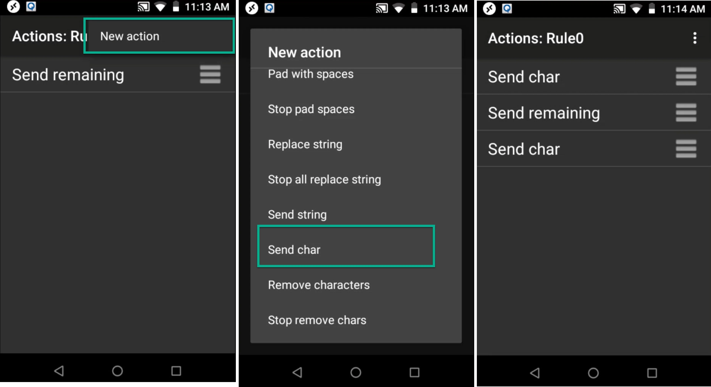

# Running CompuTec WMS through Remote Desktop Application for Android

## Remote Desktop App installation

First, install a remote desktop application (We recommend using Microsoft Remote Desktop, which is used in this tutorial, but it is possible to use other applications of this kind).

If the device has a default Google Play store application installed, download and install the remote desktop application using Google Play: download.

If the device does not have the Google Play store installed, download it manually and install it. To do this, click this link. Then, put this link on the website: https://play.google.com/store/apps/details?id=com.microsoft.rdc.android, generate a file, and download the APK file.

Next, connect the device via USB and copy the APK file to the chosen folder (ensure the device's USB connection option is set to file transfer: Settings → Connected Device → USB → Transfer File).

Next, install the app. Go to Menu → Files and find the folder with the APK file.

Next, run the application:

## Remote Desktop App Configuration

Now, it is required to set up a connection to the remote desktop. Click the + icon and set up the link. Next, click the added desktop and log in to the remote server.

## DataWedge configuration

This section lets you check how to configure DataWedge for Zebra devices. It is required to pass scanned values to the CompuTec WMS Client.

:::note

If you have a device from a different producer, please contact them to learn how to set up prefixes and suffixes for a scanner.

:::

In the default configuration, CompuTec supports prefixes as CTRL + B and suffixes as CTRL + C.

Unfortunately, Zebra devices do not pass CTRL + B correctly. Due to it, in CompuTec WMS 2.9.7_R1 and 2.10.7_R1, the option to assign prefixes and suffixes to a specific CompuTEc WMS client was added.
http://www.asciitable.com/ We use the DEC column.

Go to the device, the main menu. Open the DataWedge application and set it up in accordance with the screenshots below,

Go to the Keystroke output and click Advanced data formatting.

Check if the option is turned on and go to the further settings:

Click the + icon and add a new action. Choose char from the list. Do it again (to add prefixes and suffixes). Next, use the drag-and-drop method to put the lines in order, like in the screenshot below.

Click each row to set it up. It is recommended to set up 05 for prefixes and 03 for suffixes.

Close DataWedge.

## CompuTec WMS Client configuration

Run the remote desktop application, log in, and run CompuTec WMS.

Next, click Settings and go to the Scanner tab. Prefixes and suffixes will be set up here.

Save and log in to CompuTec WMS.

Check if the scanner is calling out works. To do this, go to Goods Receipt PO → New Goods Receipt PO.

Scan any barcode (e.g., from everyday products) in the Warehouse window. The application should give a system message about incorrect code. This is a required behavior as it shows that the device called out the scanner action.

Next, test it on barcodes used in your company.
