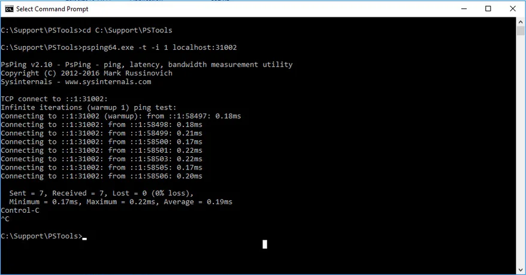
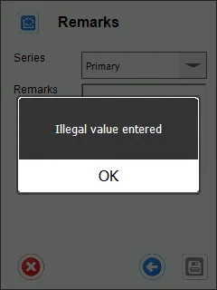
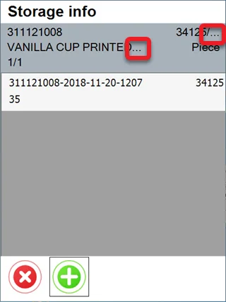
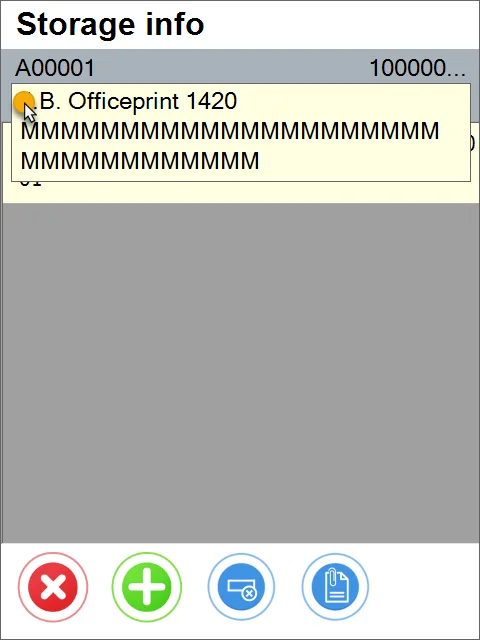
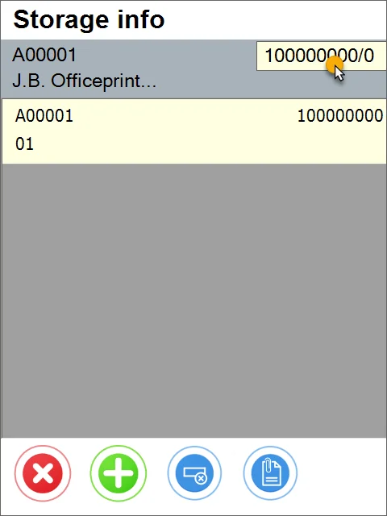
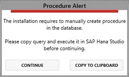
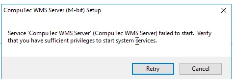

# Frequently Asked Questions

## I have installed WMS components, but it still does not work. What should I do?

1. Configuration

    As well as installing WMS components, you must configure the application, e.g., connection to a database. You can find information about that here.
2. Windows firewall inbound rule

    Be sure to set a required inbound rule in the Windows firewall. You can check how to do that here.
3. Server and Client connection addresses

    Check server and client connection addresses. If both components are installed on the same machine, an entry of “localhost,” e.g., `http://localhost:31002`, works, but if the server and the client component are installed on different machines, specific addresses should be written in. You can do that in the options tab on the client application.

    To check the connection on ports between server and workstation (in case CompuTec WMs Client operates on a different machine than CompuTec WMS Server), please perform the following steps:

    - Download the PsPing tool from this localization: [PsPing](https://docs.microsoft.com/en-us/sysinternals/downloads/psping) and unpack it.
    - Open Windows Command Prompt and navigate to the unpacked PSPing folder, e.g., cd C:\Support\PSTools
    - Run the following commands:

        `psping64.exe -t -i 1 localhost:31002`

        `psping64.exe -t -i 1 [remote host IP]:31002`

        Example:

        
4. CompuTec WMS API Test

    Please check if the CompuTec WMS API works correctly by going into a web browser to this address:

    `http://localhost:31002/API/test/get`

    `http://[remote host IP]:31002/API/test/get`
5. WMS services check

    Check if CompuTec License Server and CompuTec WMS Server services are up. You can check it in Windows Services - Control Panel > Administrative Tools > Services.

## I have installed the WMS application, but the trial period will expire soon. I purchased a license. How can I get the license file?

You should create an issue on the WMS Support page on support.computec to get the license you purchased (here). Providing accurate information to CompuTec Support will shorten the response time; thus, please check what data are required – check (ADD LINK) here.

## I did not define any bins on any warehouses in my database. Will CompuTec WMS operate properly just in the warehouses?

Yes. CompuTec WMS can operate on bins in the warehouse. However, defining bins is not required for the proper work of the application.

## Illegal value entered communication on document creation

One reason may be a lack of Item Details defined for a specific Item Master Data. Perform the Restore Item Details procedure to fix it. Click here to find out more.

## The WMS database is not installed. Please make sure all prerequisites are met in communication

CompuTec WMS User Define Objects are not installed on a specific SAP Business One database. To fix it, please install UDOs. You can check how to do this (ADD LINK) here.

## Configuration file not found. Please use the settings window for communication

You probably just installed the application, which is still not set up. Please check (ADD LINK) this link to find out more.

I have checked the information in the FAQ section and the rest of this documentation, but I still have no idea why my WMS instance does not work. What should I do?

You should request CompuTec Support assistance by posting an issue within the Support WMS space at support.computec.pl (here). To shorten the problem-solving time needed by CompuTec consultants, you should follow the rules for creating an issue you can find here.

## Data is not displayed correctly

If any data record displayed on a screen is too long, it is 'cut' with the rest represented by '...'. In these cases, you can click and hold the row, and the full name will be displayed:

## Cannot Install CompuTec WMS objects to a database

On an attempt to install CompuTec WMS objects to a database (you can check how to do this here), you get the following system message:

:::info
    The installation requires a manually created procedure in the database.

    Please copy the query and execute it in SAP Hana Studio before continuing.
:::

This system message appears upon attempts to install the CompuTec WMS object on a new database in the HANA version.

### Fix

1. Click 'Copy to Clipboard' on the system message form.
2. Run SAP HANA STUDIO.
3. Choose a required database, then 'Open SQL Console.'
4. Paste the previously copied text and save the configuration.
5. Retry to Install CompuTec WMS objects (check here how to do this).

## Error message: Error when installing CompuTec WMS objects. Please check the logs for details

### Prerequisites

A CompuTec WMS installation on a “fresh” database (without previous CompuTec WMS installation).

### Reproduction

1. Try to open Custom Configuration.
2. A system message: Error. Please install WMS objects first.
3. Try to install CompuTec WMS error.
4. Error message: Error when installing CompuTec WMS objects. Please check the logs for details.

### Fix

Restart the server or try to install the CompuTec WMS objects again.

## PF Database Version is not supported. Please update the Database or Reinstall the API.Setup

### Cause

ProcessForce version installed on the database differs from the ProcessForce API version.

### Fix

You can either:

- install ProcessForce API to the correct version
- install ProcessForce in the same version as API.

For the mentioned installers, check the [ADD LINK] Download page.

## System.Exception: :Error: Internal error (-10) occurred:Error: Internal error (-10) occurred:Error: Internal error (-10) occurred error in a log file

If this error occurs in a log file in this location: C:\ProgramData\CompuTec\ServiceManager\Logs, it is required to register the following objects in a related database manually:

- CT_WMS_OCCT
- CT_WMS_OVDA
- CT_WMS_OWTT

## The info icon does not work

On all transactions where you can choose an Item managed by Batches or Serial Numbers, an Info icon leads to additional Batch/Serial Numbers information. In some cases, nothing happens when you click it, and no system message is displayed. In cases like this, check if there is any User Defined Field configured for Batch/Serial Number Object (the button is not responsive when there are no UDFs defined).

## WMS Server Installation Error

### Reproduction

An error occurs during the installation of the CompuTec WMS Server:

### Fix

The error has been fixed in the 2.10.9 version.

In previous versions, please download this file, unpack it, and place (the whole folder) in the following directory: C:\ProgramData.

## Error. Please install SAP HANA ODBC Driver / ODBC 13 for SQL Server first

### Reproduction

Click "Save" or "Refresh" on WMS Server Settings

### Fix

After pressing "Save" or "Refresh" on WMS Server Settings, it is checked whether SAP Business One DI API and ODBC Driver - respective to the selected server type, are installed.

| Server Type                  | ODBC Driver REquired          | Download Link                                                                                                |
| ---------------------------- | ----------------------------- | ------------------------------------------------------------------------------------------------------------ |
| MSSQL (through 2008 to 2017) | ODBC Driver 13 for SQL Server | [https://www.microsoft.com/en-us/download/details.aspx?id=50420](https://www.microsoft.com/en-us/download/details.aspx?id=50420)                                               |
| SAP HANA                     | SAP HANA ODBC Driver          | [https://help.sap.com/viewer/e9146b36040844d0b1f309bc8c1ba6ab/3.2/en-US/734759c0c1c9440c857da0d366e47dda.html](https://help.sap.com/viewer/e9146b36040844d0b1f309bc8c1ba6ab/3.2/en-US/734759c0c1c9440c857da0d366e47dda.html) |

A proper Exception/Error is shown in the ServiceManager Log when one of the above drivers is missing.

## Motorola MC65: problem with scanning with RDP and DataWedge

### Example

1. In DataWedge Demo, the code is scanned correctly.
2. With an RDP connection and scanning to a notepad, a part of a code is removed. Originally: (10)21055(95)1(95)C00312, actually scanned: (10)21(95)1(95)C00312. Part of a GS1 code is missed.

### Solution

Please note that the Motorola MC65 device is no longer supported by its producer. However, Motorola support suggested (as best effort only) using Interchar Delay (DataWedge option) to slow down RDP data sending to a host.
