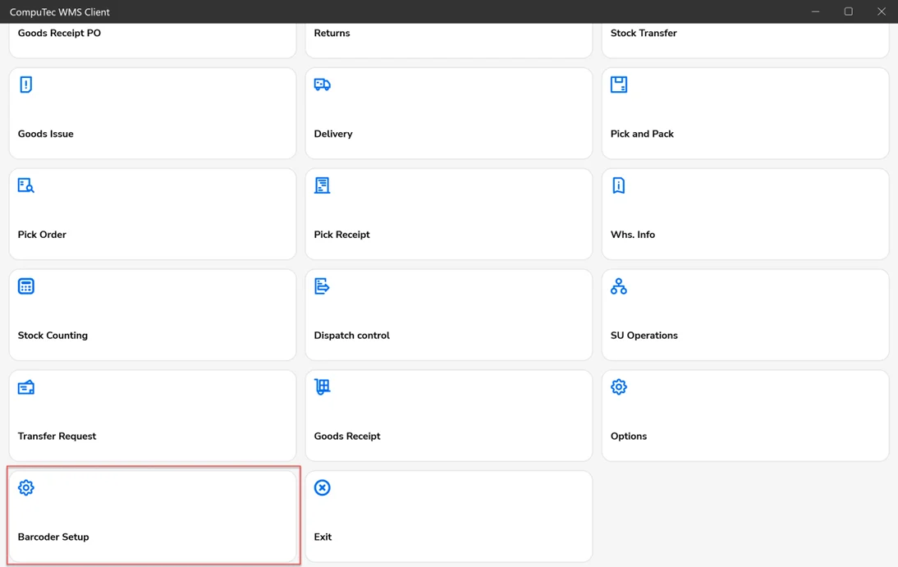
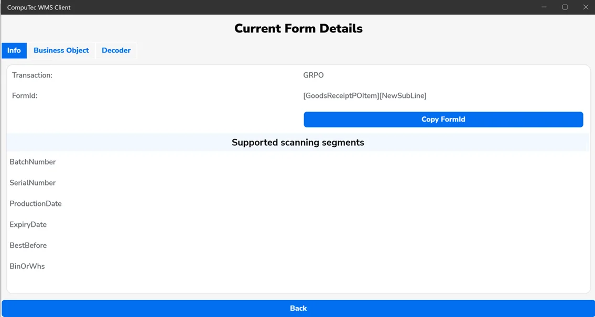
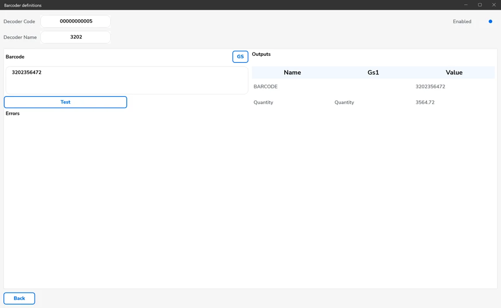

# Custom Decoder

This tool allows defining custom data to be scanned and recognized in barcodes and places within the CompuTec WMS workflow to use them.

---

## Requirements

- CompuTec WMS Server installed
- CompuTec WMS objects installed in the database
- MAUI WMS client installed (Barcoder Setup configuration from the MAUI on Windows level only)
- The latest scanner simulator (for testing)
- Correct configuration in the Scanner tab:

    (Prefix, Suffix, Scanner Group Separator).

    

    

    The settings in the scanner simulator and the Scanner tab have to be the same:

    

## Usage

Choose the option in the main menu:



Decoder definition:


Here, you can find a list of the already defined custom decoders.

Each of the decoders is defined with the following information:

### Columns

Code – a decoder ID

Name – a decoder name

Enabled – a decoder is enabled/disabled.

### Buttons

Edit – a decoder's edition

Test – a decoder's configuration testing

Delete – delete the chosen decoder

Create new – creating a new decoder

Close – close the window.

## Decoder Selection rules


A list of places in CompuTec WMS with the custom decoders assigned.

You can refresh the list by clicking the filter button.

WMS Transaction – you can filter the table to display results for all transactions or just a specific one.

WMS Form Id – filter the list by a specific Form ID.

Edit – edit a decoder assignment

Delete – delete a decoder assignment

Create new – create a decoder assignment

Close – close the window.

## Decoder Definitions


Decoder Code – a decoder's ID, filled in automatically

Decoder Name – a decoder's name

Enabled – turn a decoder on/off

Variables Definition – self-explanatory

Test – test the decoder.

The table contains a list of the rules of the specific decoder:

Name – a name of a rule

Type – a type of a rule

Enabled – turn the rule on/off

Edit – edit a rule

Delete – delete a rule

New Rule – create a new rule (you have to choose a type of a rule from a drop-down list)

Add/Update – add/update a decoder

Back – go back to the previous window.

## Variables Definition


Here, you can define variables that you can then use in the decoder's rules:

Types of variables:

Input Variables – input variables that you can use as input parameters for rules. By default, as a BARCODE input variable, it puts the whole text read from a barcode.

Internal Variables – variables you can use as input and output parameters for rules. Temporary variables.

Output Variables – you can use them as output parameters for rules.

Use GS1 Decoder – use this option if you use GS1 barcodes and want the decoder to decode GS1 prefixes and pass them to CompuTec WMS automatically. Otherwise, pulling each piece of data from barcodes has to be defined manually.

### Columns [01]

Name – a name of a variable. It has to be unique.

GS1 Code – a GS1 segment (to be chosen from a list). These variables are to be processed on the input and output of a decoder.

Pass to output – passing a variable to CompuTec WMS

Description – description of a temporary variable

### Buttons

New – a new variable creation

Delete – delete a variable

Save – save all the variables

Back – go back to the previous window.

## Rules

### SQL – this rule allows proceeding SQL queries


This rule allows the assignment of an SQL query result to output variables. You can use input and internal variable values as parameters. Names of input variables should start with @. Columns of the query result should be named the same as output variables. The query should result in one line.

Name – a rule name

Enabled – turn a rule on/off.

Stop processing more rules on failure – no more rules will be processed upon failure of a rule.

Query – here, you put an SQL query.

New – add an input or output variable. Choose a value from a drop-down list.

Copy – copy the name of a variable to the clipboard.

Delete – delete a variable.

Test Query – test the SQL query. Put the input variable values in the Test Value.

Save – save the rule.

Back – go back to the previous window.

### Regexp – this rule allows to get data using regular expressions


In an expression, you have to use named groups, and the names of the groups have to correlate with the output variables.

This rule lets us get data from a barcode or variables based on regular expressions.

Name – a rule name.

Enabled – turn a rule on/off.

Stop processing more rules on failure – no more rules will be processed upon failure of a rule.

Pattern – a field for a regular expression.

New – add new output variable. Choose a variable from a drop-down list.

Copy – copy the variable name to the clipboard.

Delete – delete a variable.

Save – save the rule.

Back - go back to the previous window.

### Replace – this rule allows to change a part of the text

Using this rule, you can replace some code text or variables.


Name – a rule name.,

Enabled – turn a rule on/off.

Old Value – a searched value.

New Value – a new value.

Save – save the rule.

Back – go back to the previous window.

## Testing decoder

Here, you can test a decoder using example barcode values.


Decoder Code – a decoder ID.

Decoder Name – a decoder name.

Enabled – turn a decoder on/off.

Barcode – a field for barcode.

GS – click to put a GS1 separator in the pointed spot in the Barcode field. The separator has to be defined in CompuTec WMS options (Scanner tab).

Test – test the decoder's behavior for a specific barcode. Clicking results in displaying output variables values sent to CompuTec WMS.

Back – go back to the previous window.

## Assigning rule to spot/screen in CompuTec WMS


You can assign a specific decoder to a chosen transaction or screen in CompuTec WMS.

Decoder – choose a decoder.

WMS Transaction – choose a CompuTec WMS transaction.

WMS Form Id – CompuTec WMS screen ID.

Optional condition – in case of assigning a few decoders to the same screen, you can define an SQL query with conditions for using a specific query.

Save – save the assignment.

Back – go back to the previous window.

### Current Form Details – additional information for a specific screen in CompuTec WMS

:::note
    This option is available only for the new CompuTec WMS Windows client.
:::

Hold the left CTRL while logging in to CompuTec WMS for this screen to be available. The screen will be available after clicking the highlighted icon:




Here, you have access to the following information:

The Info tab:

Transaction – the name of a transaction.

FormId – a screen name.

Supported scanning segments – data that CompuTec WMS reads from barcodes and uses in this screen.

The Business Object tab – here, you can preview variable values available in a specific CompuTec WMS screen.

The Decoder tab – here is information on a specific decoder.


Current Decoder Code – an ID of a decoder assigned to this screen.

Current Decoder Name – the name of a decoder assigned to this screen.

Assign decoder transaction – assign a decoder to a specific transaction.

Assign decoder screen – assign a decoder to the current transaction and screen.

Enter Barcode – a field for a barcode.

GS – click to put a GS1 separator in the pointed spot in the Barcode field. The separator has to be defined in CompuTec WMS options (Scanner tab).

Test barcode – test the decoder's behavior for a specific barcode. Clicking results in displaying output variables values sent to CompuTec WMS.

Back – go back to the previous window.

## Examples

1. The scanned code consists of the following URL address: `https://address.com/ItemCode/BatchNumber/dd-mm-yyyy`.

    From this address, we want to get and pass to CompuTec WMS: Item Code, Batch Number, and Expire Date and convert the date to YYMMDD format.

    1. Create a new decoder.
    2. Create the following variables:

        1. Internal variables:

            1. Day.
            2. Month.
            3. Year
        2. Output variables:

            1. BatchNumber (GS1 Code 10, pass to output: enabled).
            2. ItemCode (GS1 Code 91, pass to output: enabled).
            3. ExpireDate (GS1 Code 17, pass to output: enabled).
    3. Create the following rules:

        1. Regexp type rule (rule name 1)

            1. Set the input variables to BARCODE.
            2. Set the following output variables: BatchNumber, ItemCode, Day, Month, Year.
            3. Set the following for the regular expressions: `^https?:\/\/.*?\/(?\<ItemCode>[^\/]+)\/(?\<BatchNumber>[^\/]+)\/(?\<Day>\d{2})-(?\<Month>\d{2})-(?\<Year>\d{4})$`.

        2. An SQL-type rule (rule name 2).

            1. Set the following input variables: Day, Month, Year.
            2. Set the following output variables: ExpireDate.
            3. For the SQL query, set:

                ```sql
                SELECT Right('@Year',2) || '@Month' || '@Day' as "ExpireDate" FROM DUMMY
                ```

    4. Save rules and decoder.
    5. Test.

    

2. The scanned code has the 3202 prefix, which is not supported in CompuTec WMS by default. We want this data to be recognized as quantity with two last singes as decimal places.

    1. Create a decoder.
    2. Create the following variables (check the USE GS1 Decoder option)

        1. Input variables:

            InputQuantity (GS1 Code 3202).
        2. Output variables:

            Quantity (GS1 Code Quantity, pass to output: enabled)
    3. Create the following rules:

        1. An SQL-type rule (rule name 1)

            1. Set input variables to InputQuantity.
            2. Set output variables to Quantity.
            3. Set the following SQL query:

                ```sql
                SELECT CASE WHEN LENGTH('@InputQuantity') > 0 THEN LEFT('@InputQuantity',4) || '.' || RIGHT('@InputQuantity', 2) ELSE '' END AS "Quantity" FROM DUMMY
                ```

3. Save rules and decoder.
4. Test.


