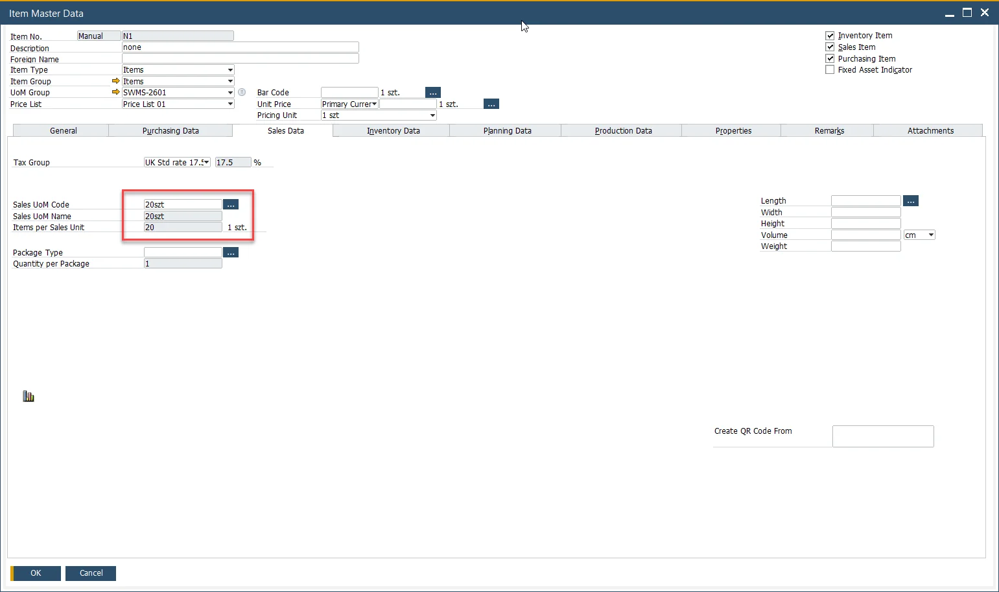

# Managing UoM in CompuTec WMS

This function allows the management of Units of Measurement (UoM) for the following transactions:

- Pick Lists from Transfer Request,
- Transfer Request (apart from MOR Transfer Request),
- Stock Transfer.

---

## Pick Lists from Transfer Request

Check the highlighted checkbox in Custom Configuration (CC):


An Inventory Transfer document in SAP Business One:


A Pick List for this document:


Without the CC checkbox, the quantities are displayed by Warehouse quantities:


When the CC checkbox is checked, the quantities are displayed by UoM:


## From Transfer Request

CompuTec WMS takes the UoM from a base SAP Business One document:


## Stock Transfer / Transfer Request

1. CompuTec WMS takes UoM from the Inventory Data tab.

    
2. Check the highlighted checkbox:

    

Now CompuTec WMS takes UoM from the Sales Data tab:




## Custom queries

Using a custom query, you can choose a line with any UoM. To do it, you have to add a column named UoM. If this column is present in a query, UoM will always be taken from here.


### For MS SQL

```sql
SELECT TOP 100 PERCENT

T0."ItemCode",

COALESCE(u."UomCode", T0."InvntryUom")  AS "UoM",

T0."ItemCode" AS "Field1",

T0."ItemName" AS "Field3",

T1."OnHand" AS "Field2",

COALESCE(u."UomCode", T0."InvntryUom")  AS "Field4"

FROM "OITM" T0

        INNER JOIN "OITW" T1 ON T1."ItemCode" = T0."ItemCode"

LEFT JOIN "OUGP" g ON g."UgpEntry" = T0."UgpEntry"

        LEFT JOIN "UGP1" g1 ON g1."UgpEntry" = g."UgpEntry"

        LEFT JOIN "OUOM" u ON u."UomEntry" = g1."UomEntry"

WHERE (('@WhereFilterValue' = '' AND ''='') OR ('@WhereFilterValue' <> '' AND (@WhereFilterQuery) ))

        AND T0."InvntItem" = 'Y'

        AND T0."validFor" = 'Y'

        AND T1."WhsCode" = @WhsCode

        @SerializationFilter

        @InventoryTransferExistsCondition

ORDER BY T0."ItemCode", u."UomCode"
```

### For ProcessForce

```sql
SELECT T0."ItemCode",  T0."UoM", T0."ItemCode" AS "Field1", T0."ItemName" AS "Field3", SUM(T0."Qty") AS "Field2", T0."UoM" AS "Field4" FROM (

        SELECT T0."ItemCode", T0."ItemName", ROUND(T1."OnHand" / g1."BaseQty", 3)  AS "Qty", COALESCE(u."UomCode", T0."InvntryUom") as "UoM", T0."U_CTSRSerialization", 'True' AS "ShowAllUoM"

        FROM "OITM" T0

                       INNER JOIN "OITW" T1 ON T1."ItemCode" = T0."ItemCode"

                       LEFT JOIN "OUGP" g ON g."UgpEntry" = T0."UgpEntry"

                       LEFT JOIN "UGP1" g1 ON g1."UgpEntry" = g."UgpEntry"

                       LEFT JOIN "OUOM" u ON u."UomEntry" = g1."UomEntry"

        WHERE

                       T0."InvntItem" = 'Y'

                       AND T0."validFor" = 'Y'

                       AND T1."WhsCode" = @WhsCode

        UNION ALL

        SELECT T3."ItemCode", T3."ItemName", ROUND(-T2."U_Quantity" / g1."BaseQty", 3) AS "Qty", COALESCE(u."UomCode", T3."InvntryUom") AS "UoM", T3."U_CTSRSerialization", 'True' AS "ShowAllUoM"

        FROM "@CT_PF_OPOR" T0

                       INNER JOIN "@CT_PF_POR1" T1 ON T1."DocEntry" = T0."DocEntry"

                       INNER JOIN "@CT_PF_POR2" T2 ON T2."DocEntry" = T0."DocEntry" AND T2."U_ReqItmLn" = T1."LineId"

                       INNER JOIN "OITM" T3 ON T3."ItemCode" = T2."U_ItemCode"

                       LEFT JOIN "OUGP" g ON g."UgpEntry" = T3."UgpEntry"

                       LEFT JOIN "UGP1" g1 ON g1."UgpEntry" = g."UgpEntry"

                       LEFT JOIN "OUOM" u ON u."UomEntry" = g1."UomEntry"

        WHERE

                       @IncludePickAlloc = 'True'

                       AND T0."U_Status" <> 'C'

                       AND T1."U_SrcWhsCode" = @WhsCode

                       AND T2."U_Quantity" > 0

                       AND T2."U_Issued" = 'N'

) T0

WHERE

        (('@WhereFilterValue' = '' AND ''='') OR ('@WhereFilterValue' <> '' AND (@WhereFilterQuery) ))

        @SerializationFilter

GROUP BY T0."ItemCode", T0."ItemName",  T0."UoM"

@InventoryTransferExistsCondition

ORDER BY T0."ItemCode", T0."UoM"
```

CompuTec WMS will show a list of all UoM, and you can choose a required group.


Adding a custom query to one transaction, e.g., Transfer Request, is possible.

Checking the 'Use Sales UoM' for New Inventory Transfer takes UoM from Sales. Unchecking it results in taking UoM from Inventory.
