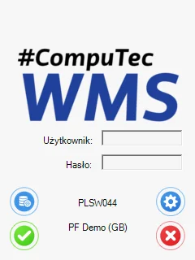

# Starting CompuTec WMS Client

## Starting CompuTec WMS Settings

1. To run the desktop version of the CompuTec WMS Client, an installation and configuration of the CompuTec WMS Server is required. For further information, click [here](../administrator-guide/installation/wms-server/overview.md).
2. To start the CompuTec WMS Client desktop version, choose it from a program list or run the CompuTec.Client.Desktop.exe file in the CompuTec WMS Client installation folder.
3. CompuTec WMS splash screen overview
    When running the application for the first time, select the Settings button to set up server addresses.

    

## General Settings overview

### Info icon

You can check the following information by clicking the 'i' icon:

- Server Name
- Company Name
- Database Name
- Server Version
- Client Version

### Configuration of WMS client-server connection

The server address has to be the same as the address where the CompuTec WMS Server is installed.
The port number has to be the same as defined in the server settings (you can check it here).
Check the Scale checkbox if CompuTec WMS is planned to be used with a scale. A new tab will be displayed in the Application settings form. Clicking it leads to the scale options.

### Other option

Show buttons focus – highligt the buttons focused on

Use global settings –

Full screen – full-screen version of the main menu form

Full screen for login panel – full screen mode for the login panel (even if the screenshot mode is set for the application, the log-in panel has a fixed size, which may lead to the display of an unconventionally small log-in panel on some devices)

## Documents tab

Checking a specific checkbox displays the Warehouse Selection form of a particular transaction. If you want to use only one default warehouse, uncheck a checkbox for a required transaction and type in a required warehouse. Click here to find out more.

### Saving settings and logging in

Click Save or Cancel on the General tab to save or discard changes. It leads back to the log in form.

::: warning
    Note that opening the Settings form and clicking Save (even without changing anything) is required to perform after the first installation of the application. This action creates the necessary configuration file to work with the application.
:::

1. After saving, the log-in window appears.

    
2. Type in a terminal username and password or log in by scanning the Employee Badge.
3. Click here to find out how to create a terminal user. Click a green icon or press Enter. If a terminal user has a barcode assigned, scanning the code logs in the user.
4. The main menu window appears.

The desktop version of CompuTec WMS Client is ready to work with.
