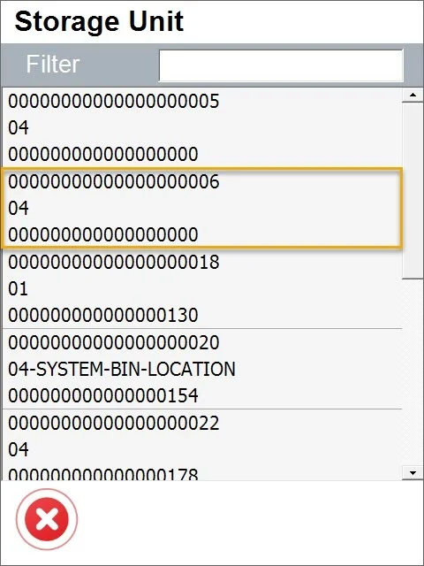

# Close SU

This option allows you to close a specific SU. Closed SU are not displayed on SU lists on transactions, and it is impossible to use them anymore. Once the SU is closed, it cannot be opened again.

---

1. To use the option, choose it from SU options:

    
2. Choose an SU that you want to close from the list:

    
3. Storage Unit details screen is open:

    

    Item rows display the following information: Item name and code, quantity, and Unit of Measurement.
4. You can check specific Storage Unit details by clicking the icon:

    
5. To close SU, click the icon:

    

    Confirm the decision in a pop-up message:

    

    The SU is now closed.
  