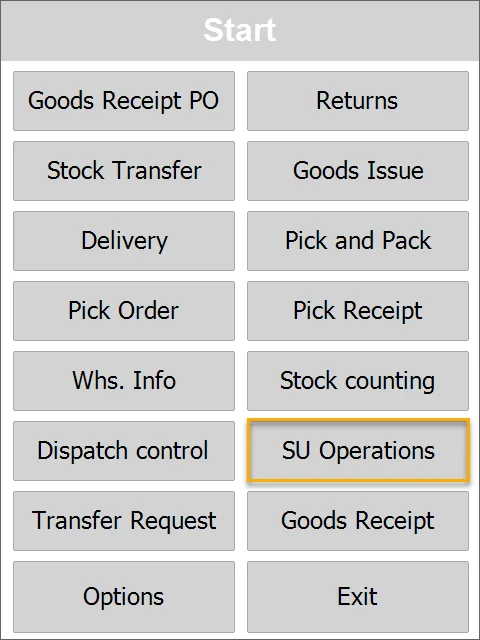
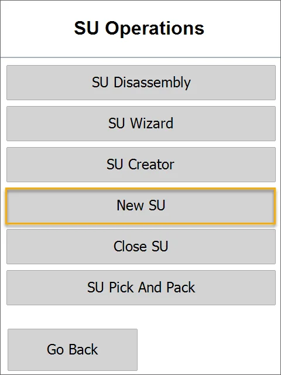
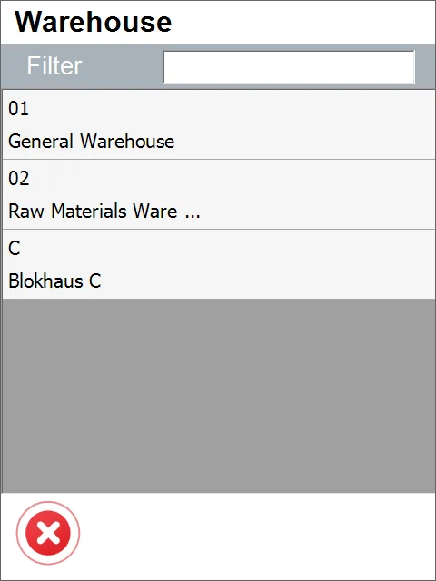
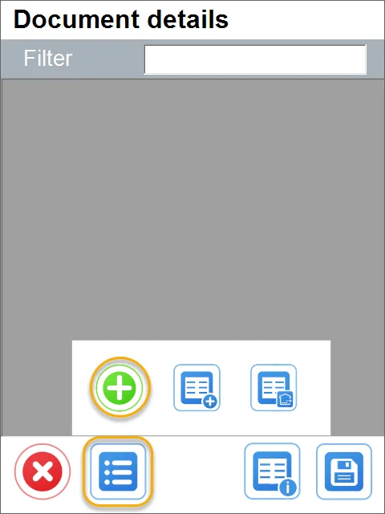
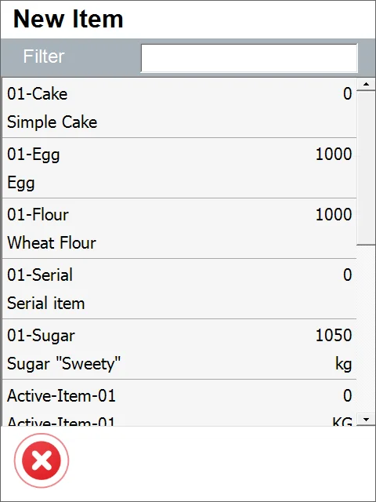
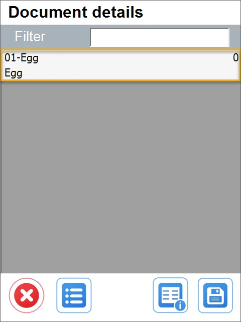
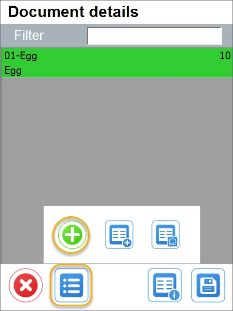
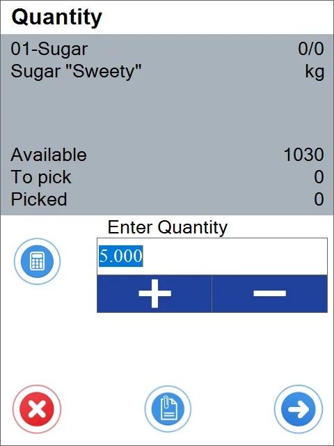
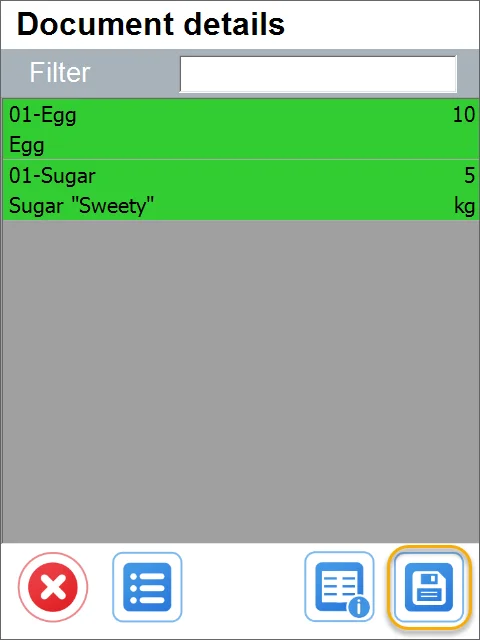
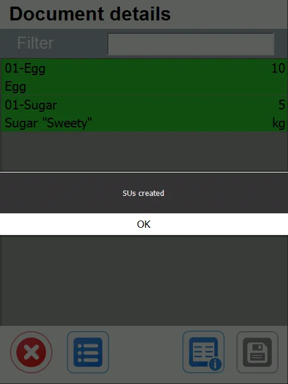

# New SU

1. Select **SU Operations** from the Main Menu.

    
2. Select **New SU**.

    
3. Choose a Warehouse in which a Storage Unit will be created.

    
4. Document Details form will be opened. You can add Items that must be included in the created Storage Unit. Click the '+' icon to add Items.

    
5. The Item Selection form will be opened. Choose an Item required to be included in the created Storage Unit.

    
6. Set the quantity for the chosen Item and click the 'Next' icon.

    
7. Similarly, you can add another item and its quantity.

    

    

    
8. Click the 'Save' icon after choosing Items required for SU and its quantity:

    
9. A new SU is created.

    
